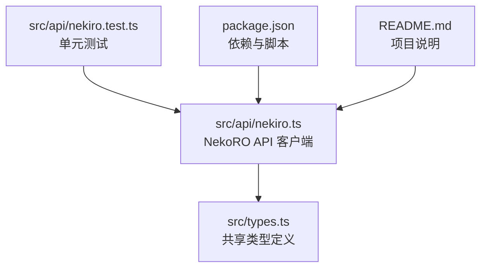
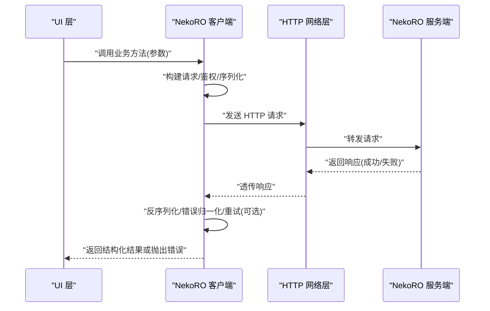
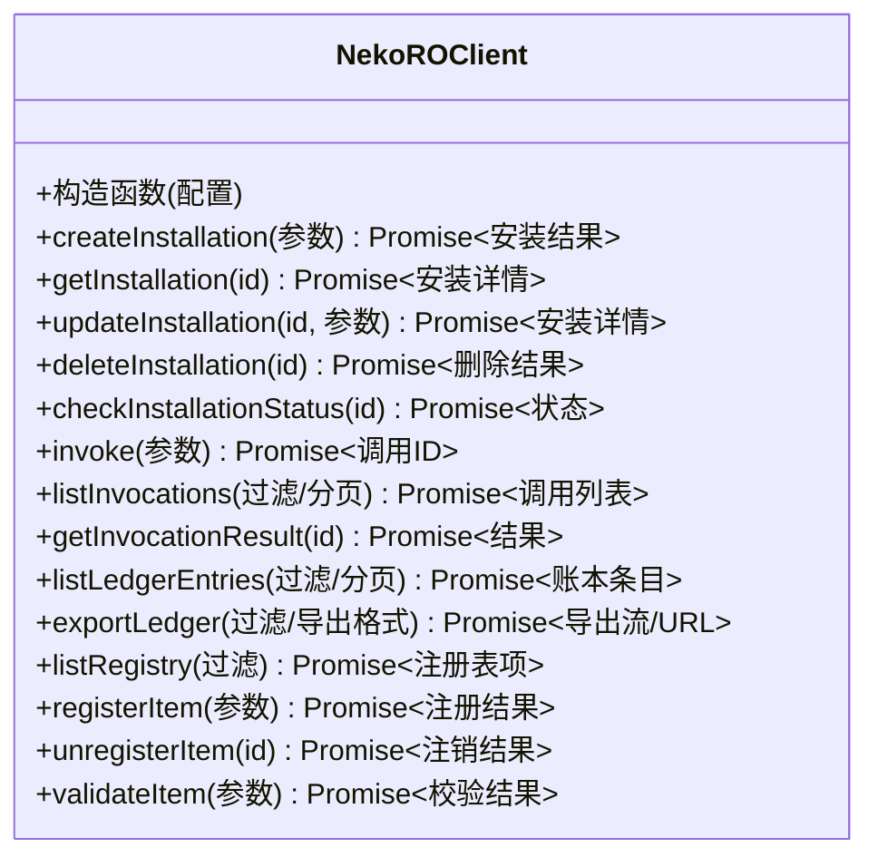
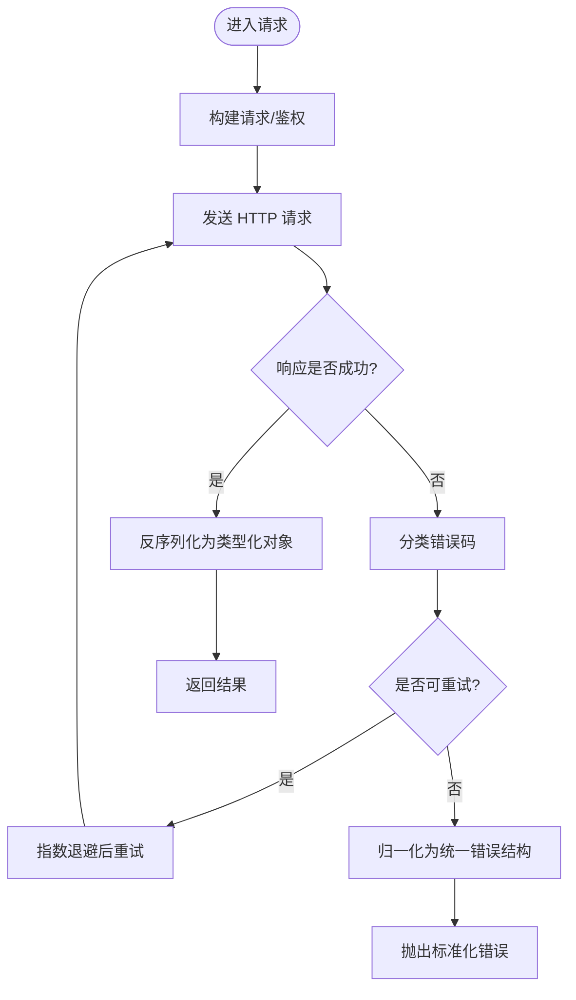
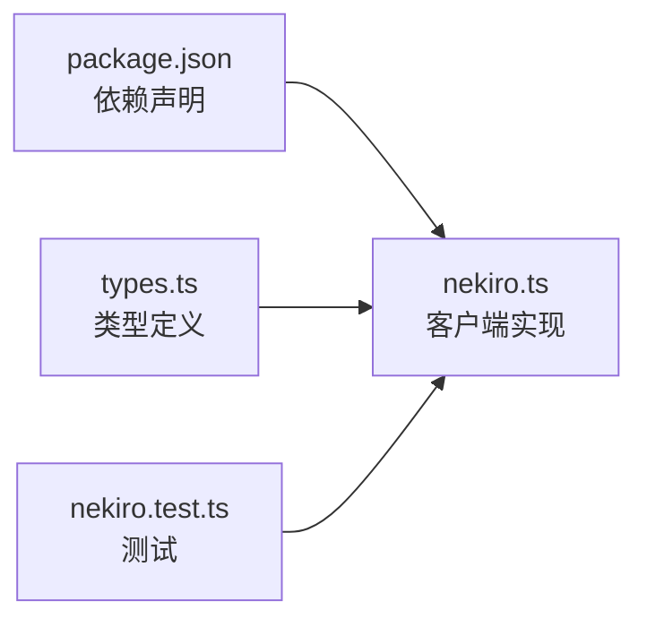

# API 参考

<cite>
**本文引用的文件**   
- [src/api/nekiro.ts](file://src/api/nekiro.ts)
- [src/api/nekiro.test.ts](file://src/api/nekiro.test.ts)
- [src/types.ts](file://src/types.ts)
- [package.json](file://package.json)
- [README.md](file://README.md)
</cite>

## 目录
1. [简介](#简介)
2. [项目结构](#项目结构)
3. [核心组件](#核心组件)
4. [架构总览](#架构总览)
5. [详细组件分析](#详细组件分析)
6. [依赖分析](#依赖分析)
7. [性能考虑](#性能考虑)
8. [故障排查指南](#故障排查指南)
9. [结论](#结论)
10. [附录](#附录)

## 简介
本文件为 NeKiro-console 的 NekoRO API 客户端参考文档，面向集成开发者。内容覆盖：
- 客户端暴露的方法与接口签名、参数与返回值约定
- TypeScript 类型定义说明
- 错误码定义与异常处理策略
- 版本兼容性与迁移指南
- 测试用例说明与调试技巧
- 最佳实践与完整集成步骤

## 项目结构
NeKiro-console 采用前端工程化组织方式，API 客户端位于 src/api 下，类型定义集中于 src/types.ts，测试用例位于同目录下的 .test.ts 文件中。

图表来源
- [src/api/nekiro.ts](file://src/api/nekiro.ts)
- [src/types.ts](file://src/types.ts)
- [src/api/nekiro.test.ts](file://src/api/nekiro.test.ts)
- [package.json](file://package.json)
- [README.md](file://README.md)

章节来源
- [src/api/nekiro.ts](file://src/api/nekiro.ts)
- [src/types.ts](file://src/types.ts)
- [src/api/nekiro.test.ts](file://src/api/nekiro.test.ts)
- [package.json](file://package.json)
- [README.md](file://README.md)

## 核心组件
本节聚焦 NekoRO API 客户端的核心能力与调用约定。为避免直接粘贴代码，以下以“路径 + 行号”的方式引用实现位置，读者可据此定位源码。

- 客户端初始化与配置
  - 入口与配置项定义见：[src/api/nekiro.ts](file://src/api/nekiro.ts)
  - 基础 URL、超时、重试等通用配置建议参见：[src/types.ts](file://src/types.ts)

- 请求/响应模型
  - 统一请求头、分页、排序、过滤等通用字段定义见：[src/types.ts](file://src/types.ts)
  - 业务实体（如安装、调用、账本、注册表等）类型见：[src/types.ts](file://src/types.ts)

- 错误模型与错误码
  - 错误对象结构与错误码枚举见：[src/types.ts](file://src/types.ts)
  - 客户端错误包装与重试策略见：[src/api/nekiro.ts](file://src/api/nekiro.ts)

- 方法清单（按功能域）
  - 安装管理：创建、查询、更新、删除、状态检查
    - 参考实现：[src/api/nekiro.ts](file://src/api/nekiro.ts)
  - 调用管理：触发执行、查询执行记录、获取结果
    - 参考实现：[src/api/nekiro.ts](file://src/api/nekiro.ts)
  - 账本查询：分页拉取、条件筛选、导出
    - 参考实现：[src/api/nekiro.ts](file://src/api/nekiro.ts)
  - 注册表操作：列出、注册、注销、校验
    - 参考实现：[src/api/nekiro.ts](file://src/api/nekiro.ts)

- 返回格式约定
  - 成功响应体包含数据与元信息（如分页），失败响应遵循统一错误结构
  - 参考实现与类型定义：[src/api/nekiro.ts](file://src/api/nekiro.ts), [src/types.ts](file://src/types.ts)

章节来源
- [src/api/nekiro.ts](file://src/api/nekiro.ts)
- [src/types.ts](file://src/types.ts)

## 架构总览
下图展示客户端在应用中的角色与交互边界：上层 UI 通过客户端发起 HTTP 请求，客户端负责序列化、鉴权、重试与错误归一化，最终将结构化响应返回给调用方。

图表来源
- [src/api/nekiro.ts](file://src/api/nekiro.ts)
- [src/types.ts](file://src/types.ts)

## 详细组件分析

### 客户端类与方法
- 职责
  - 封装所有 NekoRO 服务端 REST 接口
  - 统一错误处理、重试、日志埋点
  - 提供强类型的请求/响应契约
- 关键方法（示例）
  - 安装相关：createInstallation, getInstallation, updateInstallation, deleteInstallation, checkInstallationStatus
  - 调用相关：invoke, listInvocations, getInvocationResult
  - 账本相关：listLedgerEntries, exportLedger
  - 注册表相关：listRegistry, registerItem, unregisterItem, validateItem
- 方法签名与类型
  - 参数与返回类型均以 TypeScript 类型约束，详见：[src/types.ts](file://src/types.ts)
  - 具体实现与调用链见：[src/api/nekiro.ts](file://src/api/nekiro.ts)

图表来源
- [src/api/nekiro.ts](file://src/api/nekiro.ts)
- [src/types.ts](file://src/types.ts)

章节来源
- [src/api/nekiro.ts](file://src/api/nekiro.ts)
- [src/types.ts](file://src/types.ts)

### 错误模型与错误码
- 错误对象结构
  - 包含错误码、消息、附加上下文（如请求 ID、字段级错误）
  - 类型定义见：[src/types.ts](file://src/types.ts)
- 常见错误码
  - 认证/授权失败、参数校验失败、资源不存在、服务不可用、限流等
  - 枚举与说明见：[src/types.ts](file://src/types.ts)
- 客户端错误处理策略
  - 自动重试：针对瞬时错误（如 5xx、网络抖动）进行指数退避
  - 幂等保护：对 GET/HEAD/安全方法默认幂等；写操作需确保业务幂等
  - 错误归一化：将不同来源的错误转换为统一结构，便于上层处理
  - 实现参考：[src/api/nekiro.ts](file://src/api/nekiro.ts)

图表来源
- [src/api/nekiro.ts](file://src/api/nekiro.ts)
- [src/types.ts](file://src/types.ts)

章节来源
- [src/api/nekiro.ts](file://src/api/nekiro.ts)
- [src/types.ts](file://src/types.ts)

### 类型系统概览
- 通用类型
  - 分页、排序、过滤、时间戳、ID 等
- 业务类型
  - 安装、调用、账本、注册表等实体的字段与约束
- 错误类型
  - 错误码、错误对象、字段级错误
- 参考位置
  - [src/types.ts](file://src/types.ts)

章节来源
- [src/types.ts](file://src/types.ts)

### 调用示例与最佳实践
- 基本调用流程
  - 初始化客户端 -> 设置基础 URL/鉴权 -> 调用方法 -> 处理成功/失败分支
  - 参考实现与用法模式：[src/api/nekiro.ts](file://src/api/nekiro.ts)
- 分页与大数据量
  - 使用游标或页码+大小组合，避免一次性加载过多数据
  - 参考类型与返回结构：[src/types.ts](file://src/types.ts)
- 并发与节流
  - 对高频调用使用队列或令牌桶限流，避免服务端压力
- 幂等与重试
  - 读操作天然幂等；写操作建议携带幂等键并配合客户端重试
- 错误处理
  - 捕获标准化错误，区分用户提示与系统告警
  - 参考错误模型与处理逻辑：[src/types.ts](file://src/types.ts), [src/api/nekiro.ts](file://src/api/nekiro.ts)

章节来源
- [src/api/nekiro.ts](file://src/api/nekiro.ts)
- [src/types.ts](file://src/types.ts)

### 测试用例说明与调试技巧
- 测试范围
  - 客户端初始化、请求构造、错误归一化、重试策略、类型断言
- 运行方式
  - 使用包管理器脚本执行测试套件
  - 参考脚本与依赖：[package.json](file://package.json)
- 单测文件
  - 客户端行为与边界用例：[src/api/nekiro.test.ts](file://src/api/nekiro.test.ts)
- 调试技巧
  - 开启请求日志与网络抓包
  - 使用断点验证类型与错误分支
  - 模拟服务端错误场景（如 5xx、限流）验证重试与降级

章节来源
- [src/api/nekiro.test.ts](file://src/api/nekiro.test.ts)
- [package.json](file://package.json)

## 依赖分析
- 运行时依赖
  - HTTP 客户端库、JSON 序列化、时间处理等
  - 依赖声明与版本约束见：[package.json](file://package.json)
- 模块耦合
  - 客户端与类型定义解耦，便于独立演进与替换实现
  - 测试与实现分离，保证回归稳定性

图表来源
- [package.json](file://package.json)
- [src/api/nekiro.ts](file://src/api/nekiro.ts)
- [src/types.ts](file://src/types.ts)
- [src/api/nekiro.test.ts](file://src/api/nekiro.test.ts)

章节来源
- [package.json](file://package.json)
- [src/api/nekiro.ts](file://src/api/nekiro.ts)
- [src/types.ts](file://src/types.ts)
- [src/api/nekiro.test.ts](file://src/api/nekiro.test.ts)

## 性能考虑
- 连接复用与池化：合理配置连接池，减少握手开销
- 批量与分页：优先使用分页与批量接口，降低往返次数
- 缓存策略：对只读热点数据实施本地缓存与失效策略
- 超时与重试：根据业务 SLA 调整超时与重试上限，避免雪崩
- 压缩与传输：启用 gzip/br 压缩，减少带宽占用

## 故障排查指南
- 常见问题
  - 鉴权失败：检查 Token 有效期与作用域
  - 参数校验失败：对照类型定义逐项核对必填与格式
  - 资源不存在：确认 ID 与命名空间
  - 服务不可用/限流：观察错误码与重试间隔
- 定位手段
  - 查看客户端日志与网络请求详情
  - 使用最小复现用例隔离问题
  - 对比服务端错误码与客户端错误映射
- 参考实现
  - 错误归一化与重试逻辑：[src/api/nekiro.ts](file://src/api/nekiro.ts)
  - 错误类型与错误码：[src/types.ts](file://src/types.ts)

章节来源
- [src/api/nekiro.ts](file://src/api/nekiro.ts)
- [src/types.ts](file://src/types.ts)

## 结论
本参考文档系统化梳理了 NeKiro-console 中 NekoRO API 客户端的能力边界、类型契约与错误处理机制。通过统一的错误模型、可配置的重试策略与清晰的类型定义，开发者可以快速集成并稳定对接 NekoRO 服务端。建议在生产环境结合监控与告警完善可观测性，并在升级时严格遵循版本兼容性策略。

## 附录

### 版本兼容性与迁移指南
- 语义化版本
  - 主版本变更可能引入破坏性变更，需评估影响面并制定回滚方案
  - 次版本新增向后兼容功能
  - 修订版本修复缺陷与安全问题
- 迁移步骤
  - 阅读变更日志与类型差异
  - 逐步替换废弃 API，补充缺失参数
  - 运行测试套件，验证端到端流程
- 参考
  - 项目说明与使用说明：[README.md](file://README.md)
  - 客户端与类型定义：[src/api/nekiro.ts](file://src/api/nekiro.ts), [src/types.ts](file://src/types.ts)

章节来源
- [README.md](file://README.md)
- [src/api/nekiro.ts](file://src/api/nekiro.ts)
- [src/types.ts](file://src/types.ts)