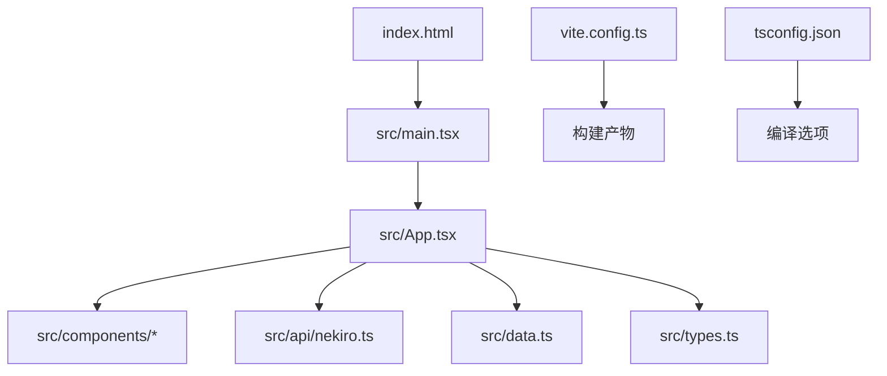
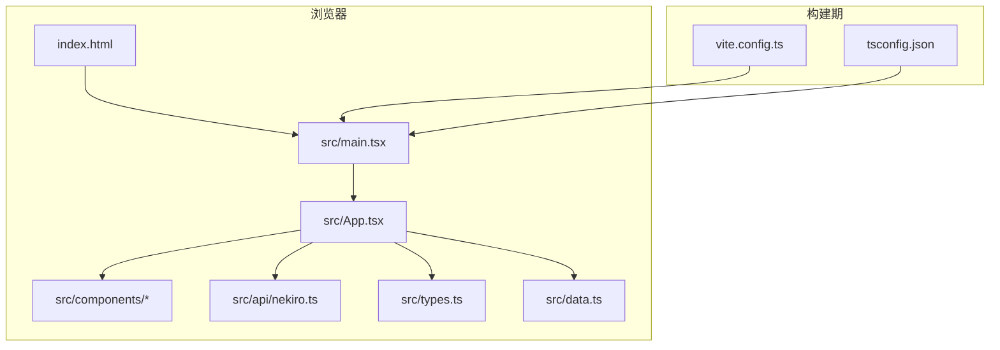
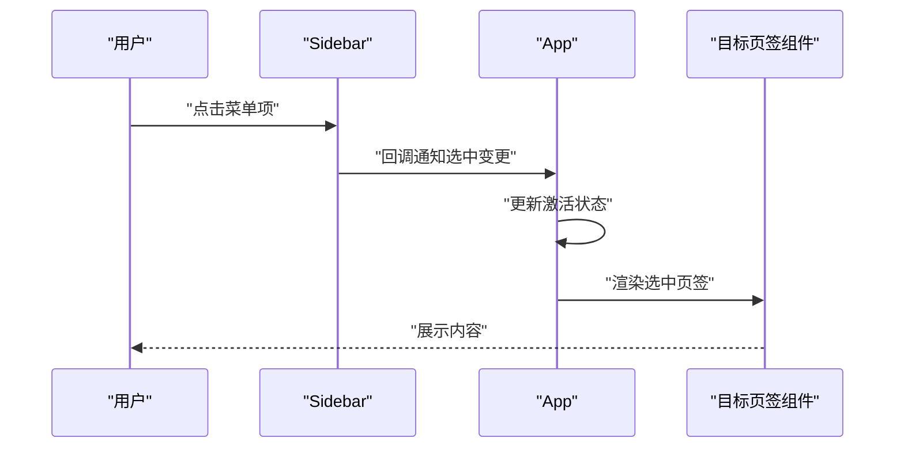
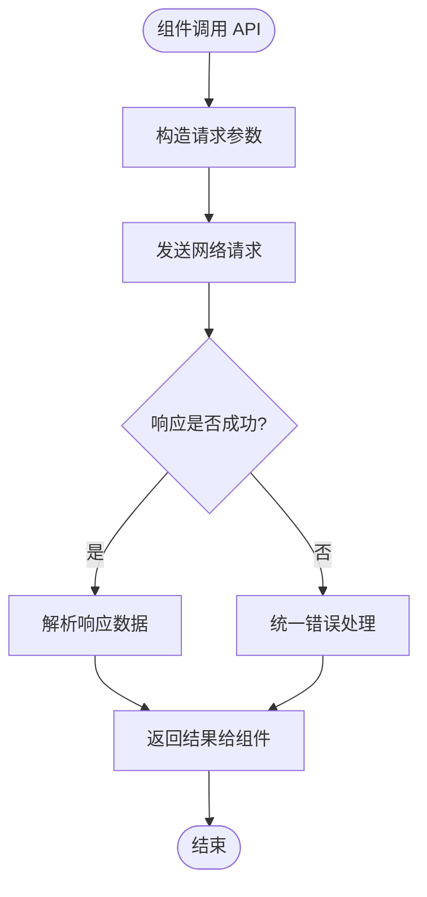
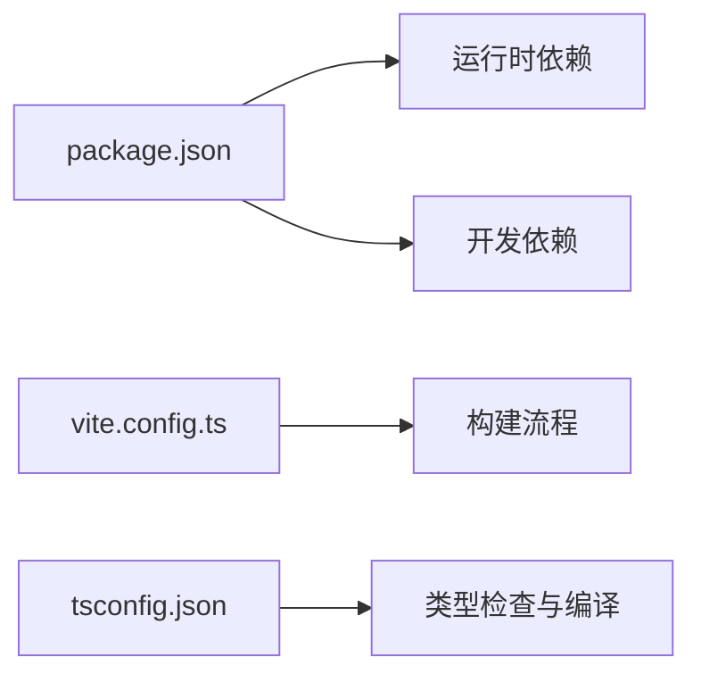

# 开发指南

<cite>
**本文引用的文件**   
- [README.md](file://README.md)
- [package.json](file://package.json)
- [tsconfig.json](file://tsconfig.json)
- [vite.config.ts](file://vite.config.ts)
- [index.html](file://index.html)
- [src/main.tsx](file://src/main.tsx)
- [src/App.tsx](file://src/App.tsx)
- [src/types.ts](file://src/types.ts)
- [src/data.ts](file://src/data.ts)
- [src/api/nekiro.ts](file://src/api/nekiro.ts)
- [src/api/nekiro.test.ts](file://src/api/nekiro.test.ts)
- [src/components/Header.tsx](file://src/components/Header.tsx)
- [src/components/Sidebar.tsx](file://src/components/Sidebar.tsx)
- [src/components/InstallationsTab.tsx](file://src/components/InstallationsTab.tsx)
- [src/components/InvocationsTab.tsx](file://src/components/InvocationsTab.tsx)
- [src/components/LedgerTab.tsx](file://src/components/LedgerTab.tsx)
- [src/components/RegistryTab.tsx](file://src/components/RegistryTab.tsx)
</cite>

## 目录
1. [简介](#简介)
2. [项目结构](#项目结构)
3. [核心组件](#核心组件)
4. [架构总览](#架构总览)
5. [详细组件分析](#详细组件分析)
6. [依赖分析](#依赖分析)
7. [性能考虑](#性能考虑)
8. [故障排查指南](#故障排查指南)
9. [结论](#结论)
10. [附录](#附录)

## 简介
本指南面向 NeKiro-console 的新老开发者，提供从环境搭建、配置优化到功能扩展的完整流程说明。文档覆盖 TypeScript 与 Vite 的配置要点、代码规范与命名约定、Git 工作流与提交规范、调试与性能分析方法、新增模块的最佳实践，以及代码审查清单与质量保证流程。目标是帮助团队在一致的开发体验下高效协作与交付。

## 项目结构
NeKiro-console 采用基于功能的模块化组织方式：
- src/api：API 客户端与测试
- src/components：UI 组件（页面级 Tab、侧边栏、头部等）
- src：应用入口、类型定义、数据与主视图
- public：静态资源
- 根目录：构建与工程化配置（Vite、TypeScript、包管理）

图表来源
- [index.html:1-200](file://index.html#L1-L200)
- [src/main.tsx:1-200](file://src/main.tsx#L1-L200)
- [src/App.tsx:1-200](file://src/App.tsx#L1-L200)
- [vite.config.ts:1-200](file://vite.config.ts#L1-L200)
- [tsconfig.json:1-200](file://tsconfig.json#L1-L200)

章节来源
- [README.md:1-200](file://README.md#L1-L200)
- [package.json:1-200](file://package.json#L1-L200)
- [index.html:1-200](file://index.html#L1-L200)
- [src/main.tsx:1-200](file://src/main.tsx#L1-L200)
- [src/App.tsx:1-200](file://src/App.tsx#L1-L200)
- [vite.config.ts:1-200](file://vite.config.ts#L1-L200)
- [tsconfig.json:1-200](file://tsconfig.json#L1-L200)

## 核心组件
- 应用入口与挂载
  - 入口文件负责创建 React 根节点并挂载到 DOM。
  - 入口文件引入全局样式与类型声明。
- 应用根视图
  - 根视图组合头部、侧边栏与各功能页签，协调路由或状态切换。
- API 层
  - 封装后端接口调用，统一错误处理与请求配置。
- 数据与类型
  - 集中定义共享类型与示例数据，保证前后端契约一致性。
- UI 组件
  - 按功能拆分 Tab 组件，保持单一职责与可复用性。

章节来源
- [src/main.tsx:1-200](file://src/main.tsx#L1-L200)
- [src/App.tsx:1-200](file://src/App.tsx#L1-L200)
- [src/api/nekiro.ts:1-200](file://src/api/nekiro.ts#L1-L200)
- [src/types.ts:1-200](file://src/types.ts#L1-L200)
- [src/data.ts:1-200](file://src/data.ts#L1-L200)
- [src/components/Header.tsx:1-200](file://src/components/Header.tsx#L1-L200)
- [src/components/Sidebar.tsx:1-200](file://src/components/Sidebar.tsx#L1-L200)
- [src/components/InstallationsTab.tsx:1-200](file://src/components/InstallationsTab.tsx#L1-L200)
- [src/components/InvocationsTab.tsx:1-200](file://src/components/InvocationsTab.tsx#L1-L200)
- [src/components/LedgerTab.tsx:1-200](file://src/components/LedgerTab.tsx#L1-L200)
- [src/components/RegistryTab.tsx:1-200](file://src/components/RegistryTab.tsx#L1-L200)

## 架构总览
前端采用 React + Vite + TypeScript 技术栈。应用以单页形式运行，通过入口文件初始化渲染树；业务逻辑集中在 App 层，组件按功能划分；API 层统一封装网络请求；类型与数据集中管理，确保契约稳定。

图表来源
- [index.html:1-200](file://index.html#L1-L200)
- [src/main.tsx:1-200](file://src/main.tsx#L1-L200)
- [src/App.tsx:1-200](file://src/App.tsx#L1-L200)
- [src/api/nekiro.ts:1-200](file://src/api/nekiro.ts#L1-L200)
- [src/types.ts:1-200](file://src/types.ts#L1-L200)
- [src/data.ts:1-200](file://src/data.ts#L1-L200)
- [vite.config.ts:1-200](file://vite.config.ts#L1-L200)
- [tsconfig.json:1-200](file://tsconfig.json#L1-L200)

## 详细组件分析

### 入口与根视图
- 入口职责
  - 创建根容器、注入全局样式、启动应用。
- 根视图职责
  - 组合头部、侧边栏与多个功能页签，维护当前激活页签的状态。
- 交互序列
  - 用户点击侧边栏项 → 更新激活状态 → 渲染对应页签组件。

图表来源
- [src/main.tsx:1-200](file://src/main.tsx#L1-L200)
- [src/App.tsx:1-200](file://src/App.tsx#L1-L200)
- [src/components/Sidebar.tsx:1-200](file://src/components/Sidebar.tsx#L1-L200)
- [src/components/InstallationsTab.tsx:1-200](file://src/components/InstallationsTab.tsx#L1-L200)
- [src/components/InvocationsTab.tsx:1-200](file://src/components/InvocationsTab.tsx#L1-L200)
- [src/components/LedgerTab.tsx:1-200](file://src/components/LedgerTab.tsx#L1-L200)
- [src/components/RegistryTab.tsx:1-200](file://src/components/RegistryTab.tsx#L1-L200)

章节来源
- [src/main.tsx:1-200](file://src/main.tsx#L1-L200)
- [src/App.tsx:1-200](file://src/App.tsx#L1-L200)
- [src/components/Sidebar.tsx:1-200](file://src/components/Sidebar.tsx#L1-L200)
- [src/components/InstallationsTab.tsx:1-200](file://src/components/InstallationsTab.tsx#L1-L200)
- [src/components/InvocationsTab.tsx:1-200](file://src/components/InvocationsTab.tsx#L1-L200)
- [src/components/LedgerTab.tsx:1-200](file://src/components/LedgerTab.tsx#L1-L200)
- [src/components/RegistryTab.tsx:1-200](file://src/components/RegistryTab.tsx#L1-L200)

### API 层与数据流
- 职责边界
  - 封装 HTTP 请求、统一错误处理、参数校验与重试策略（如有）。
- 数据契约
  - 使用 types.ts 中的类型定义约束请求与响应结构。
- 典型流程
  - 组件发起请求 → API 层构造请求 → 返回 Promise → 组件处理成功/失败分支。

图表来源
- [src/api/nekiro.ts:1-200](file://src/api/nekiro.ts#L1-L200)
- [src/types.ts:1-200](file://src/types.ts#L1-L200)

章节来源
- [src/api/nekiro.ts:1-200](file://src/api/nekiro.ts#L1-L200)
- [src/types.ts:1-200](file://src/types.ts#L1-L200)
- [src/api/nekiro.test.ts:1-200](file://src/api/nekiro.test.ts#L1-L200)

### 类型与数据
- 类型定义
  - 集中管理实体、枚举、接口与联合类型，避免散落的 any。
- 示例数据
  - 提供 mock 数据用于本地开发与演示。

章节来源
- [src/types.ts:1-200](file://src/types.ts#L1-L200)
- [src/data.ts:1-200](file://src/data.ts#L1-L200)

### UI 组件
- Header
  - 展示应用标题与全局操作入口。
- Sidebar
  - 导航菜单，维护当前激活页签。
- 各页签组件
  - InstallationsTab、InvocationsTab、LedgerTab、RegistryTab 分别承载各自业务视图。

章节来源
- [src/components/Header.tsx:1-200](file://src/components/Header.tsx#L1-L200)
- [src/components/Sidebar.tsx:1-200](file://src/components/Sidebar.tsx#L1-L200)
- [src/components/InstallationsTab.tsx:1-200](file://src/components/InstallationsTab.tsx#L1-L200)
- [src/components/InvocationsTab.tsx:1-200](file://src/components/InvocationsTab.tsx#L1-L200)
- [src/components/LedgerTab.tsx:1-200](file://src/components/LedgerTab.tsx#L1-L200)
- [src/components/RegistryTab.tsx:1-200](file://src/components/RegistryTab.tsx#L1-L200)

## 依赖分析
- 运行时依赖
  - React 生态：React、ReactDOM。
  - 构建工具：Vite。
  - 语言支持：TypeScript。
- 开发依赖
  - 类型声明、测试框架、Lint/格式化（如已集成）。
- 版本锁定
  - 通过 package.json 与锁文件管理依赖版本，确保构建可重复。

图表来源
- [package.json:1-200](file://package.json#L1-L200)
- [vite.config.ts:1-200](file://vite.config.ts#L1-L200)
- [tsconfig.json:1-200](file://tsconfig.json#L1-L200)

章节来源
- [package.json:1-200](file://package.json#L1-L200)
- [vite.config.ts:1-200](file://vite.config.ts#L1-L200)
- [tsconfig.json:1-200](file://tsconfig.json#L1-L200)

## 性能考虑
- 构建与打包
  - 启用按需加载与代码分割，减少首屏体积。
  - 合理配置缓存与增量构建，提升开发体验。
- 运行时优化
  - 避免不必要的重渲染，合理使用 memo/useMemo/useCallback。
  - 大列表虚拟化、图片懒加载与资源压缩。
- 监控与分析
  - 使用浏览器性能面板与 Lighthouse 进行基准测试与瓶颈定位。
  - 对关键路径埋点，关注首次绘制与可交互时间。

[本节为通用指导，不直接分析具体文件]

## 故障排查指南
- 常见问题
  - 端口占用：修改开发服务器端口或释放占用进程。
  - 类型报错：检查 tsconfig 与类型定义是否匹配。
  - 构建失败：清理缓存、重装依赖后重试。
- 日志与调试
  - 在 API 层增加请求/响应日志，便于定位网络问题。
  - 使用断点调试与条件断点，缩小问题范围。
- 回归与验证
  - 补充单元测试与端到端用例，确保修复有效且不引入回归。

章节来源
- [src/api/nekiro.ts:1-200](file://src/api/nekiro.ts#L1-L200)
- [src/api/nekiro.test.ts:1-200](file://src/api/nekiro.test.ts#L1-L200)

## 结论
通过统一的工程化配置、清晰的组件分层与稳定的类型契约，NeKiro-console 具备良好的可扩展性与可维护性。遵循本指南的流程与规范，将显著提升团队协作效率与交付质量。

[本节为总结性内容，不直接分析具体文件]

## 附录

### 开发环境搭建
- 前置要求
  - Node.js LTS 版本。
  - 推荐使用 pnpm/yarn/npm 任一包管理器。
- 安装与启动
  - 安装依赖：执行包管理器安装命令。
  - 启动开发服务器：执行开发脚本。
  - 构建生产包：执行构建脚本。
- 环境变量
  - 在 .env 或 .env.development/.env.production 中配置后端地址与功能开关。

章节来源
- [package.json:1-200](file://package.json#L1-L200)
- [index.html:1-200](file://index.html#L1-L200)

### TypeScript 配置详解与编译选项
- 目标与模块系统
  - 设置输出目标与模块格式，确保与运行环境与构建工具兼容。
- 严格模式
  - 开启严格类型检查，减少潜在运行时错误。
- 路径别名
  - 配置路径映射，简化导入路径。
- 声明文件
  - 引入第三方库的类型声明，必要时自定义声明。
- 排除与包含
  - 精确控制参与编译的文件范围，提升构建速度。

章节来源
- [tsconfig.json:1-200](file://tsconfig.json#L1-L200)

### Vite 自定义配置方法
- 开发服务器
  - 配置代理、热重载、端口与基础路径。
- 插件体系
  - 按需引入插件实现自动导入、SVG 图标、Tailwind 等能力。
- 构建优化
  - 配置分包策略、压缩、外部依赖与资源内联。
- 多环境
  - 使用环境变量与条件配置区分 dev/prod。

章节来源
- [vite.config.ts:1-200](file://vite.config.ts#L1-L200)

### 代码规范与命名约定
- 文件与目录
  - 组件按功能分目录，文件名使用 PascalCase，常量与工具函数使用 camelCase。
- 类型与接口
  - 优先使用 interface/type 明确数据结构，避免 any。
- 组件设计
  - 单一职责、受控与非受控模式清晰、Props 最小暴露。
- 注释与文档
  - 复杂逻辑添加行内注释，对外 API 提供 JSDoc。

[本节为通用规范建议，不直接分析具体文件]

### Git 工作流与提交规范
- 分支模型
  - main 保护分支，feature/xxx 功能分支，hotfix/xxx 紧急修复。
- 提交信息
  - 采用约定式提交，例如 feat/fix/docs/style/refactor/test/chore/build/ci/perf。
- 合并流程
  - Pull Request 评审通过后合并，保留审计轨迹。
- 标签与发布
  - 语义化版本号，配合自动化流水线生成变更日志。

[本节为通用流程建议，不直接分析具体文件]

### 调试技巧与性能分析
- 前端调试
  - 使用浏览器开发者工具的 Sources、Network、Performance、Memory 面板。
- 接口调试
  - 在 API 层打印请求上下文与错误堆栈，结合 Mock 数据快速定位。
- 性能分析
  - 使用 Lighthouse 与 WebPageTest 评估指标，关注 LCP、FID、CLS。
- 压测与回归
  - 建立基线指标，持续监控回归。

[本节为通用指导，不直接分析具体文件]

### 如何添加新功能模块
- 步骤概览
  - 新建类型与数据定义（types.ts/data.ts）。
  - 实现 API 调用（api/nekiro.ts），补充测试（api/nekiro.test.ts）。
  - 新增组件（components/YourFeature.tsx），并在 App 中注册。
  - 更新路由/导航（Sidebar/Header），完成联调与自测。
- 验收标准
  - 类型完备、无 lint 警告、测试通过、性能达标。

章节来源
- [src/types.ts:1-200](file://src/types.ts#L1-L200)
- [src/data.ts:1-200](file://src/data.ts#L1-L200)
- [src/api/nekiro.ts:1-200](file://src/api/nekiro.ts#L1-L200)
- [src/api/nekiro.test.ts:1-200](file://src/api/nekiro.test.ts#L1-L200)
- [src/App.tsx:1-200](file://src/App.tsx#L1-L200)
- [src/components/Sidebar.tsx:1-200](file://src/components/Sidebar.tsx#L1-L200)
- [src/components/Header.tsx:1-200](file://src/components/Header.tsx#L1-L200)

### 扩展现有功能
- 组件扩展
  - 通过 props 与插槽机制增强现有组件能力，避免破坏性变更。
- API 演进
  - 向后兼容新增字段，废弃字段标记弃用周期。
- 配置扩展
  - 在 vite.config.ts 与 tsconfig.json 中按需扩展，保持最小改动。

章节来源
- [vite.config.ts:1-200](file://vite.config.ts#L1-L200)
- [tsconfig.json:1-200](file://tsconfig.json#L1-L200)

### 代码审查清单与质量保证流程
- 审查清单
  - 类型是否完备、错误处理是否完善、是否有副作用未清理、是否存在性能隐患。
- 自动化
  - 提交前钩子执行 lint 与测试，CI 流水线执行全量检查。
- 度量与报告
  - 覆盖率阈值、复杂度上限、安全扫描与依赖漏洞告警。

[本节为通用流程建议，不直接分析具体文件]