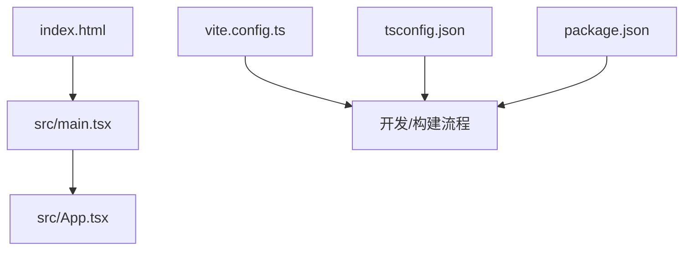
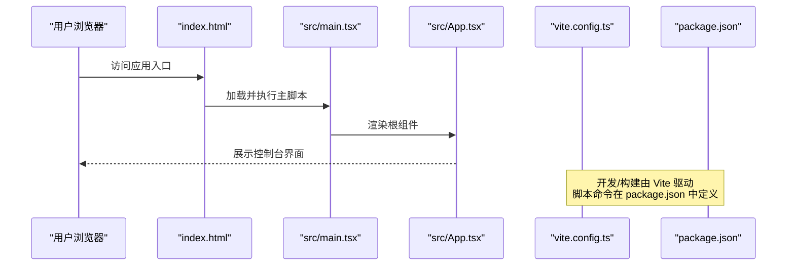
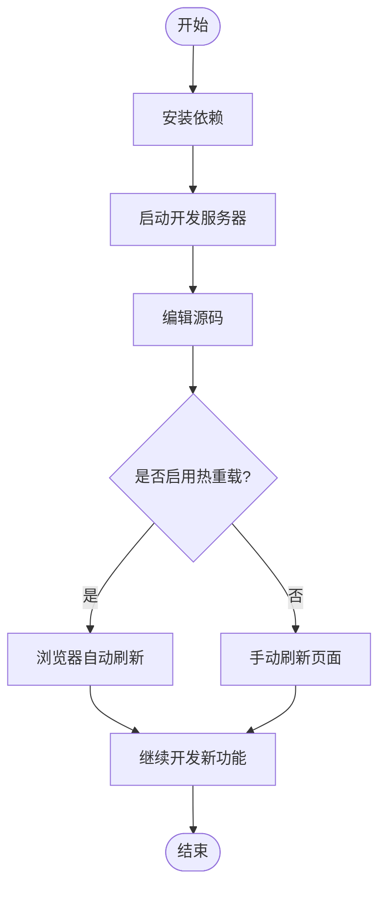
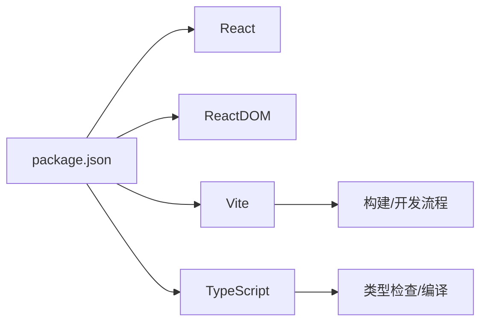

# 快速开始

<cite>
**本文引用的文件**   
- [package.json](file://package.json)
- [vite.config.ts](file://vite.config.ts)
- [tsconfig.json](file://tsconfig.json)
- [index.html](file://index.html)
- [src/main.tsx](file://src/main.tsx)
- [src/App.tsx](file://src/App.tsx)
- [README.md](file://README.md)
</cite>

## 目录
1. [简介](#简介)
2. [项目结构](#项目结构)
3. [核心组件](#核心组件)
4. [架构总览](#架构总览)
5. [详细组件分析](#详细组件分析)
6. [依赖分析](#依赖分析)
7. [性能考虑](#性能考虑)
8. [故障排除指南](#故障排除指南)
9. [结论](#结论)
10. [附录](#附录)

## 简介
本指南面向首次接触 NeKiro-console 的开发者，帮助你在最短时间内完成环境准备、依赖安装、本地开发服务器启动与第一个应用的创建。你将了解：
- 环境与浏览器要求
- 依赖安装与开发环境搭建步骤
- 本地开发服务器的启动命令与基本用法
- 首个应用示例与基础配置说明
- 常见问题与排错建议

## 项目结构
NeKiro-console 是一个基于 Vite + React + TypeScript 的前端控制台应用。关键入口与配置文件如下：
- index.html：应用 HTML 入口
- src/main.tsx：React 应用初始化与挂载
- src/App.tsx：应用根组件
- vite.config.ts：Vite 构建与开发服务器配置
- tsconfig.json：TypeScript 编译选项
- package.json：脚本命令与依赖声明

图表来源
- [index.html:1-20](file://index.html#L1-L20)
- [src/main.tsx:1-40](file://src/main.tsx#L1-L40)
- [src/App.tsx:1-40](file://src/App.tsx#L1-L40)
- [vite.config.ts:1-40](file://vite.config.ts#L1-L40)
- [tsconfig.json:1-40](file://tsconfig.json#L1-L40)
- [package.json:1-40](file://package.json#L1-L40)

章节来源
- [index.html:1-20](file://index.html#L1-L20)
- [src/main.tsx:1-40](file://src/main.tsx#L1-L40)
- [src/App.tsx:1-40](file://src/App.tsx#L1-L40)
- [vite.config.ts:1-40](file://vite.config.ts#L1-L40)
- [tsconfig.json:1-40](file://tsconfig.json#L1-L40)
- [package.json:1-40](file://package.json#L1-L40)

## 核心组件
- 应用入口与挂载
  - main.tsx 负责初始化 React 应用并挂载到 DOM。
  - App.tsx 作为根组件，组织页面布局与功能模块。
- 构建与开发工具链
  - vite.config.ts 定义开发服务器、代理、插件等。
  - tsconfig.json 提供 TypeScript 编译目标与路径映射。
  - package.json 提供 npm/yarn/pnpm 脚本与依赖版本约束。

章节来源
- [src/main.tsx:1-40](file://src/main.tsx#L1-L40)
- [src/App.tsx:1-40](file://src/App.tsx#L1-L40)
- [vite.config.ts:1-40](file://vite.config.ts#L1-L40)
- [tsconfig.json:1-40](file://tsconfig.json#L1-L40)
- [package.json:1-40](file://package.json#L1-L40)

## 架构总览
下图展示了从浏览器到前端应用的核心交互路径，以及开发与构建阶段的工具链关系。

图表来源
- [index.html:1-20](file://index.html#L1-L20)
- [src/main.tsx:1-40](file://src/main.tsx#L1-L40)
- [src/App.tsx:1-40](file://src/App.tsx#L1-L40)
- [vite.config.ts:1-40](file://vite.config.ts#L1-L40)
- [package.json:1-40](file://package.json#L1-L40)

## 详细组件分析

### 环境要求
- Node.js
  - 建议使用 LTS 版本（如 18.x 或 20.x）。请确保已安装 Node.js 且可通过命令行运行 node 与 npm/yarn/pnpm。
- 包管理器
  - 支持 npm、yarn 或 pnpm。选择其一并在后续命令中使用对应命令。
- 浏览器兼容性
  - 现代浏览器（Chrome、Edge、Firefox、Safari）均可使用。若需兼容旧版浏览器，请在构建配置中调整目标环境。

章节来源
- [package.json:1-40](file://package.json#L1-L40)
- [tsconfig.json:1-40](file://tsconfig.json#L1-L40)
- [vite.config.ts:1-40](file://vite.config.ts#L1-L40)

### 依赖安装与开发环境搭建
- 克隆仓库后进入项目根目录。
- 安装依赖
  - 使用你选择的包管理器执行安装命令（例如：npm install、yarn 或 pnpm install）。
- 验证安装
  - 安装完成后，可运行开发服务器以确认环境正常。

章节来源
- [package.json:1-40](file://package.json#L1-L40)

### 本地开发服务器启动与基本使用
- 启动开发服务器
  - 使用 package.json 中定义的脚本命令启动（例如：npm run dev、yarn dev 或 pnpm dev）。
- 访问地址
  - 默认监听本地端口（通常为 5173），在浏览器打开 http://localhost:5173 即可看到应用。
- 热重载
  - 修改源码后，开发服务器会自动刷新页面，便于快速迭代。

章节来源
- [package.json:1-40](file://package.json#L1-L40)
- [vite.config.ts:1-40](file://vite.config.ts#L1-L40)

### 第一个应用示例与基础配置
- 创建第一个页面
  - 在 src 目录下新增一个组件文件（例如 FirstPage.tsx），并在路由或根组件中引入该组件进行展示。
- 基础配置
  - 如需自定义开发服务器端口、代理或构建产物输出路径，可在 vite.config.ts 中进行配置。
  - 如需调整 TypeScript 编译目标或路径别名，可在 tsconfig.json 中修改。
- 运行验证
  - 保存文件后，浏览器应自动刷新并显示新页面内容。

章节来源
- [src/App.tsx:1-40](file://src/App.tsx#L1-L40)
- [vite.config.ts:1-40](file://vite.config.ts#L1-L40)
- [tsconfig.json:1-40](file://tsconfig.json#L1-L40)

### 开发工作流概览

[此图为概念性流程图，无需图表来源]

## 依赖分析
- 运行时依赖
  - React 与 ReactDOM：用于构建用户界面与 DOM 操作。
  - 其他 UI 或工具库：根据业务需要引入。
- 开发依赖
  - Vite：提供快速的开发服务器与构建能力。
  - TypeScript：类型检查与编译。
  - 可能的 ESLint/Prettier：代码规范与格式化。

图表来源
- [package.json:1-40](file://package.json#L1-L40)

章节来源
- [package.json:1-40](file://package.json#L1-L40)

## 性能考虑
- 使用开发服务器时，按需开启热重载以提升迭代效率。
- 生产构建前，确保关闭调试日志与多余插件，减少打包体积。
- 合理拆分组件与路由，避免首屏加载过大。
- 对静态资源进行压缩与缓存策略优化（通过构建配置实现）。

[本节为通用指导，无需章节来源]

## 故障排除指南
- 无法找到 Node.js 或包管理器命令
  - 确认已正确安装 Node.js 与所选包管理器，并在终端中可执行相应命令。
- 端口占用导致开发服务器无法启动
  - 修改 vite.config.ts 中的端口配置，或释放被占用的端口。
- 依赖安装失败
  - 清理缓存后重试（例如 npm cache clean --force 或 yarn cache clean），或使用镜像源加速下载。
- TypeScript 报错
  - 检查 tsconfig.json 的目标与模块设置是否与项目一致；必要时升级 Node.js 版本。
- 浏览器不兼容
  - 调整构建目标（browserslist 或 Vite 配置），确保目标浏览器得到支持。

章节来源
- [vite.config.ts:1-40](file://vite.config.ts#L1-L40)
- [tsconfig.json:1-40](file://tsconfig.json#L1-L40)
- [package.json:1-40](file://package.json#L1-L40)

## 结论
通过以上步骤，你可以在几分钟内完成 NeKiro-console 的环境搭建、依赖安装与本地开发服务器启动，并创建你的第一个应用页面。建议在熟悉基础流程后，进一步阅读 README 与相关文档，了解更深入的配置与最佳实践。

[本节为总结性内容，无需章节来源]

## 附录
- 常用命令速查
  - 安装依赖：npm install / yarn / pnpm install
  - 启动开发服务器：npm run dev / yarn dev / pnpm dev
  - 构建生产版本：npm run build / yarn build / pnpm build
- 参考文档
  - README.md：项目概述与使用说明
  - vite.config.ts：开发服务器与构建配置
  - tsconfig.json：TypeScript 编译选项

章节来源
- [README.md:1-40](file://README.md#L1-L40)
- [vite.config.ts:1-40](file://vite.config.ts#L1-L40)
- [tsconfig.json:1-40](file://tsconfig.json#L1-L40)
- [package.json:1-40](file://package.json#L1-L40)