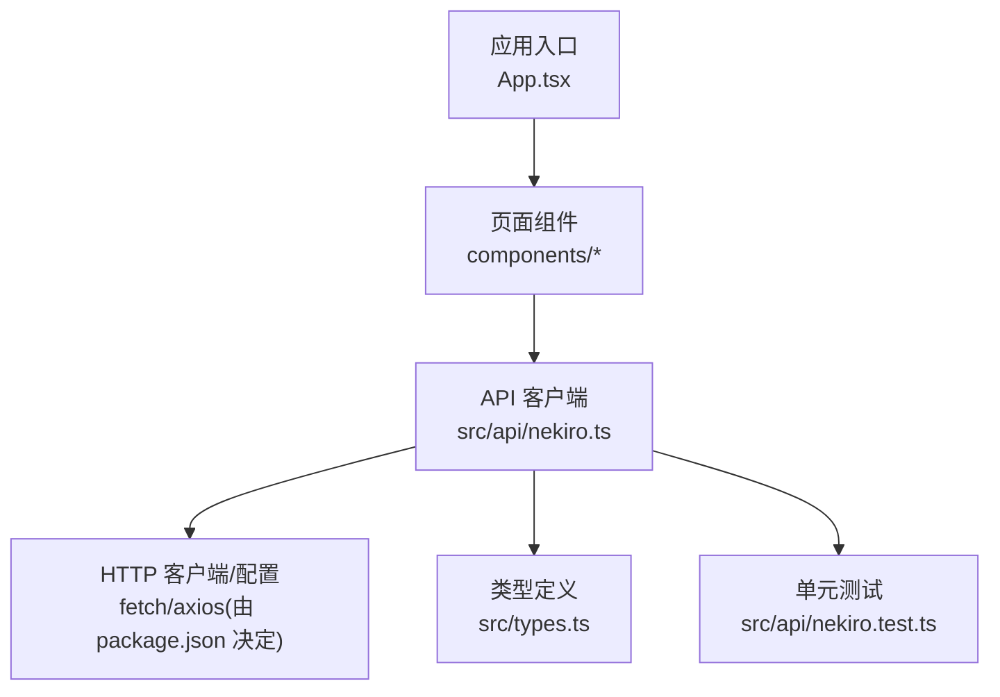
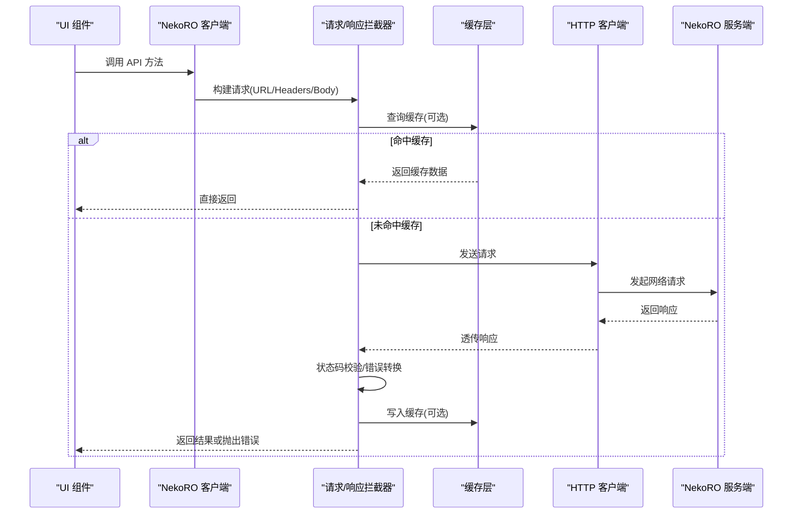
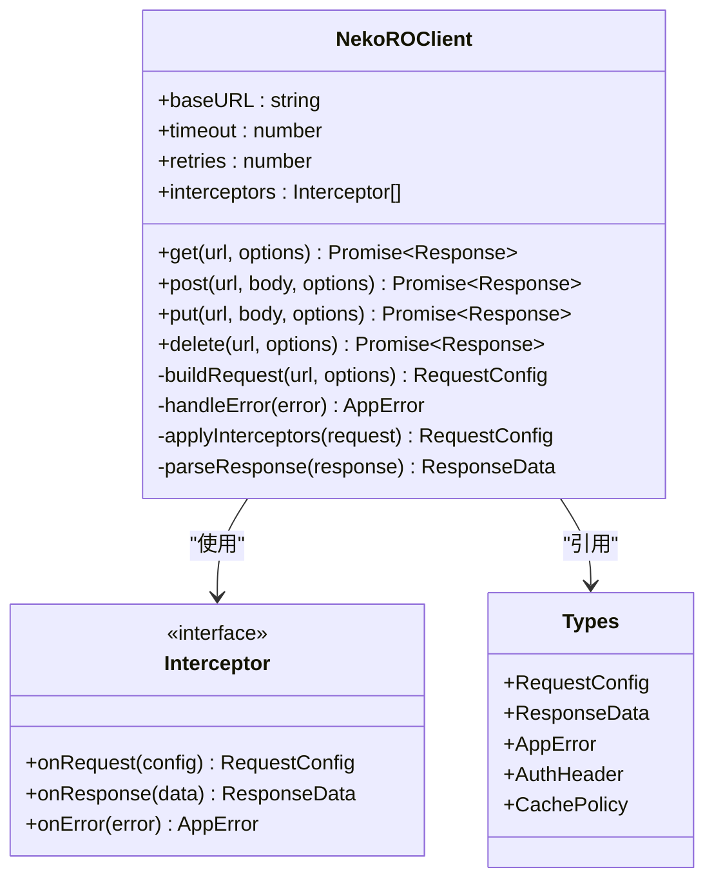
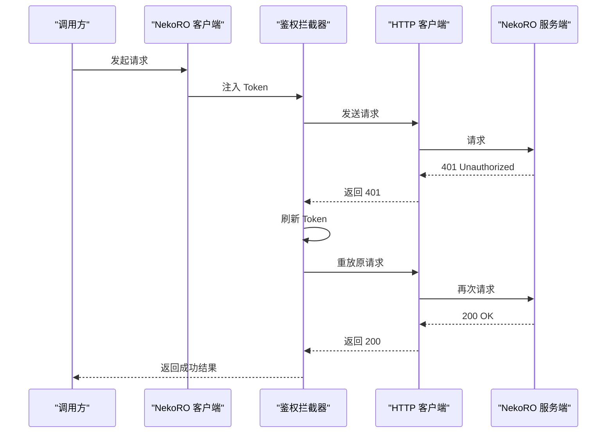
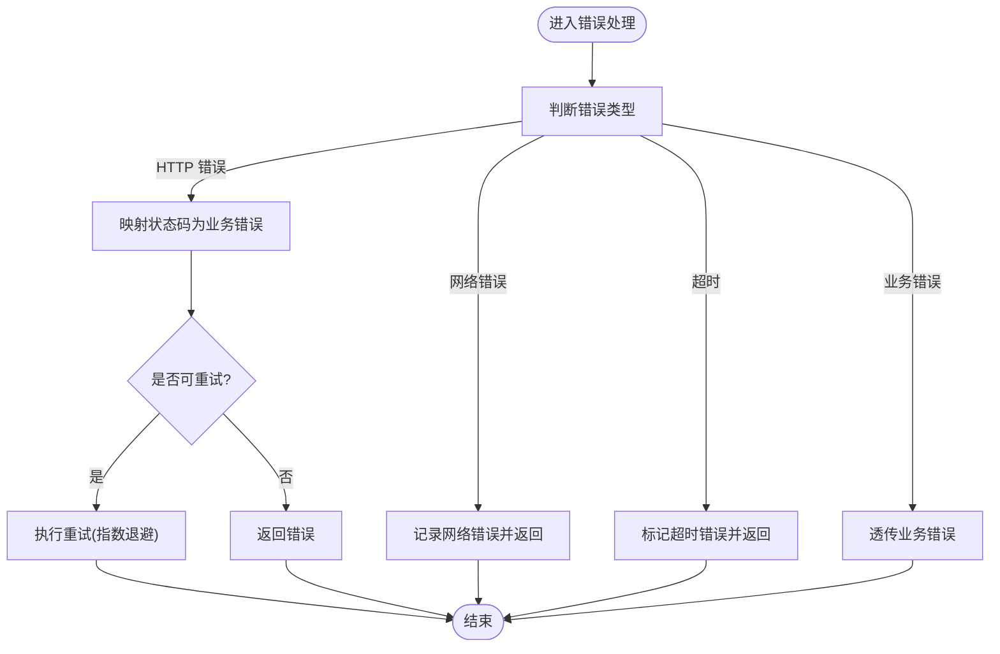
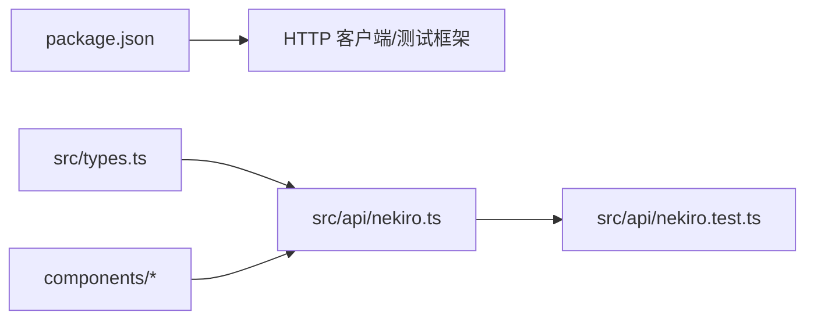

# API 集成层

<cite>
**本文引用的文件**   
- [src/api/nekiro.ts](file://src/api/nekiro.ts)
- [src/api/nekiro.test.ts](file://src/api/nekiro.test.ts)
- [src/types.ts](file://src/types.ts)
- [package.json](file://package.json)
</cite>

## 目录
1. [简介](#简介)
2. [项目结构](#项目结构)
3. [核心组件](#核心组件)
4. [架构总览](#架构总览)
5. [详细组件分析](#详细组件分析)
6. [依赖分析](#依赖分析)
7. [性能考虑](#性能考虑)
8. [故障排查指南](#故障排查指南)
9. [结论](#结论)
10. [附录](#附录)

## 简介
本文件面向后端集成开发者，系统化梳理 NeKiro-console 的 API 集成层设计与实现。重点覆盖 NekoRO API 客户端的请求封装、错误处理机制与响应拦截器；API 方法签名、参数校验与返回值格式；测试策略与单元测试编写规范；网络请求优化与缓存策略；认证与安全考量；并提供调用示例与错误处理模式，帮助快速、稳定地对接 NekoRO 服务。

## 项目结构
本项目采用前端工程化组织方式，API 集成层位于 src/api 目录，类型定义集中于 src/types.ts，测试用例与业务代码同目录便于维护。

图表来源
- [src/api/nekiro.ts](file://src/api/nekiro.ts)
- [src/types.ts](file://src/types.ts)
- [src/api/nekiro.test.ts](file://src/api/nekiro.test.ts)

章节来源
- [src/api/nekiro.ts](file://src/api/nekiro.ts)
- [src/types.ts](file://src/types.ts)
- [src/api/nekiro.test.ts](file://src/api/nekiro.test.ts)

## 核心组件
- API 客户端模块：提供统一的 NekoRO 接口封装，包括基础 URL、请求头、超时、重试、鉴权注入、错误统一处理与响应拦截。
- 类型系统：集中管理请求/响应模型、枚举与常量，确保前后端契约一致。
- 测试套件：对关键路径进行单测覆盖，包含成功、失败、鉴权异常、超时等场景。

章节来源
- [src/api/nekiro.ts](file://src/api/nekiro.ts)
- [src/types.ts](file://src/types.ts)
- [src/api/nekiro.test.ts](file://src/api/nekiro.test.ts)

## 架构总览
下图展示从 UI 到远端服务的端到端调用链路，以及客户端内部的关键环节（请求构建、拦截器、错误处理、重试与缓存）。

图表来源
- [src/api/nekiro.ts](file://src/api/nekiro.ts)
- [src/types.ts](file://src/types.ts)

## 详细组件分析

### NekoRO 客户端设计
- 基础配置
  - 基础地址：通过环境变量或配置文件注入，避免硬编码。
  - 默认请求头：Content-Type、Accept、语言/时区等。
  - 超时与重试：可配置的超时时间、最大重试次数与退避策略。
- 请求封装
  - 统一封装 GET/POST/PUT/DELETE 等方法，自动序列化请求体、拼接查询参数。
  - 支持可选的中间件式拦截器链，用于注入鉴权、日志、埋点等。
- 响应拦截器
  - 统一解析响应体，将非 JSON 响应转换为结构化对象。
  - 根据状态码映射为领域错误类型，附加上下文信息（请求 ID、耗时、URL）。
- 错误处理
  - 网络错误、超时、HTTP 错误、业务错误分层处理。
  - 提供标准化错误对象，包含 code、message、details、retryable 等字段。
- 鉴权与安全
  - 在请求前注入 Token（Bearer），支持刷新令牌逻辑。
  - 敏感信息不落盘，Token 仅存内存，必要时加密存储。
- 缓存策略
  - 基于 URL+Query 的键生成，支持 TTL、条件缓存（如只缓存 GET）。
  - 提供手动失效与批量失效能力。

章节来源
- [src/api/nekiro.ts](file://src/api/nekiro.ts)
- [src/types.ts](file://src/types.ts)

#### 类图（客户端与类型）

图表来源
- [src/api/nekiro.ts](file://src/api/nekiro.ts)
- [src/types.ts](file://src/types.ts)

### API 方法签名与参数校验
- 通用方法
  - get(url, options): 获取资源，options 支持 headers、params、cache、signal 等。
  - post(url, body, options): 创建资源，body 需满足对应类型约束。
  - put(url, body, options): 更新资源。
  - delete(url, options): 删除资源。
- 参数校验
  - 必填字段校验、类型校验、范围校验、白名单校验。
  - 校验失败立即返回结构化错误，不发起网络请求。
- 返回值格式
  - 成功：{ data, meta, traceId }
  - 失败：{ error: AppError }
  - 分页：{ items, total, page, pageSize }

章节来源
- [src/api/nekiro.ts](file://src/api/nekiro.ts)
- [src/types.ts](file://src/types.ts)

### 错误处理机制
- 错误分类
  - 网络错误：连接失败、DNS 解析失败、CORS 错误。
  - 超时错误：超过配置的 timeout。
  - HTTP 错误：4xx/5xx 状态码映射为领域错误。
  - 业务错误：服务端返回的业务码与消息。
- 错误对象
  - code: 错误码（字符串或枚举）
  - message: 用户可读消息
  - details: 原始响应或堆栈摘要
  - retryable: 是否可重试
- 重试与退避
  - 指数退避、抖动、最大重试次数限制。
  - 幂等请求（GET/HEAD/OPTIONS/PUT/DELETE）才允许自动重试。

章节来源
- [src/api/nekiro.ts](file://src/api/nekiro.ts)

### 认证机制与安全考虑
- 认证流程
  - 登录成功后保存 Token，后续请求自动注入 Authorization: Bearer <token>。
  - 401 触发刷新令牌流程，刷新成功后重放原请求。
- 安全建议
  - 不在日志中输出完整请求体与 Token。
  - 启用 HTTPS，严格校验证书。
  - 设置合理的 CORS 策略与 CSP。
  - 对敏感操作增加二次确认与防重放（nonce/timestamp）。

章节来源
- [src/api/nekiro.ts](file://src/api/nekiro.ts)
- [src/types.ts](file://src/types.ts)

### 缓存策略
- 缓存键
  - 基于规范化后的 URL + Query 排序生成唯一键。
- 缓存规则
  - 仅缓存 GET 请求，且服务端返回 200。
  - 支持 TTL、条件缓存（如按 ETag/Last-Modified）。
- 失效策略
  - 写操作后主动失效相关键。
  - 提供全局失效与按前缀失效。

章节来源
- [src/api/nekiro.ts](file://src/api/nekiro.ts)

### 单元测试与测试策略
- 测试目标
  - 验证请求构建、拦截器链、错误映射、重试与缓存行为。
- 测试工具
  - 使用异步测试框架，配合 fetch/axios 的 mock 或 http server。
- 典型用例
  - 成功路径：200 响应并正确解析。
  - 鉴权失败：401 触发刷新并重试。
  - 网络错误：捕获并返回标准错误对象。
  - 超时：达到 timeout 抛出超时错误。
  - 缓存命中：相同请求直接返回缓存。
- 断言要点
  - 检查最终返回结构与错误码。
  - 检查是否发起实际网络请求（mock 计数）。
  - 检查缓存写入与失效。

章节来源
- [src/api/nekiro.test.ts](file://src/api/nekiro.test.ts)

#### 序列图（鉴权失败与重试）

图表来源
- [src/api/nekiro.ts](file://src/api/nekiro.ts)

#### 流程图（错误处理）

图表来源
- [src/api/nekiro.ts](file://src/api/nekiro.ts)

## 依赖分析
- 外部依赖
  - HTTP 客户端：由 package.json 中的依赖决定（例如 axios 或原生 fetch）。
  - 测试框架：Jest/Vitest 等。
- 内部依赖
  - types.ts 提供共享类型，被客户端与测试共同引用。
  - 组件通过 API 客户端访问 NekoRO 服务。

图表来源
- [package.json](file://package.json)
- [src/types.ts](file://src/types.ts)
- [src/api/nekiro.ts](file://src/api/nekiro.ts)
- [src/api/nekiro.test.ts](file://src/api/nekiro.test.ts)

章节来源
- [package.json](file://package.json)
- [src/types.ts](file://src/types.ts)
- [src/api/nekiro.ts](file://src/api/nekiro.ts)
- [src/api/nekiro.test.ts](file://src/api/nekiro.test.ts)

## 性能考虑
- 请求合并与去抖：对高频短间隔请求进行合并，减少重复网络开销。
- 并发控制：限制同时进行的请求数，避免雪崩。
- 流式与分片：大列表采用分页与增量加载。
- 缓存命中率：合理设置 TTL 与失效策略，提升命中率。
- 压缩与传输：启用 gzip/br，减少带宽占用。
- 监控与指标：记录耗时、成功率、错误率、缓存命中率。

[本节为通用指导，无需源码引用]

## 故障排查指南
- 常见问题
  - 401 频繁出现：检查 Token 刷新逻辑与过期时间。
  - 请求超时：调整 timeout 与服务器延迟，检查网络质量。
  - 缓存不一致：确认写操作后是否正确失效相关键。
  - 跨域问题：核对 CORS 配置与请求头。
- 定位手段
  - 开启调试日志，打印请求 ID、URL、耗时与错误码。
  - 使用浏览器网络面板与服务端日志交叉比对。
  - 针对特定错误码添加专项用例与告警。

章节来源
- [src/api/nekiro.ts](file://src/api/nekiro.ts)
- [src/api/nekiro.test.ts](file://src/api/nekiro.test.ts)

## 结论
NeKiro-console 的 API 集成层以“统一封装 + 拦截器 + 错误标准化 + 缓存”为核心，提供了高内聚、低耦合的 NekoRO 客户端。通过完善的类型系统与测试策略，保障接口的稳定性与可维护性。结合认证与安全最佳实践，可在复杂网络环境下提供可靠的集成体验。

[本节为总结，无需源码引用]

## 附录

### 调用示例与错误处理模式
- 基本调用
  - 使用 get/post/put/delete 方法，传入 URL 与必要参数。
  - 成功时读取 data 字段，失败时读取 error.code 与 error.message。
- 鉴权失败处理
  - 捕获 401，触发刷新 Token 后重试一次。
- 超时与重试
  - 对幂等请求启用自动重试，非幂等请求由调用方决定是否重试。
- 缓存使用
  - 对读多写少的接口启用缓存，并在写操作后失效相关键。

章节来源
- [src/api/nekiro.ts](file://src/api/nekiro.ts)
- [src/api/nekiro.test.ts](file://src/api/nekiro.test.ts)