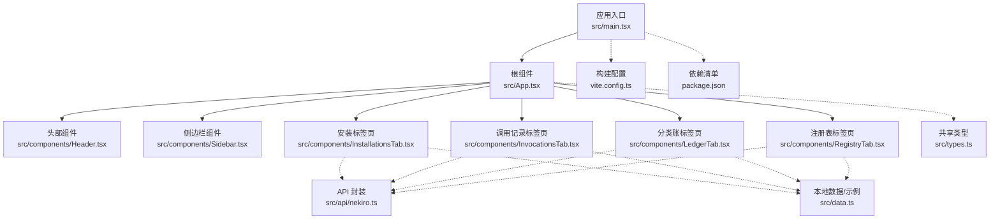
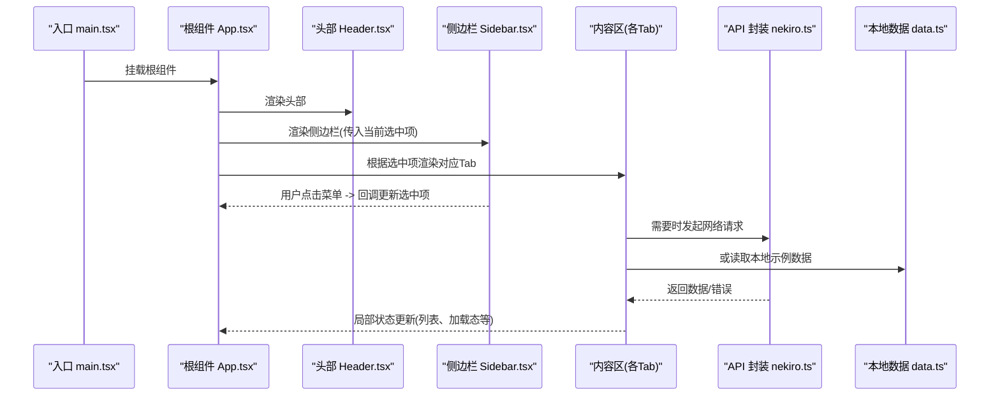
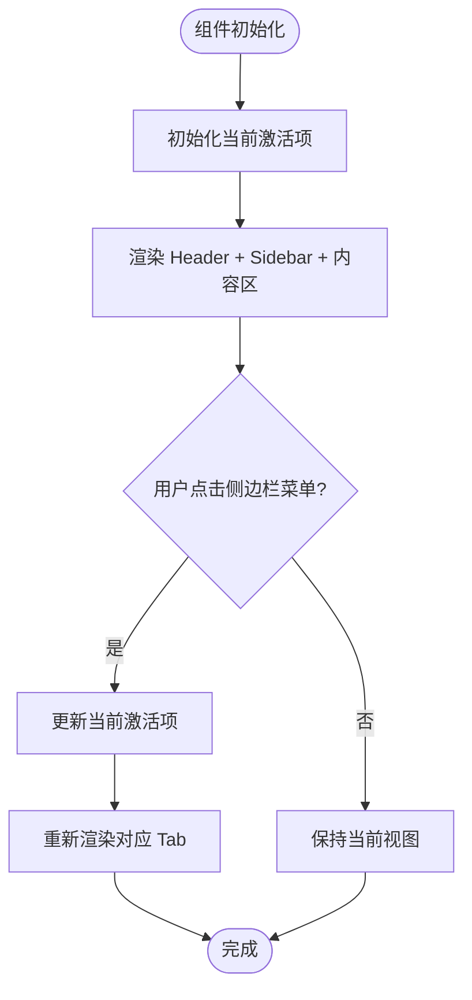
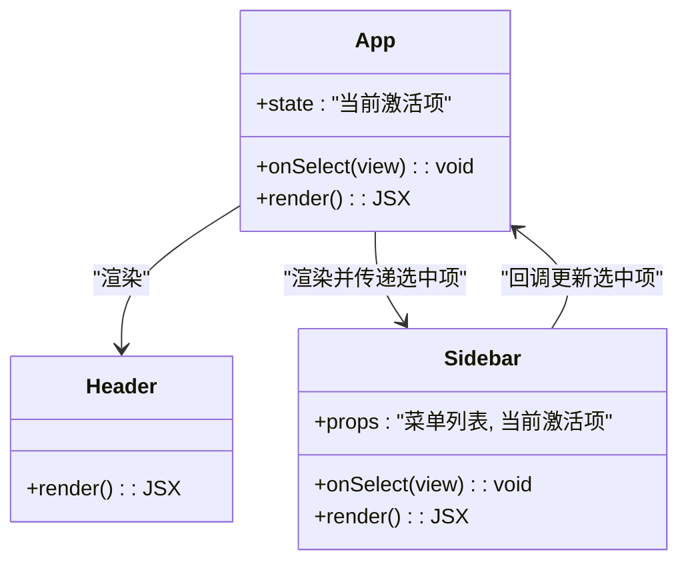
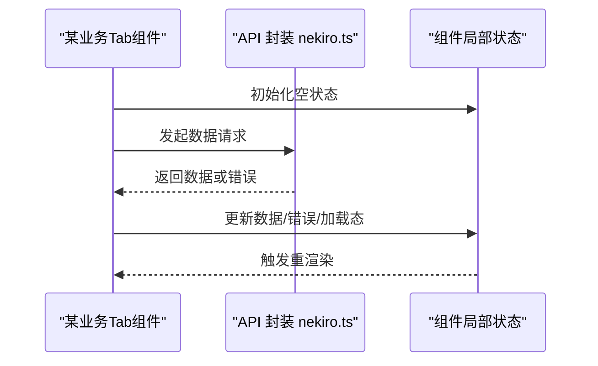
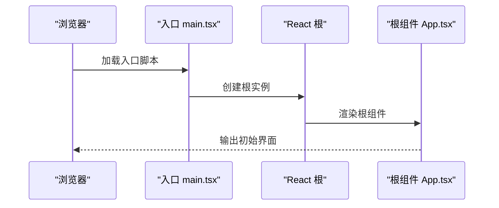
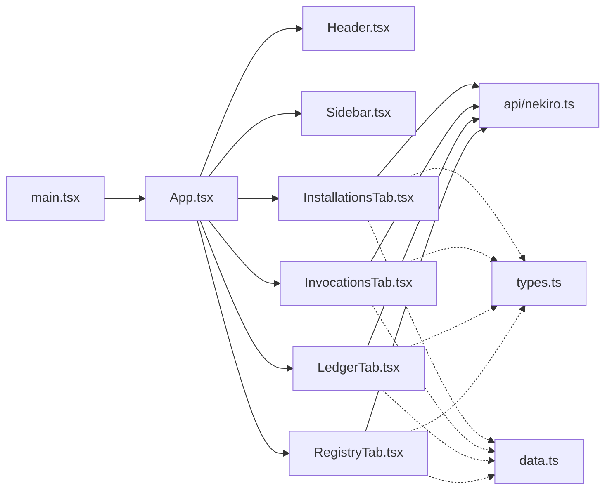

# 前端架构设计

<cite>
**本文引用的文件**   
- [main.tsx](file://src/main.tsx)
- [App.tsx](file://src/App.tsx)
- [Header.tsx](file://src/components/Header.tsx)
- [Sidebar.tsx](file://src/components/Sidebar.tsx)
- [InstallationsTab.tsx](file://src/components/InstallationsTab.tsx)
- [InvocationsTab.tsx](file://src/components/InvocationsTab.tsx)
- [LedgerTab.tsx](file://src/components/LedgerTab.tsx)
- [RegistryTab.tsx](file://src/components/RegistryTab.tsx)
- [nekiro.ts](file://src/api/nekiro.ts)
- [data.ts](file://src/data.ts)
- [types.ts](file://src/types.ts)
- [index.css](file://src/index.css)
- [vite.config.ts](file://vite.config.ts)
- [package.json](file://package.json)
</cite>

## 目录
1. [简介](#简介)
2. [项目结构](#项目结构)
3. [核心组件](#核心组件)
4. [架构总览](#架构总览)
5. [详细组件分析](#详细组件分析)
6. [依赖关系分析](#依赖关系分析)
7. [性能考虑](#性能考虑)
8. [故障排查指南](#故障排查指南)
9. [结论](#结论)
10. [附录](#附录)

## 简介
本文件面向开发者，系统化梳理 NeKiro-console 的前端架构与实现要点。重点覆盖：
- React 组件层次结构与模块化组织方式
- 根组件 App.tsx 的设计模式与组件间通信机制
- 应用入口 main.tsx 的初始化流程与配置
- 核心布局组件 Header、Sidebar 的职责与交互模式
- 组件生命周期管理策略与状态提升方案
- 组件复用模式与最佳实践
- 架构图表展示组件依赖关系和数据流向

## 项目结构
本项目采用基于功能域与职责分层相结合的目录组织方式：
- src/main.tsx：应用启动与渲染入口
- src/App.tsx：根组件，负责全局布局与路由切换
- src/components：页面级与布局级组件（Header、Sidebar 与各业务 Tab）
- src/api：对外 API 封装（如 nekiro.ts）
- src/data.ts：本地数据或示例数据
- src/types.ts：共享类型定义
- src/index.css：全局样式
- vite.config.ts：Vite 构建配置
- package.json：依赖与脚本

图表来源
- [main.tsx](file://src/main.tsx)
- [App.tsx](file://src/App.tsx)
- [Header.tsx](file://src/components/Header.tsx)
- [Sidebar.tsx](file://src/components/Sidebar.tsx)
- [InstallationsTab.tsx](file://src/components/InstallationsTab.tsx)
- [InvocationsTab.tsx](file://src/components/InvocationsTab.tsx)
- [LedgerTab.tsx](file://src/components/LedgerTab.tsx)
- [RegistryTab.tsx](file://src/components/RegistryTab.tsx)
- [nekiro.ts](file://src/api/nekiro.ts)
- [data.ts](file://src/data.ts)
- [types.ts](file://src/types.ts)
- [vite.config.ts](file://vite.config.ts)
- [package.json](file://package.json)

章节来源
- [main.tsx](file://src/main.tsx)
- [App.tsx](file://src/App.tsx)
- [Header.tsx](file://src/components/Header.tsx)
- [Sidebar.tsx](file://src/components/Sidebar.tsx)
- [InstallationsTab.tsx](file://src/components/InstallationsTab.tsx)
- [InvocationsTab.tsx](file://src/components/InvocationsTab.tsx)
- [LedgerTab.tsx](file://src/components/LedgerTab.tsx)
- [RegistryTab.tsx](file://src/components/RegistryTab.tsx)
- [nekiro.ts](file://src/api/nekiro.ts)
- [data.ts](file://src/data.ts)
- [types.ts](file://src/types.ts)
- [vite.config.ts](file://vite.config.ts)
- [package.json](file://package.json)

## 核心组件
- 根组件 App.tsx
  - 职责：提供整体布局容器，承载 Header、Sidebar 与内容区；维护当前激活的标签页状态；将导航选择通过 props 传递给 Sidebar；将选中视图名称通过 props 传递给各 Tab 组件以驱动渲染。
  - 设计模式：受控组件 + 状态提升。将“当前选中的标签”这一跨组件状态提升到 App 层，避免子组件各自维护不一致的状态。
  - 组件间通信：父传子（props），无额外事件总线或全局状态库。

- 布局组件
  - Header.tsx：顶部导航/标题区域，通常用于品牌展示与全局操作入口。
  - Sidebar.tsx：左侧导航菜单，接收当前激活项并高亮显示；点击时回调通知父组件更新状态。

- 业务标签页组件
  - InstallationsTab.tsx、InvocationsTab.tsx、LedgerTab.tsx、RegistryTab.tsx：分别对应不同业务模块的数据展示与交互。它们从 props 获取当前视图标识，必要时调用 API 或读取本地数据。

- API 与数据
  - api/nekiro.ts：对后端服务的统一封装，集中处理请求参数、错误码与响应解析。
  - data.ts：本地示例数据或静态资源，便于开发调试与演示。

- 类型与样式
  - types.ts：共享的类型定义，确保组件 props 与数据结构一致。
  - index.css：全局样式，保证布局一致性。

章节来源
- [App.tsx](file://src/App.tsx)
- [Header.tsx](file://src/components/Header.tsx)
- [Sidebar.tsx](file://src/components/Sidebar.tsx)
- [InstallationsTab.tsx](file://src/components/InstallationsTab.tsx)
- [InvocationsTab.tsx](file://src/components/InvocationsTab.tsx)
- [LedgerTab.tsx](file://src/components/LedgerTab.tsx)
- [RegistryTab.tsx](file://src/components/RegistryTab.tsx)
- [nekiro.ts](file://src/api/nekiro.ts)
- [data.ts](file://src/data.ts)
- [types.ts](file://src/types.ts)
- [index.css](file://src/index.css)

## 架构总览
下图展示了从入口到根组件再到布局与业务组件的调用链路与数据流向。

图表来源
- [main.tsx](file://src/main.tsx)
- [App.tsx](file://src/App.tsx)
- [Header.tsx](file://src/components/Header.tsx)
- [Sidebar.tsx](file://src/components/Sidebar.tsx)
- [InstallationsTab.tsx](file://src/components/InstallationsTab.tsx)
- [InvocationsTab.tsx](file://src/components/InvocationsTab.tsx)
- [LedgerTab.tsx](file://src/components/LedgerTab.tsx)
- [RegistryTab.tsx](file://src/components/RegistryTab.tsx)
- [nekiro.ts](file://src/api/nekiro.ts)
- [data.ts](file://src/data.ts)

## 详细组件分析

### 根组件 App.tsx
- 职责与模式
  - 作为布局容器，组合 Header、Sidebar 与内容区。
  - 使用状态提升管理“当前激活的标签”，使 Sidebar 与内容区保持一致。
  - 通过 props 向子组件传递必要信息（如当前视图名）。
- 关键流程
  - 初始化：设置默认激活项。
  - 交互：Sidebar 回调更新激活项，触发重新渲染对应 Tab。
  - 扩展：新增 Tab 时仅需在 App 中增加分支逻辑与对应组件引用。

图表来源
- [App.tsx](file://src/App.tsx)

章节来源
- [App.tsx](file://src/App.tsx)

### 布局组件 Header.tsx 与 Sidebar.tsx
- Header.tsx
  - 职责：展示应用标题/Logo、全局操作入口（如搜索、帮助等）。
  - 交互：通常为纯展示或触发轻量动作，不持有复杂状态。
- Sidebar.tsx
  - 职责：渲染导航菜单，高亮当前选中项。
  - 交互：点击菜单项时回调父组件（App）以更新激活项。
  - 可复用性：菜单数据可由外部注入，便于在不同场景复用。

图表来源
- [App.tsx](file://src/App.tsx)
- [Header.tsx](file://src/components/Header.tsx)
- [Sidebar.tsx](file://src/components/Sidebar.tsx)

章节来源
- [Header.tsx](file://src/components/Header.tsx)
- [Sidebar.tsx](file://src/components/Sidebar.tsx)

### 业务标签页组件（Installations / Invocations / Ledger / Registry）
- 共同职责
  - 根据 props 确定当前视图，展示相应数据与操作。
  - 可选地调用 API 获取数据，或使用本地示例数据。
- 数据流
  - 组件内部维护局部状态（如列表、分页、加载态、错误态）。
  - 通过 useEffect 类钩子在挂载或依赖变化时触发数据加载。
  - 将结果写入局部状态，驱动 UI 更新。

图表来源
- [InstallationsTab.tsx](file://src/components/InstallationsTab.tsx)
- [InvocationsTab.tsx](file://src/components/InvocationsTab.tsx)
- [LedgerTab.tsx](file://src/components/LedgerTab.tsx)
- [RegistryTab.tsx](file://src/components/RegistryTab.tsx)
- [nekiro.ts](file://src/api/nekiro.ts)

章节来源
- [InstallationsTab.tsx](file://src/components/InstallationsTab.tsx)
- [InvocationsTab.tsx](file://src/components/InvocationsTab.tsx)
- [LedgerTab.tsx](file://src/components/LedgerTab.tsx)
- [RegistryTab.tsx](file://src/components/RegistryTab.tsx)
- [nekiro.ts](file://src/api/nekiro.ts)

### 应用入口 main.tsx
- 职责
  - 创建 React 根节点并将 App 组件挂载到 DOM。
  - 引入必要的样式与运行时配置。
- 初始化流程
  - 导入根组件与样式。
  - 创建根实例并挂载到目标元素。
  - 暴露开发工具（如适用）。

图表来源
- [main.tsx](file://src/main.tsx)
- [App.tsx](file://src/App.tsx)

章节来源
- [main.tsx](file://src/main.tsx)

## 依赖关系分析
- 组件耦合
  - App 与布局组件为强耦合（父子关系），通过 props 通信，符合单一职责原则。
  - 业务 Tab 与 App 松耦合，仅依赖 props 与 API 封装。
- 外部依赖
  - API 封装位于独立模块，便于替换与测试。
  - 本地数据与类型定义解耦，利于扩展与复用。

图表来源
- [main.tsx](file://src/main.tsx)
- [App.tsx](file://src/App.tsx)
- [Header.tsx](file://src/components/Header.tsx)
- [Sidebar.tsx](file://src/components/Sidebar.tsx)
- [InstallationsTab.tsx](file://src/components/InstallationsTab.tsx)
- [InvocationsTab.tsx](file://src/components/InvocationsTab.tsx)
- [LedgerTab.tsx](file://src/components/LedgerTab.tsx)
- [RegistryTab.tsx](file://src/components/RegistryTab.tsx)
- [nekiro.ts](file://src/api/nekiro.ts)
- [data.ts](file://src/data.ts)
- [types.ts](file://src/types.ts)

章节来源
- [main.tsx](file://src/main.tsx)
- [App.tsx](file://src/App.tsx)
- [Header.tsx](file://src/components/Header.tsx)
- [Sidebar.tsx](file://src/components/Sidebar.tsx)
- [InstallationsTab.tsx](file://src/components/InstallationsTab.tsx)
- [InvocationsTab.tsx](file://src/components/InvocationsTab.tsx)
- [LedgerTab.tsx](file://src/components/LedgerTab.tsx)
- [RegistryTab.tsx](file://src/components/RegistryTab.tsx)
- [nekiro.ts](file://src/api/nekiro.ts)
- [data.ts](file://src/data.ts)
- [types.ts](file://src/types.ts)

## 性能考虑
- 渲染优化
  - 合理使用 React.memo 包裹纯展示型组件（如 Header、菜单项），减少不必要的重渲染。
  - 对大列表进行虚拟化或分页加载，避免一次性渲染过多节点。
- 数据加载
  - 在 Tab 组件中使用条件加载与缓存策略，避免重复请求。
  - 对 API 请求添加去抖/节流，防止频繁触发。
- 构建与打包
  - 利用 Vite 的代码分割与按需加载特性，拆分大型模块。
  - 合理配置别名与路径映射，提升编译效率。

[本节为通用指导，无需特定文件来源]

## 故障排查指南
- 常见问题定位
  - 页面空白：检查入口是否成功挂载根组件，确认 DOM 目标元素存在。
  - 菜单不生效：核对 Sidebar 回调是否正确更新 App 的激活项状态。
  - 数据未刷新：检查 Tab 组件的依赖数组与副作用触发时机。
  - 接口报错：查看 API 封装的错误处理与日志输出，确认请求参数与鉴权头。
- 建议的调试手段
  - 在关键回调处打印状态变更，观察状态提升链路。
  - 使用浏览器开发者工具的 Network 面板验证 API 行为。
  - 对复杂组件增加最小复现用例，逐步缩小问题范围。

章节来源
- [main.tsx](file://src/main.tsx)
- [App.tsx](file://src/App.tsx)
- [Sidebar.tsx](file://src/components/Sidebar.tsx)
- [InstallationsTab.tsx](file://src/components/InstallationsTab.tsx)
- [InvocationsTab.tsx](file://src/components/InvocationsTab.tsx)
- [LedgerTab.tsx](file://src/components/LedgerTab.tsx)
- [RegistryTab.tsx](file://src/components/RegistryTab.tsx)
- [nekiro.ts](file://src/api/nekiro.ts)

## 结论
NeKiro-console 采用清晰的父子层级与状态提升模式，实现了布局与业务解耦。通过统一的 API 封装与类型定义，提升了可维护性与可扩展性。建议在后续迭代中持续完善错误边界、加载骨架与单元测试，进一步提升健壮性与开发体验。

[本节为总结性内容，无需特定文件来源]

## 附录
- 构建与运行
  - 使用包管理器安装依赖后，通过开发服务器启动应用。
  - 构建产物由 Vite 生成，可按需调整输出目录与压缩策略。
- 配置参考
  - 构建配置位于 vite.config.ts，包含插件、别名与代理等选项。
  - 依赖清单与脚本位于 package.json。

章节来源
- [vite.config.ts](file://vite.config.ts)
- [package.json](file://package.json)