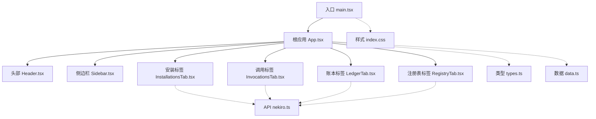
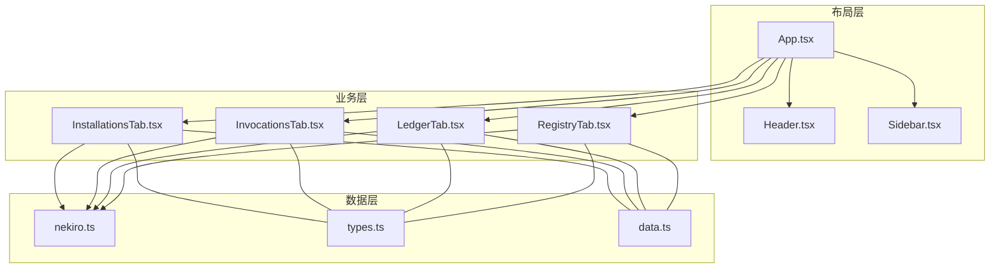
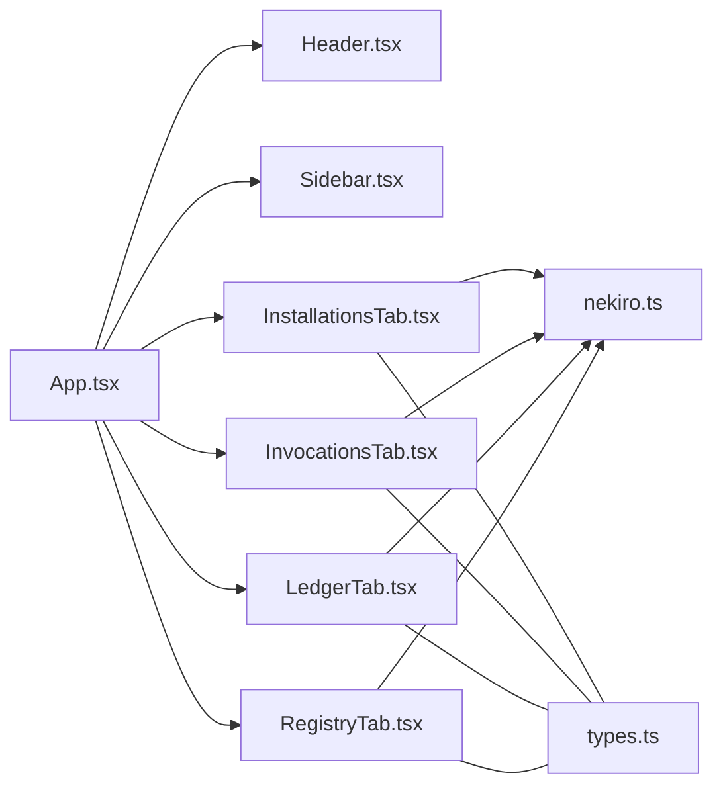

# 技术架构

<cite>
**本文引用的文件**   
- [App.tsx](file://src/App.tsx)
- [main.tsx](file://src/main.tsx)
- [types.ts](file://src/types.ts)
- [data.ts](file://src/data.ts)
- [Header.tsx](file://src/components/Header.tsx)
- [Sidebar.tsx](file://src/components/Sidebar.tsx)
- [InstallationsTab.tsx](file://src/components/InstallationsTab.tsx)
- [InvocationsTab.tsx](file://src/components/InvocationsTab.tsx)
- [LedgerTab.tsx](file://src/components/LedgerTab.tsx)
- [RegistryTab.tsx](file://src/components/RegistryTab.tsx)
- [nekiro.ts](file://src/api/nekiro.ts)
- [index.css](file://src/index.css)
- [vite.config.ts](file://vite.config.ts)
- [tsconfig.json](file://tsconfig.json)
- [package.json](file://package.json)
</cite>

## 目录
1. [简介](#简介)
2. [项目结构](#项目结构)
3. [核心组件](#核心组件)
4. [架构总览](#架构总览)
5. [详细组件分析](#详细组件分析)
6. [依赖关系分析](#依赖关系分析)
7. [性能考量](#性能考量)
8. [故障排查指南](#故障排查指南)
9. [结论](#结论)
10. [附录](#附录)

## 简介
本技术架构文档面向架构师与高级开发者，系统性阐述 NeKiro-console 的前端应用设计。内容涵盖 React 组件层次、状态管理策略、模块化组织、TypeScript 类型体系、样式与主题方案、组件生命周期管理与性能优化，并提供架构图与数据流图，帮助读者快速把握系统全貌与关键决策权衡。

## 项目结构
NeKiro-console 采用基于功能域与职责分层的组织方式：
- 入口与根应用：main.tsx 负责初始化 React 应用；App.tsx 作为根容器编排布局与页面路由（或标签页切换）。
- 业务组件：components 目录下按功能划分 Header、Sidebar 以及多个 Tab 组件（安装、调用、账本、注册表等），体现“页面级组件”的拆分思路。
- 数据与类型：types.ts 定义全局类型契约；data.ts 提供本地示例数据或静态配置；api 目录封装后端交互接口。
- 构建与工程化：vite.config.ts、tsconfig.json、package.json 分别定义构建、类型与依赖。
- 样式：index.css 承载全局样式与主题变量。

图表来源
- [main.tsx](file://src/main.tsx)
- [App.tsx](file://src/App.tsx)
- [Header.tsx](file://src/components/Header.tsx)
- [Sidebar.tsx](file://src/components/Sidebar.tsx)
- [InstallationsTab.tsx](file://src/components/InstallationsTab.tsx)
- [InvocationsTab.tsx](file://src/components/InvocationsTab.tsx)
- [LedgerTab.tsx](file://src/components/LedgerTab.tsx)
- [RegistryTab.tsx](file://src/components/RegistryTab.tsx)
- [nekiro.ts](file://src/api/nekiro.ts)
- [types.ts](file://src/types.ts)
- [data.ts](file://src/data.ts)
- [index.css](file://src/index.css)

章节来源
- [main.tsx](file://src/main.tsx)
- [App.tsx](file://src/App.tsx)
- [types.ts](file://src/types.ts)
- [data.ts](file://src/data.ts)
- [Header.tsx](file://src/components/Header.tsx)
- [Sidebar.tsx](file://src/components/Sidebar.tsx)
- [InstallationsTab.tsx](file://src/components/InstallationsTab.tsx)
- [InvocationsTab.tsx](file://src/components/InvocationsTab.tsx)
- [LedgerTab.tsx](file://src/components/LedgerTab.tsx)
- [RegistryTab.tsx](file://src/components/RegistryTab.tsx)
- [nekiro.ts](file://src/api/nekiro.ts)
- [index.css](file://src/index.css)
- [vite.config.ts](file://vite.config.ts)
- [tsconfig.json](file://tsconfig.json)
- [package.json](file://package.json)

## 核心组件
- 根应用 App.tsx：负责整体布局与子模块装配，协调头部、侧边栏与内容区，并维护跨组件共享状态（如当前选中标签、用户信息、主题开关等）。
- 头部 Header.tsx：展示应用标题、导航入口与全局操作（如搜索、设置、用户菜单）。
- 侧边栏 Sidebar.tsx：提供功能导航与快捷入口，支持折叠与高亮当前项。
- 标签页组件：
  - InstallationsTab.tsx：管理安装列表、新增/删除/更新等操作。
  - InvocationsTab.tsx：展示调用记录、筛选与详情查看。
  - LedgerTab.tsx：呈现账本数据、统计汇总与导出能力。
  - RegistryTab.tsx：维护注册表条目、版本管理与发布流程。
- API 层 nekiro.ts：统一封装 HTTP 请求、错误处理与重试策略，为各 Tab 提供一致的数据访问接口。
- 类型与数据：
  - types.ts：集中定义领域模型、API 响应/请求体、枚举与联合类型，确保前后端契约一致。
  - data.ts：提供本地示例数据或静态配置，便于开发调试与演示。

章节来源
- [App.tsx](file://src/App.tsx)
- [Header.tsx](file://src/components/Header.tsx)
- [Sidebar.tsx](file://src/components/Sidebar.tsx)
- [InstallationsTab.tsx](file://src/components/InstallationsTab.tsx)
- [InvocationsTab.tsx](file://src/components/InvocationsTab.tsx)
- [LedgerTab.tsx](file://src/components/LedgerTab.tsx)
- [RegistryTab.tsx](file://src/components/RegistryTab.tsx)
- [nekiro.ts](file://src/api/nekiro.ts)
- [types.ts](file://src/types.ts)
- [data.ts](file://src/data.ts)

## 架构总览
前端采用“轻量状态 + 明确边界”的架构风格：
- 组件分层：布局层（App、Header、Sidebar）与业务层（各 Tab）解耦，通过 props 与回调传递数据与事件。
- 状态管理：优先使用 React 内置状态（useState/useReducer）与上下文（useContext）进行局部与跨层级状态共享；避免过度引入外部状态库，保持可维护性与学习成本可控。
- 数据获取：在业务组件中发起请求，交由 api 层统一处理网络细节；必要时结合缓存与去抖/节流策略提升体验。
- 类型驱动：以 types.ts 为中心，贯穿组件 props、API 响应与本地数据结构，减少运行时错误。
- 样式与主题：通过 CSS 变量与全局样式文件实现主题切换与一致性视觉规范。

图表来源
- [App.tsx](file://src/App.tsx)
- [Header.tsx](file://src/components/Header.tsx)
- [Sidebar.tsx](file://src/components/Sidebar.tsx)
- [InstallationsTab.tsx](file://src/components/InstallationsTab.tsx)
- [InvocationsTab.tsx](file://src/components/InvocationsTab.tsx)
- [LedgerTab.tsx](file://src/components/LedgerTab.tsx)
- [RegistryTab.tsx](file://src/components/RegistryTab.tsx)
- [nekiro.ts](file://src/api/nekiro.ts)
- [types.ts](file://src/types.ts)
- [data.ts](file://src/data.ts)

## 详细组件分析

### 根应用 App.tsx
- 职责：组合布局与业务模块，维护全局 UI 状态（如当前标签、主题、用户会话），提供向下透传的上下文或回调。
- 状态策略：对跨组件共享的小规模状态使用 useState/useReducer；对更复杂的副作用与派生状态考虑 useReducer 配合自定义 Hook。
- 路由/导航：若未引入路由库，则以状态驱动渲染不同 Tab 内容；若引入路由，则在此处配置路由映射与守卫逻辑。
- 性能要点：将稳定不变的 props 使用 useMemo/useCallback 包裹；对大型列表采用虚拟滚动或分页加载。

章节来源
- [App.tsx](file://src/App.tsx)

### 头部 Header.tsx
- 职责：展示品牌信息与全局操作入口，支持搜索、通知、用户菜单等。
- 交互模式：通过回调向父组件上报动作（如打开设置、切换主题、登出）。
- 可访问性：为关键按钮添加 aria-* 属性与键盘导航支持。

章节来源
- [Header.tsx](file://src/components/Header.tsx)

### 侧边栏 Sidebar.tsx
- 职责：提供功能导航与快捷入口，支持折叠与高亮当前项。
- 状态管理：维护当前选中项与展开/收起状态；与 App 同步导航目标。
- 扩展性：通过配置化菜单项驱动渲染，便于后续接入权限控制与动态菜单。

章节来源
- [Sidebar.tsx](file://src/components/Sidebar.tsx)

### 安装标签 InstallationsTab.tsx
- 职责：展示安装清单，支持新增、编辑、删除、批量操作与状态过滤。
- 数据流：从 API 拉取数据，转换为本地状态；提交变更时调用 API 并乐观更新 UI。
- 错误处理：捕获网络与业务异常，提示用户并回滚乐观更新。

章节来源
- [InstallationsTab.tsx](file://src/components/InstallationsTab.tsx)
- [nekiro.ts](file://src/api/nekiro.ts)
- [types.ts](file://src/types.ts)

### 调用标签 InvocationsTab.tsx
- 职责：展示调用记录，支持时间范围筛选、关键字检索与详情查看。
- 性能优化：分页加载、查询去抖、结果缓存；大列表虚拟化渲染。
- 数据一致性：与后端保持一致的分页与排序语义。

章节来源
- [InvocationsTab.tsx](file://src/components/InvocationsTab.tsx)
- [nekiro.ts](file://src/api/nekiro.ts)
- [types.ts](file://src/types.ts)

### 账本标签 LedgerTab.tsx
- 职责：呈现账本数据、统计汇总与导出能力。
- 计算逻辑：聚合统计可通过 useMemo 派生，避免重复计算。
- 导出策略：生成 CSV/JSON 并通过 Blob 下载，注意大数据量时的内存占用。

章节来源
- [LedgerTab.tsx](file://src/components/LedgerTab.tsx)
- [types.ts](file://src/types.ts)

### 注册表标签 RegistryTab.tsx
- 职责：维护注册表条目、版本管理与发布流程。
- 并发控制：防止重复提交与竞态条件，使用请求锁或队列机制。
- 校验与反馈：表单校验失败即时提示，成功操作后刷新列表。

章节来源
- [RegistryTab.tsx](file://src/components/RegistryTab.tsx)
- [nekiro.ts](file://src/api/nekiro.ts)
- [types.ts](file://src/types.ts)

### API 层 nekiro.ts
- 职责：统一封装 HTTP 请求、错误处理、重试与拦截器（鉴权头、超时、日志）。
- 类型安全：返回类型由 types.ts 约束，确保调用方获得强类型推断。
- 可观测性：埋点关键指标（耗时、错误率），便于监控与排障。

章节来源
- [nekiro.ts](file://src/api/nekiro.ts)
- [types.ts](file://src/types.ts)

### 类型体系 types.ts
- 设计理念：以领域模型为核心，定义实体、枚举、联合类型与 API 契约；通过泛型与工具类型提升复用与可读性。
- 规范建议：
  - 命名：使用 PascalCase 表示类型，camelCase 表示字段。
  - 可选字段：显式标注可选性，避免隐式 undefined。
  - 错误模型：统一错误码与消息结构，便于前端统一处理。
  - 常量：将枚举值集中管理，避免魔法字符串。

章节来源
- [types.ts](file://src/types.ts)

### 数据与配置 data.ts
- 职责：提供本地示例数据或静态配置，用于开发阶段快速验证与演示。
- 演进路径：随产品推进逐步替换为真实 API 数据，保留兼容层以便平滑迁移。

章节来源
- [data.ts](file://src/data.ts)

### 样式与主题 index.css
- 主题变量：通过 CSS 自定义属性定义颜色、字号、间距等，支持明暗主题切换。
- 组件样式：优先使用 CSS Modules 或原子化方案（如 Tailwind）以提升可维护性；当前以全局样式为主，后续可按需迁移。
- 可访问性：遵循对比度与焦点可见性规范，确保无障碍体验。

章节来源
- [index.css](file://src/index.css)

## 依赖关系分析
- 内部依赖：
  - 布局层依赖业务层组件；业务层依赖 API 层与类型定义。
  - 类型定义被所有层引用，形成稳定的契约中心。
- 外部依赖：
  - React 生态（React、ReactDOM、Vite、TypeScript）。
  - HTTP 客户端（如 fetch/axios）由 API 层封装。
- 潜在风险：
  - 循环依赖：确保组件间单向依赖，避免双向 import。
  - 类型漂移：严格开启 TypeScript 严格模式，定期运行类型检查。

图表来源
- [App.tsx](file://src/App.tsx)
- [Header.tsx](file://src/components/Header.tsx)
- [Sidebar.tsx](file://src/components/Sidebar.tsx)
- [InstallationsTab.tsx](file://src/components/InstallationsTab.tsx)
- [InvocationsTab.tsx](file://src/components/InvocationsTab.tsx)
- [LedgerTab.tsx](file://src/components/LedgerTab.tsx)
- [RegistryTab.tsx](file://src/components/RegistryTab.tsx)
- [nekiro.ts](file://src/api/nekiro.ts)
- [types.ts](file://src/types.ts)

章节来源
- [App.tsx](file://src/App.tsx)
- [types.ts](file://src/types.ts)
- [nekiro.ts](file://src/api/nekiro.ts)

## 性能考量
- 渲染优化：
  - 合理使用 React.memo、useMemo、useCallback 减少不必要的重渲染。
  - 大列表采用分页、无限滚动或虚拟化渲染。
- 数据获取：
  - 请求去抖/节流，避免频繁触发。
  - 结果缓存与失效策略（时间戳、版本号或键名）。
- 资源加载：
  - 按需懒加载组件与路由，减小首屏体积。
  - 图片与静态资源压缩与 CDN 加速。
- 内存管理：
  - 及时清理定时器与事件监听器，避免泄漏。
  - 大数据导出时采用流式处理或分块生成。

[本节为通用指导，不直接分析具体文件]

## 故障排查指南
- 常见问题定位：
  - 网络错误：检查 API 层错误处理与重试策略，确认鉴权头与超时配置。
  - 类型错误：运行类型检查，核对 types.ts 与 API 响应结构是否一致。
  - 状态不一致：审查状态更新路径与副作用顺序，确保幂等与回滚逻辑。
- 调试建议：
  - 启用开发工具面板（React DevTools、Network、Console）。
  - 在关键路径增加结构化日志与埋点，便于追踪问题链路。
  - 使用最小复现案例隔离问题，逐步缩小范围。

章节来源
- [nekiro.ts](file://src/api/nekiro.ts)
- [types.ts](file://src/types.ts)

## 结论
NeKiro-console 采用清晰的分层与职责分离，结合类型驱动与轻量状态管理，在保证可维护性的同时兼顾性能与可扩展性。未来可在以下方面持续演进：
- 引入路由与权限控制，增强导航与访问治理能力。
- 完善错误与监控体系，提升线上稳定性与可观测性。
- 渐进式样式现代化，提升主题与多端适配能力。

[本节为总结性内容，不直接分析具体文件]

## 附录

### 构建与工程化
- Vite 配置：vite.config.ts 定义开发服务器、插件与构建选项。
- TypeScript：tsconfig.json 配置严格模式与路径别名，保障类型安全与代码质量。
- 依赖管理：package.json 声明项目依赖与脚本命令。

章节来源
- [vite.config.ts](file://vite.config.ts)
- [tsconfig.json](file://tsconfig.json)
- [package.json](file://package.json)