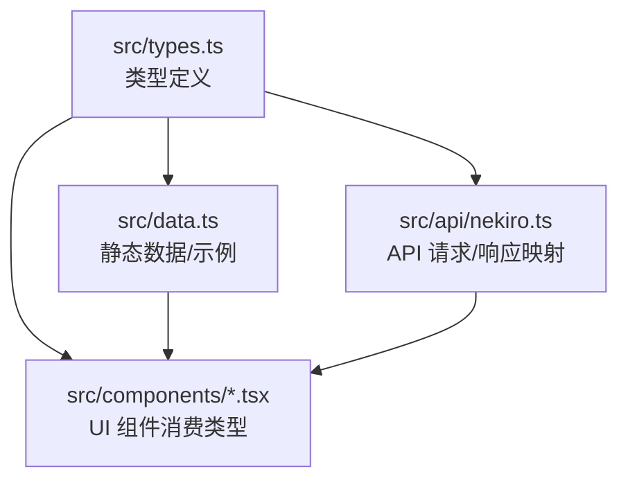
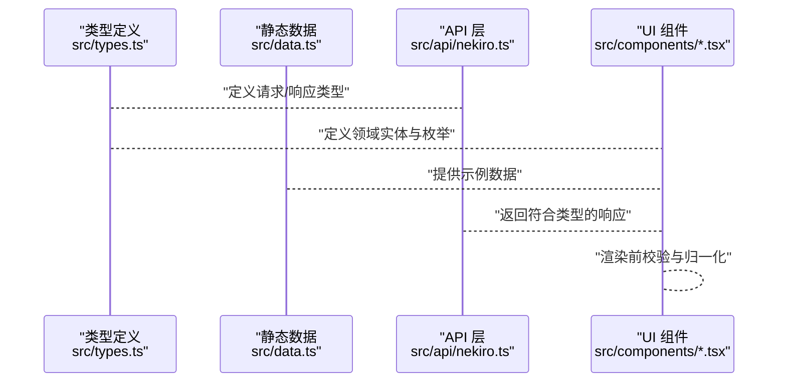
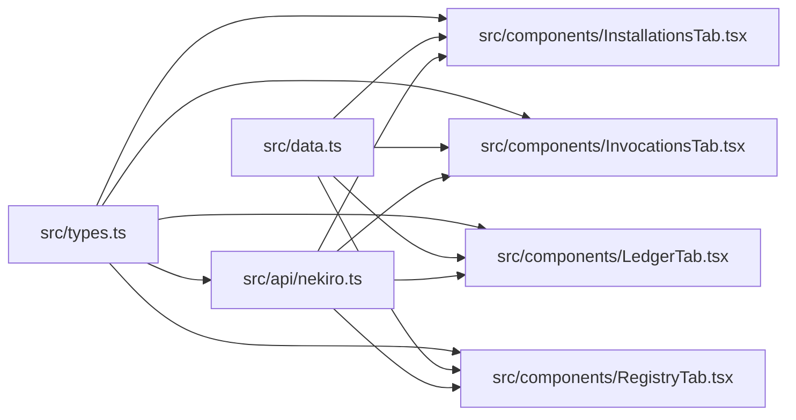

# 数据模型设计

<cite>
**本文引用的文件**   
- [src/types.ts](file://src/types.ts)
- [src/data.ts](file://src/data.ts)
- [src/api/nekiro.ts](file://src/api/nekiro.ts)
- [src/components/InstallationsTab.tsx](file://src/components/InstallationsTab.tsx)
- [src/components/InvocationsTab.tsx](file://src/components/InvocationsTab.tsx)
- [src/components/LedgerTab.tsx](file://src/components/LedgerTab.tsx)
- [src/components/RegistryTab.tsx](file://src/components/RegistryTab.tsx)
</cite>

## 目录
1. [简介](#简介)
2. [项目结构](#项目结构)
3. [核心组件](#核心组件)
4. [架构总览](#架构总览)
5. [详细组件分析](#详细组件分析)
6. [依赖分析](#依赖分析)
7. [性能考虑](#性能考虑)
8. [故障排查指南](#故障排查指南)
9. [结论](#结论)
10. [附录](#附录)

## 简介
本文件面向 NeKiro-console 的数据模型设计与使用，聚焦 TypeScript 类型定义、数据结构与字段约束、静态数据管理、配置模式、数据验证与业务约束、序列化/反序列化策略，以及类型安全的开发实践。文档旨在为开发者提供清晰、可操作的数据模型参考与最佳实践，帮助在 UI 组件与 API 层之间建立一致、可维护的数据契约。

## 项目结构
NeKiro-console 的数据模型相关代码主要分布在以下位置：
- 类型定义：src/types.ts
- 静态数据与示例：src/data.ts
- API 请求与响应映射：src/api/nekiro.ts
- 页面级 Tab 组件（消费数据模型）：src/components/*.tsx

图表来源
- [src/types.ts](file://src/types.ts)
- [src/data.ts](file://src/data.ts)
- [src/api/nekiro.ts](file://src/api/nekiro.ts)
- [src/components/InstallationsTab.tsx](file://src/components/InstallationsTab.tsx)
- [src/components/InvocationsTab.tsx](file://src/components/InvocationsTab.tsx)
- [src/components/LedgerTab.tsx](file://src/components/LedgerTab.tsx)
- [src/components/RegistryTab.tsx](file://src/components/RegistryTab.tsx)

章节来源
- [src/types.ts](file://src/types.ts)
- [src/data.ts](file://src/data.ts)
- [src/api/nekiro.ts](file://src/api/nekiro.ts)
- [src/components/InstallationsTab.tsx](file://src/components/InstallationsTab.tsx)
- [src/components/InvocationsTab.tsx](file://src/components/InvocationsTab.tsx)
- [src/components/LedgerTab.tsx](file://src/components/LedgerTab.tsx)
- [src/components/RegistryTab.tsx](file://src/components/RegistryTab.tsx)

## 核心组件
本节从“类型—数据—接口—视图”的链路出发，梳理 NeKiro-console 数据模型的核心要点。

- 类型定义中心
  - 单一类型入口：所有领域实体、枚举、联合类型、泛型约束均集中在 src/types.ts，便于统一管理与复用。
  - 命名规范：采用 PascalCase 表示类型与接口；枚举值使用大写加下划线；联合类型以 XxxOrYyy 形式表达互斥状态。
  - 可选与必填：通过 ? 标记可选字段；对关键标识与状态字段保持必填，避免运行时空指针。
  - 联合类型与判别式：对于多态数据，优先使用带字面量字段的判别式联合，确保分支安全。
  - 泛型使用：对通用容器（如分页、列表包装、表单结果）使用泛型参数，提升复用性与可读性。

- 静态数据与示例
  - 示例数据：src/data.ts 提供最小可用示例，用于本地开发与演示，建议与真实 API 返回结构保持一致。
  - 常量与字典：将不可变配置（如枚举映射、默认值、校验规则）集中管理，避免散落在组件中。

- API 契约
  - 请求/响应类型：在 src/api/nekiro.ts 中明确定义请求体与响应体的类型，保证前后端契约一致性。
  - 错误模型：统一错误码与消息结构，便于前端统一处理与展示。

- UI 消费
  - 组件仅消费已定义的领域类型，不自行构造未声明的结构，减少类型漂移风险。
  - 在渲染前进行必要的数据归一化与校验，确保进入渲染逻辑的数据满足约束。

章节来源
- [src/types.ts](file://src/types.ts)
- [src/data.ts](file://src/data.ts)
- [src/api/nekiro.ts](file://src/api/nekiro.ts)
- [src/components/InstallationsTab.tsx](file://src/components/InstallationsTab.tsx)
- [src/components/InvocationsTab.tsx](file://src/components/InvocationsTab.tsx)
- [src/components/LedgerTab.tsx](file://src/components/LedgerTab.tsx)
- [src/components/RegistryTab.tsx](file://src/components/RegistryTab.tsx)

## 架构总览
下图展示了数据模型在系统中的流转路径：类型定义作为契约，驱动 API 层与 UI 层的实现，静态数据用于本地演示与测试。

图表来源
- [src/types.ts](file://src/types.ts)
- [src/data.ts](file://src/data.ts)
- [src/api/nekiro.ts](file://src/api/nekiro.ts)
- [src/components/InstallationsTab.tsx](file://src/components/InstallationsTab.tsx)
- [src/components/InvocationsTab.tsx](file://src/components/InvocationsTab.tsx)
- [src/components/LedgerTab.tsx](file://src/components/LedgerTab.tsx)
- [src/components/RegistryTab.tsx](file://src/components/RegistryTab.tsx)

## 详细组件分析

### 类型系统与设计规范
- 接口与实体
  - 每个领域对象对应一个接口，包含唯一标识、时间戳、状态等公共字段，便于跨模块复用。
  - 对敏感或易错字段增加只读语义（通过 const 或工具函数封装），防止意外修改。
- 联合类型与判别式
  - 使用字面量字段作为判别式，配合条件分支，确保所有可能状态都被显式处理。
- 泛型与容器
  - 列表、分页、表单提交结果等使用泛型包裹，提高复用度与可读性。
- 枚举与常量
  - 将业务枚举集中定义，并提供映射表，避免魔法字符串。
- 可选与必填
  - 必填字段用于强约束（如 ID、状态），可选字段用于扩展点（如备注、额外信息）。

章节来源
- [src/types.ts](file://src/types.ts)

### 静态数据与配置模式
- 示例数据
  - 使用与 API 一致的字段结构，便于在 UI 中进行端到端演示。
- 配置项
  - 将 UI 文案、默认筛选、分页大小等配置集中管理，支持按环境切换。
- 常量与字典
  - 将枚举值与显示文本的映射集中管理，避免重复计算与不一致。

章节来源
- [src/data.ts](file://src/data.ts)

### API 层数据契约
- 请求类型
  - 明确查询参数、过滤条件、排序与分页字段，避免歧义。
- 响应类型
  - 统一成功/失败结构，包含数据体与错误信息，便于统一处理。
- 错误模型
  - 定义错误码、错误消息与附加上下文，便于前端提示与日志记录。

章节来源
- [src/api/nekiro.ts](file://src/api/nekiro.ts)

### UI 组件数据消费
- InstallationsTab
  - 消费安装相关的领域类型，负责展示安装列表、状态与详情。
- InvocationsTab
  - 消费调用记录相关类型，负责展示调用历史、耗时与结果摘要。
- LedgerTab
  - 消费账本/流水相关类型，负责展示条目明细与汇总。
- RegistryTab
  - 消费注册表相关类型，负责展示注册项与版本信息。

章节来源
- [src/components/InstallationsTab.tsx](file://src/components/InstallationsTab.tsx)
- [src/components/InvocationsTab.tsx](file://src/components/InvocationsTab.tsx)
- [src/components/LedgerTab.tsx](file://src/components/LedgerTab.tsx)
- [src/components/RegistryTab.tsx](file://src/components/RegistryTab.tsx)

### 数据验证与业务约束
- 输入校验
  - 在提交前对关键字段进行非空、格式与范围校验，尽早拦截非法输入。
- 状态机
  - 对生命周期字段（如状态）使用有限状态集合，禁止任意赋值。
- 幂等与去重
  - 对创建类操作引入幂等键或唯一约束，避免重复提交导致的数据异常。
- 容错与降级
  - 对缺失字段提供默认值或降级展示，保证 UI 可用性。

章节来源
- [src/types.ts](file://src/types.ts)
- [src/api/nekiro.ts](file://src/api/nekiro.ts)
- [src/components/InstallationsTab.tsx](file://src/components/InstallationsTab.tsx)
- [src/components/InvocationsTab.tsx](file://src/components/InvocationsTab.tsx)
- [src/components/LedgerTab.tsx](file://src/components/LedgerTab.tsx)
- [src/components/RegistryTab.tsx](file://src/components/RegistryTab.tsx)

### 序列化与反序列化
- 入站数据
  - 接收后端 JSON 后，先进行基础校验，再转换为内部领域类型。
- 出站数据
  - 提交前将内部类型序列化为 API 期望的格式，去除多余字段并补齐必填字段。
- 时区与日期
  - 统一使用 ISO 字符串或时间戳，并在边界处进行转换，避免浏览器差异。
- 大对象优化
  - 对大型列表采用分页与懒加载，减少一次性解析开销。

章节来源
- [src/api/nekiro.ts](file://src/api/nekiro.ts)
- [src/types.ts](file://src/types.ts)

### 类型安全的开发模式与最佳实践
- 单一事实来源
  - 所有类型定义集中于 src/types.ts，避免多处重复定义造成不一致。
- 判别式联合
  - 使用字面量字段区分多态数据，强制分支覆盖，减少遗漏。
- 工具函数封装
  - 将常见转换、校验、格式化逻辑封装为纯函数，便于测试与复用。
- 常量与字典
  - 将枚举与显示映射集中管理，避免硬编码。
- 渐进式增强
  - 新增字段时保持向后兼容，优先使用可选字段与默认值。

章节来源
- [src/types.ts](file://src/types.ts)
- [src/data.ts](file://src/data.ts)
- [src/api/nekiro.ts](file://src/api/nekiro.ts)

## 依赖分析
类型定义是系统的契约中心，API 层与 UI 层都依赖其保持一致。静态数据主要用于演示与测试，不改变契约关系。

图表来源
- [src/types.ts](file://src/types.ts)
- [src/data.ts](file://src/data.ts)
- [src/api/nekiro.ts](file://src/api/nekiro.ts)
- [src/components/InstallationsTab.tsx](file://src/components/InstallationsTab.tsx)
- [src/components/InvocationsTab.tsx](file://src/components/InvocationsTab.tsx)
- [src/components/LedgerTab.tsx](file://src/components/LedgerTab.tsx)
- [src/components/RegistryTab.tsx](file://src/components/RegistryTab.tsx)

章节来源
- [src/types.ts](file://src/types.ts)
- [src/data.ts](file://src/data.ts)
- [src/api/nekiro.ts](file://src/api/nekiro.ts)
- [src/components/InstallationsTab.tsx](file://src/components/InstallationsTab.tsx)
- [src/components/InvocationsTab.tsx](file://src/components/InvocationsTab.tsx)
- [src/components/LedgerTab.tsx](file://src/components/LedgerTab.tsx)
- [src/components/RegistryTab.tsx](file://src/components/RegistryTab.tsx)

## 性能考虑
- 类型检查成本
  - 合理拆分类型文件，避免单文件过大导致编译缓慢。
- 数据体积
  - 对大型列表采用分页、按需加载与虚拟滚动，降低内存占用。
- 序列化开销
  - 仅在必要时进行深拷贝与转换，避免频繁复制大对象。
- 缓存策略
  - 对不变或低频变更的配置与字典进行缓存，减少重复计算。

[本节为通用指导，无需源码引用]

## 故障排查指南
- 类型不匹配
  - 现象：编译期报错或运行期 undefined。
  - 排查：确认 API 响应结构与类型定义一致，必要时添加断言或守卫函数。
- 状态分支遗漏
  - 现象：某些状态未处理导致 UI 异常。
  - 排查：检查判别式联合的所有分支是否覆盖，补充默认分支。
- 字段缺失或为空
  - 现象：渲染空白或崩溃。
  - 排查：在边界处进行空值合并与默认值设置，确保下游消费安全。
- 时区与日期问题
  - 现象：时间显示不正确。
  - 排查：统一时区与格式，避免在不同浏览器环境下出现差异。

章节来源
- [src/types.ts](file://src/types.ts)
- [src/api/nekiro.ts](file://src/api/nekiro.ts)
- [src/components/InstallationsTab.tsx](file://src/components/InstallationsTab.tsx)
- [src/components/InvocationsTab.tsx](file://src/components/InvocationsTab.tsx)
- [src/components/LedgerTab.tsx](file://src/components/LedgerTab.tsx)
- [src/components/RegistryTab.tsx](file://src/components/RegistryTab.tsx)

## 结论
NeKiro-console 的数据模型以类型定义为契约中心，贯穿 API 层与 UI 层，结合静态数据与配置模式，形成稳定、可扩展的数据体系。通过严格的字段约束、判别式联合与泛型容器，提升了类型安全与可维护性。遵循本文的最佳实践，可在保证正确性的同时提升开发效率与用户体验。

[本节为总结性内容，无需源码引用]

## 附录
- 术语
  - 判别式联合：通过特定字面量字段区分不同子类型的联合类型。
  - 契约：前后端共享的类型约定，确保数据一致性。
- 参考路径
  - 类型定义：src/types.ts
  - 静态数据：src/data.ts
  - API 契约：src/api/nekiro.ts
  - 组件消费：src/components/*.tsx

[本节为补充说明，无需源码引用]