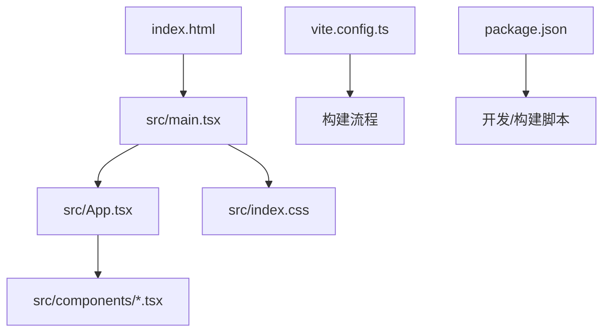
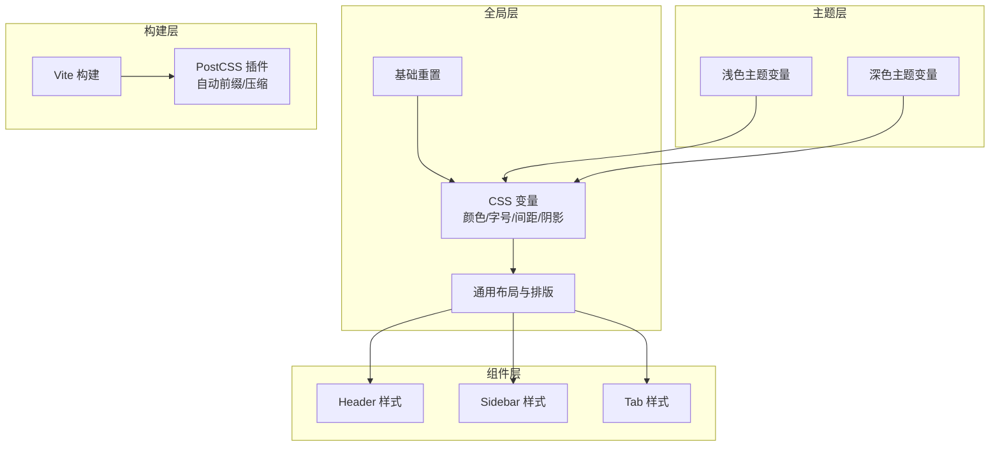
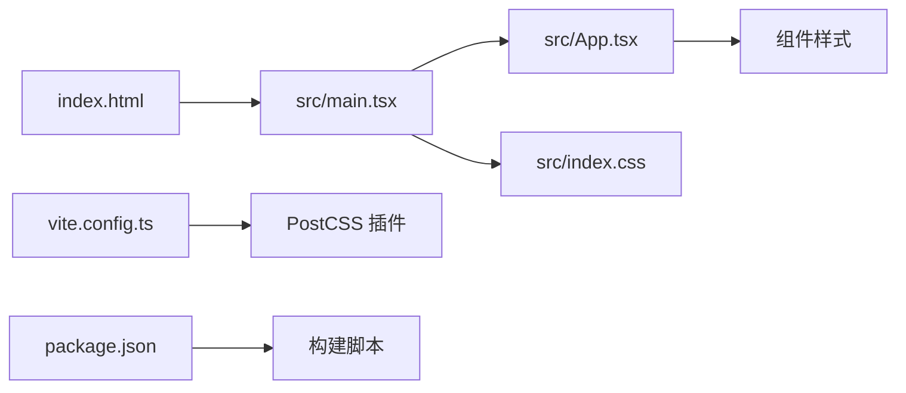

# 样式架构

<cite>
**本文引用的文件**   
- [src/index.css](file://src/index.css)
- [src/App.tsx](file://src/App.tsx)
- [src/main.tsx](file://src/main.tsx)
- [index.html](file://index.html)
- [package.json](file://package.json)
- [vite.config.ts](file://vite.config.ts)
</cite>

## 目录
1. [简介](#简介)
2. [项目结构](#项目结构)
3. [核心组件](#核心组件)
4. [架构总览](#架构总览)
5. [详细组件分析](#详细组件分析)
6. [依赖分析](#依赖分析)
7. [性能考虑](#性能考虑)
8. [故障排查指南](#故障排查指南)
9. [结论](#结论)
10. [附录](#附录)

## 简介
本文件面向 UI 开发者，系统化梳理 NeKiro-console 的样式架构与最佳实践。内容覆盖 CSS 组织结构与管理策略、命名规范与模块化方案、主题系统与变量设计、响应式布局与跨浏览器兼容、性能优化技巧、调试方法与工具推荐，以及样式定制与扩展指南。目标是帮助团队在统一规范下高效协作，构建可维护、可扩展且高性能的前端样式体系。

## 项目结构
当前仓库采用 Vite + React 的工程化方案，样式入口位于 src/index.css，由应用主入口引入并全局生效。HTML 模板通过 index.html 提供基础页面骨架。Vite 配置与包管理信息分别位于 vite.config.ts 与 package.json。

图表来源
- [index.html](file://index.html)
- [src/main.tsx](file://src/main.tsx)
- [src/App.tsx](file://src/App.tsx)
- [src/index.css](file://src/index.css)
- [vite.config.ts](file://vite.config.ts)
- [package.json](file://package.json)

章节来源
- [src/index.css](file://src/index.css)
- [src/App.tsx](file://src/App.tsx)
- [src/main.tsx](file://src/main.tsx)
- [index.html](file://index.html)
- [package.json](file://package.json)
- [vite.config.ts](file://vite.config.ts)

## 核心组件
- 全局样式入口：src/index.css 作为全局样式集中地，适合放置基础重置、全局变量、通用排版与布局规则。
- 应用根组件：src/App.tsx 负责挂载业务组件与整体布局，建议在此处组织页面级布局样式或按需引入模块样式。
- 应用启动：src/main.tsx 负责初始化 React 应用与注入全局样式。
- 页面模板：index.html 提供基础 DOM 结构与元信息，便于设置全局字体、视口等。

章节来源
- [src/index.css](file://src/index.css)
- [src/App.tsx](file://src/App.tsx)
- [src/main.tsx](file://src/main.tsx)
- [index.html](file://index.html)

## 架构总览
NeKiro-console 的样式架构遵循“全局入口 + 组件内聚”的模式：
- 全局层：基础重置、CSS 自定义属性（变量）、通用排版与布局。
- 组件层：各组件样式尽量内聚到对应模块，避免全局污染。
- 主题层：通过 CSS 变量实现主题切换与品牌化定制。
- 构建层：Vite 提供原生 CSS 支持，结合 PostCSS 插件可实现兼容性处理与优化。

图表来源
- [src/index.css](file://src/index.css)
- [src/App.tsx](file://src/App.tsx)
- [vite.config.ts](file://vite.config.ts)
- [package.json](file://package.json)

## 详细组件分析

### 全局样式入口（src/index.css）
职责与建议
- 基础重置：统一浏览器默认样式差异，确保一致渲染。
- 主题变量：定义 CSS 自定义属性，包括颜色、字号、行高、间距、圆角、阴影、断点等。
- 通用排版：标题层级、段落、链接、列表、表格等基础样式。
- 通用布局：容器、栅格、边距、对齐等常用布局类。
- 响应式基线：基于 CSS 变量的断点常量，配合媒体查询实现响应式。

命名规范建议
- 变量命名：使用语义化前缀与层级，如 --color-primary、--spacing-md、--radius-sm。
- 类名风格：BEM 或 kebab-case，如 header__title、sidebar__item、tab--active。
- 作用域控制：优先使用组件内聚样式；必要时在全局层提供最小化的通用类。

章节来源
- [src/index.css](file://src/index.css)

### 应用根与布局（src/App.tsx）
职责与建议
- 页面级布局：组合 Header、Sidebar、Tabs 等区域，形成控制台主框架。
- 布局样式：建议使用 CSS Grid/Flexbox 构建主布局，并通过 CSS 变量控制尺寸与间距。
- 主题切换：在根节点上切换 data-theme 或 class，驱动 CSS 变量变化。

章节来源
- [src/App.tsx](file://src/App.tsx)

### 应用启动与样式注入（src/main.tsx）
职责与建议
- 初始化 React 应用，并在入口处引入全局样式，确保首屏样式可用。
- 若需要按需加载样式，可在路由或组件级别动态 import 样式模块。

章节来源
- [src/main.tsx](file://src/main.tsx)

### 页面模板（index.html）
职责与建议
- 设置视口、字符集、基础字体与 favicon。
- 为全局样式提供稳定的 DOM 环境，避免样式闪烁。

章节来源
- [index.html](file://index.html)

### 构建与兼容性（vite.config.ts、package.json）
职责与建议
- Vite 原生支持 CSS 与 CSS Modules，无需额外配置即可使用。
- 可通过 PostCSS 插件（如 autoprefixer、cssnano）提升兼容性与性能。
- 在 package.json 中声明构建脚本与依赖，便于团队协作与 CI 集成。

章节来源
- [vite.config.ts](file://vite.config.ts)
- [package.json](file://package.json)

## 依赖分析
样式相关依赖关系如下：
- index.html 提供页面骨架，main.tsx 初始化应用并引入全局样式。
- App.tsx 组织页面布局与组件，组件样式应尽量内聚。
- vite.config.ts 与 package.json 决定构建流程与插件生态。

图表来源
- [index.html](file://index.html)
- [src/main.tsx](file://src/main.tsx)
- [src/App.tsx](file://src/App.tsx)
- [src/index.css](file://src/index.css)
- [vite.config.ts](file://vite.config.ts)
- [package.json](file://package.json)

## 性能考虑
- 减少全局样式体积：将通用样式拆分为独立模块，按需加载。
- 合理使用 CSS 变量：避免在关键路径重复计算，利用浏览器原生变量特性。
- 媒体查询与断点：基于 CSS 变量统一管理断点，减少重复代码。
- 构建优化：启用 PostCSS 压缩与前缀处理，减小样式体积并提升兼容性。
- 图片与图标：使用 SVG 或字体图标，避免大体积位图影响首屏。
- 避免过度选择器：保持选择器简洁，降低重排与重绘成本。

[本节为通用指导，不直接分析具体文件]

## 故障排查指南
- 样式未生效
  - 检查 main.tsx 是否正确引入全局样式。
  - 确认 index.html 是否包含必要的 meta 与基础标签。
- 主题切换无效
  - 检查根节点是否切换了正确的 data-theme 或 class。
  - 确认 CSS 变量在不同主题下的值是否正确覆盖。
- 响应式异常
  - 核对断点变量与媒体查询逻辑是否一致。
  - 使用浏览器开发者工具的“设备模拟”验证不同屏幕尺寸。
- 构建后样式缺失
  - 检查 vite.config.ts 与 package.json 中的构建脚本与插件配置。
  - 清理缓存并重新构建。

章节来源
- [src/main.tsx](file://src/main.tsx)
- [index.html](file://index.html)
- [vite.config.ts](file://vite.config.ts)
- [package.json](file://package.json)

## 结论
NeKiro-console 的样式架构以全局入口为核心，结合组件内聚与 CSS 变量实现主题化与可维护性。通过 Vite 与 PostCSS 的构建能力，兼顾兼容性与性能。建议在团队中推广统一的命名规范与模块化策略，持续优化样式体积与渲染性能，并提供完善的调试与测试流程，保障 UI 质量与交付效率。

[本节为总结性内容，不直接分析具体文件]

## 附录

### 样式命名规范
- 变量命名：--theme-color-primary、--spacing-base、--font-size-lg。
- 类名风格：kebab-case 或 BEM，如 .header__title、.sidebar__item--active。
- 状态类：--active、--disabled、--loading，避免与业务语义耦合。

### 主题系统与变量设计
- 主题变量分层：基础色板、中性色、功能色、文本色、背景色、边框色、阴影、圆角、字号、行高、间距、断点。
- 主题切换：在根节点切换 data-theme 或 class，驱动变量覆盖。
- 可访问性：保证对比度符合 WCAG 标准，提供高对比度主题。

### 响应式布局实现
- 断点管理：通过 CSS 变量定义断点，统一在媒体查询中使用。
- 布局策略：优先使用 Flexbox/Grid，结合 min/max 与 clamp 实现弹性排版。
- 组件适配：在小屏隐藏次要元素，在大屏展示完整信息。

### 跨浏览器兼容性处理
- 使用 Autoprefixer 自动添加必要前缀。
- 对老旧浏览器降级策略：提供基础样式与渐进增强。
- 避免使用最新但未广泛支持的 CSS 特性。

### 样式性能优化技巧
- 拆分与按需加载：按页面或功能模块拆分样式，减少首屏负担。
- 选择器优化：避免深层嵌套与复杂选择器。
- 资源优化：SVG 图标、字体子集化、图片懒加载。

### 样式调试方法与工具推荐
- 浏览器开发者工具：Elements、Styles、Computed、Performance。
- 可视化调试：React DevTools 查看组件树与样式来源。
- 自动化检查：Stylelint 进行样式规范校验，CI 中集成。

### 样式定制与扩展指南
- 新增主题：复制主题变量块，覆盖根节点变量。
- 扩展组件样式：在组件目录内创建样式模块，避免全局污染。
- 设计令牌：将设计系统映射为 CSS 变量，确保设计与实现一致。

[本节为通用指导，不直接分析具体文件]