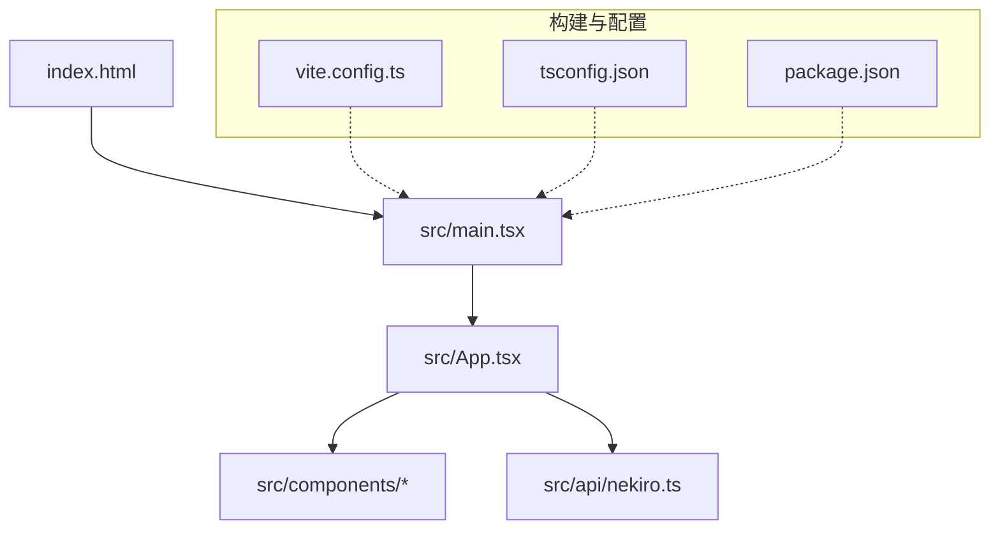
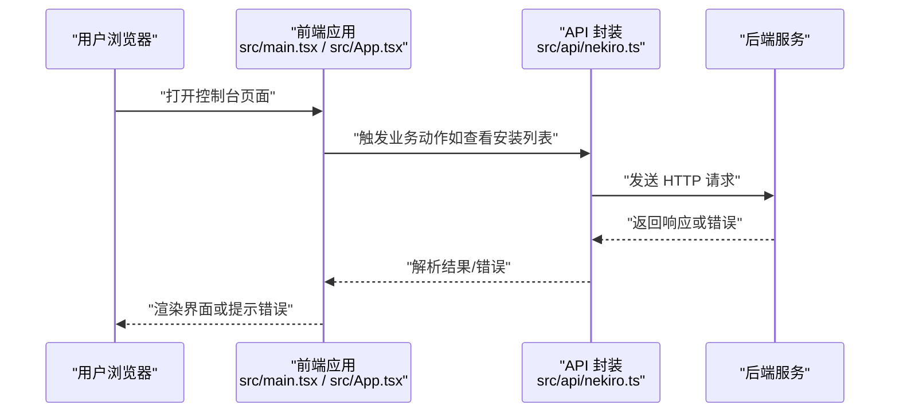
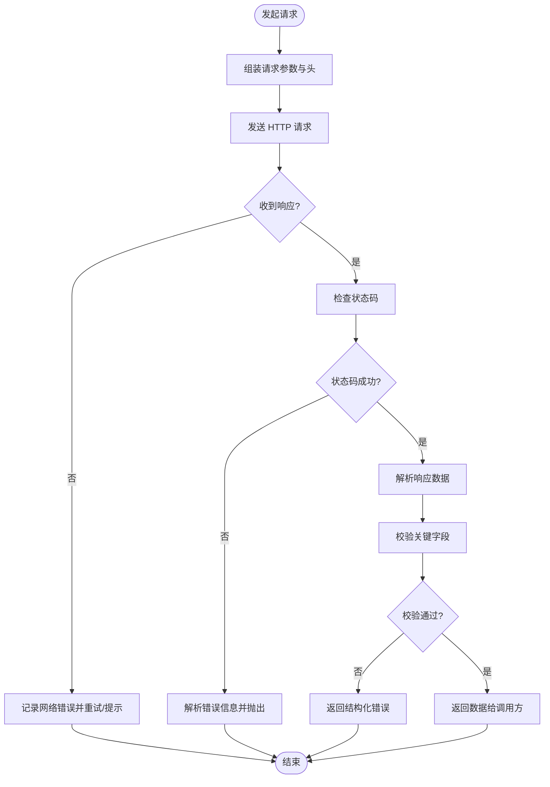
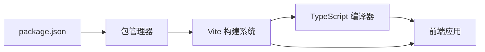
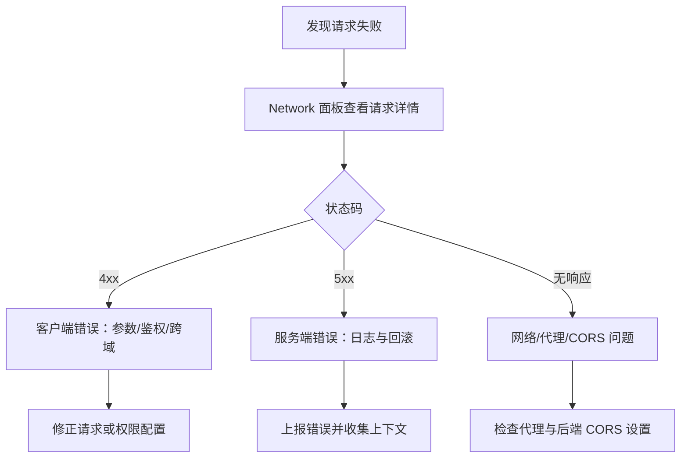

# 故障排除

<cite>
**本文引用的文件**   
- [package.json](file://package.json)
- [vite.config.ts](file://vite.config.ts)
- [tsconfig.json](file://tsconfig.json)
- [index.html](file://index.html)
- [src/main.tsx](file://src/main.tsx)
- [src/App.tsx](file://src/App.tsx)
- [src/api/nekiro.ts](file://src/api/nekiro.ts)
- [src/components/Header.tsx](file://src/components/Header.tsx)
- [src/components/InstallationsTab.tsx](file://src/components/InstallationsTab.tsx)
- [src/components/InvocationsTab.tsx](file://src/components/InvocationsTab.tsx)
- [src/components/LedgerTab.tsx](file://src/components/LedgerTab.tsx)
- [src/components/RegistryTab.tsx](file://src/components/RegistryTab.tsx)
- [src/components/Sidebar.tsx](file://src/components/Sidebar.tsx)
</cite>

## 目录
1. [简介](#简介)
2. [项目结构](#项目结构)
3. [核心组件](#核心组件)
4. [架构总览](#架构总览)
5. [详细组件分析](#详细组件分析)
6. [依赖分析](#依赖分析)
7. [性能考虑](#性能考虑)
8. [故障排除指南](#故障排除指南)
9. [结论](#结论)
10. [附录](#附录)

## 简介
本指南面向 NeKiro-console 的使用者与开发者，聚焦于“自助排障”。内容覆盖环境搭建、构建错误、运行时问题、网络请求失败、性能瓶颈与浏览器兼容性等常见场景，并提供可操作的诊断步骤与修复建议。目标是帮助用户快速定位问题并恢复服务，减少技术支持负担。

## 项目结构
NeKiro-console 基于 Vite + React + TypeScript 的前端工程。关键入口与配置如下：
- 应用入口：src/main.tsx
- 根组件：src/App.tsx
- API 层：src/api/nekiro.ts
- 页面/功能组件：src/components/*
- 构建与类型：vite.config.ts、tsconfig.json、package.json
- 静态资源入口：index.html

图表来源
- [index.html:1-200](file://index.html#L1-L200)
- [src/main.tsx:1-200](file://src/main.tsx#L1-L200)
- [src/App.tsx:1-200](file://src/App.tsx#L1-L200)
- [src/api/nekiro.ts:1-200](file://src/api/nekiro.ts#L1-L200)
- [vite.config.ts:1-200](file://vite.config.ts#L1-L200)
- [tsconfig.json:1-200](file://tsconfig.json#L1-L200)
- [package.json:1-200](file://package.json#L1-L200)

章节来源
- [index.html:1-200](file://index.html#L1-L200)
- [src/main.tsx:1-200](file://src/main.tsx#L1-L200)
- [src/App.tsx:1-200](file://src/App.tsx#L1-L200)
- [src/api/nekiro.ts:1-200](file://src/api/nekiro.ts#L1-L200)
- [vite.config.ts:1-200](file://vite.config.ts#L1-L200)
- [tsconfig.json:1-200](file://tsconfig.json#L1-L200)
- [package.json:1-200](file://package.json#L1-L200)

## 核心组件
- 应用启动流程：index.html 加载 main.tsx，main.tsx 初始化 React 应用并挂载到 DOM，App.tsx 作为根组件组织路由与布局。
- 数据交互：各 Tab 组件（安装、调用、账本、注册表）通过 src/api/nekiro.ts 发起网络请求，统一处理错误与状态。
- 构建与类型：Vite 负责开发与构建；TypeScript 提供类型检查与编译时校验。

章节来源
- [src/main.tsx:1-200](file://src/main.tsx#L1-L200)
- [src/App.tsx:1-200](file://src/App.tsx#L1-L200)
- [src/api/nekiro.ts:1-200](file://src/api/nekiro.ts#L1-L200)
- [src/components/InstallationsTab.tsx:1-200](file://src/components/InstallationsTab.tsx#L1-L200)
- [src/components/InvocationsTab.tsx:1-200](file://src/components/InvocationsTab.tsx#L1-L200)
- [src/components/LedgerTab.tsx:1-200](file://src/components/LedgerTab.tsx#L1-L200)
- [src/components/RegistryTab.tsx:1-200](file://src/components/RegistryTab.tsx#L1-L200)

## 架构总览
下图展示了从用户操作到后端服务的典型请求链路，以及开发/生产环境的差异点。

图表来源
- [src/main.tsx:1-200](file://src/main.tsx#L1-L200)
- [src/App.tsx:1-200](file://src/App.tsx#L1-L200)
- [src/api/nekiro.ts:1-200](file://src/api/nekiro.ts#L1-L200)

## 详细组件分析

### 应用启动与挂载
- index.html 引入构建产物，main.tsx 创建 React 根节点并挂载 App.tsx。
- 常见问题：
  - 白屏：检查 HTML 中脚本路径是否正确、构建产物是否生成、浏览器控制台是否有语法错误。
  - 跨域：确认开发代理或后端 CORS 配置。
- 排查要点：
  - 在浏览器开发者工具中查看 Network 面板的初始请求与错误。
  - 使用 Source 面板断点进入 main.tsx 与 App.tsx，逐步验证挂载过程。

章节来源
- [index.html:1-200](file://index.html#L1-L200)
- [src/main.tsx:1-200](file://src/main.tsx#L1-L200)
- [src/App.tsx:1-200](file://src/App.tsx#L1-L200)

### API 层与网络请求
- 职责：集中管理请求地址、方法、参数与错误处理逻辑，供各 Tab 组件复用。
- 常见问题：
  - 请求失败：网络不可达、CORS、鉴权失败、服务端异常。
  - 数据格式不一致：字段缺失或类型不匹配导致渲染异常。
- 排查要点：
  - 在 Network 面板筛选 XHR/Fetch，查看请求头、URL、状态码与响应体。
  - 在 API 层添加日志输出（仅开发环境），记录入参与出参。
  - 对错误进行分层处理：网络错误、HTTP 错误、业务错误。

图表来源
- [src/api/nekiro.ts:1-200](file://src/api/nekiro.ts#L1-L200)

章节来源
- [src/api/nekiro.ts:1-200](file://src/api/nekiro.ts#L1-L200)

### 功能组件（Tabs）
- 安装、调用、账本、注册表等 Tab 组件负责展示与交互，依赖 API 层获取数据。
- 常见问题：
  - 页面空白或报错：组件内部状态未初始化、异步数据为空、事件绑定异常。
  - 交互无响应：按钮点击未触发回调、表单提交未拦截默认行为。
- 排查要点：
  - 在组件内增加最小化复现用例，逐步注释代码定位问题。
  - 使用 React DevTools 检查组件树与状态变化。

章节来源
- [src/components/InstallationsTab.tsx:1-200](file://src/components/InstallationsTab.tsx#L1-L200)
- [src/components/InvocationsTab.tsx:1-200](file://src/components/InvocationsTab.tsx#L1-L200)
- [src/components/LedgerTab.tsx:1-200](file://src/components/LedgerTab.tsx#L1-L200)
- [src/components/RegistryTab.tsx:1-200](file://src/components/RegistryTab.tsx#L1-L200)
- [src/components/Header.tsx:1-200](file://src/components/Header.tsx#L1-200)
- [src/components/Sidebar.tsx:1-200](file://src/components/Sidebar.tsx#L1-200)

## 依赖分析
- 构建与运行依赖由 package.json 管理，包含开发服务器、打包器、类型定义与运行时库。
- 类型与编译选项由 tsconfig.json 控制，影响模块解析、目标环境与严格性。
- Vite 配置位于 vite.config.ts，决定开发代理、别名、插件与优化策略。

图表来源
- [package.json:1-200](file://package.json#L1-L200)
- [vite.config.ts:1-200](file://vite.config.ts#L1-L200)
- [tsconfig.json:1-200](file://tsconfig.json#L1-L200)

章节来源
- [package.json:1-200](file://package.json#L1-L200)
- [vite.config.ts:1-200](file://vite.config.ts#L1-L200)
- [tsconfig.json:1-200](file://tsconfig.json#L1-L200)

## 性能考虑
- 首屏加载：
  - 启用按需加载与代码分割，避免一次性加载全部组件。
  - 压缩静态资源，开启缓存策略。
- 运行时性能：
  - 避免在渲染函数中进行昂贵计算，必要时使用记忆化或延迟计算。
  - 列表渲染使用稳定 key，减少不必要的重渲染。
- 网络优化：
  - 合并请求、分页加载、增量更新。
  - 合理设置超时与重试，避免雪崩。

[本节为通用指导，不涉及具体文件]

## 故障排除指南

### 环境问题诊断与修复
- Node.js 版本不兼容
  - 现象：安装依赖时报错、构建失败。
  - 排查：查看 package.json 中的引擎要求与当前 Node 版本。
  - 修复：切换至推荐版本（建议使用 nvm）。
- 包管理器缓存损坏
  - 现象：依赖安装不完整或重复安装。
  - 修复：清理缓存后重新安装。
- 端口占用
  - 现象：开发服务器无法启动或端口冲突。
  - 修复：更换端口或释放占用进程。

章节来源
- [package.json:1-200](file://package.json#L1-L200)

### 构建错误排查
- TypeScript 类型错误
  - 现象：tsc 或 Vite 构建报类型错误。
  - 排查：根据错误定位到具体文件与行号，修正类型或忽略声明。
  - 参考：tsconfig.json 的严格性与模块解析规则。
- Vite 配置错误
  - 现象：构建失败、别名无效、代理不生效。
  - 排查：检查 vite.config.ts 的路径、插件顺序与环境变量。
- 资源路径错误
  - 现象：构建后静态资源 404。
  - 排查：核对 public 目录与构建输出路径，确保引用正确。

章节来源
- [tsconfig.json:1-200](file://tsconfig.json#L1-L200)
- [vite.config.ts:1-200](file://vite.config.ts#L1-L200)
- [index.html:1-200](file://index.html#L1-L200)

### 运行时错误调试技巧
- 白屏或崩溃
  - 使用浏览器控制台查看堆栈，定位到具体组件或 API 调用。
  - 在 main.tsx 与 App.tsx 入口处添加最小化错误边界与日志。
- 状态异常
  - 使用 React DevTools 检查组件状态与副作用。
  - 在关键分支打印必要上下文，避免泄露敏感信息。
- 事件未触发
  - 检查事件绑定与作用域，确认 DOM 已挂载。

章节来源
- [src/main.tsx:1-200](file://src/main.tsx#L1-L200)
- [src/App.tsx:1-200](file://src/App.tsx#L1-L200)

### 网络请求失败的排查流程
- 基础连通性
  - 使用 curl 或 Postman 直接访问后端接口，确认可达性与鉴权。
- 跨域问题
  - 现象：浏览器报 CORS 错误。
  - 修复：后端允许前端域名与方法；或在开发环境配置代理。
- 鉴权失败
  - 现象：401/403。
  - 修复：检查 Token 有效期与刷新机制，确保请求头携带正确凭证。
- 服务端异常
  - 现象：5xx 或业务错误码。
  - 修复：结合后端日志定位问题，前端做降级与友好提示。

图表来源
- [src/api/nekiro.ts:1-200](file://src/api/nekiro.ts#L1-L200)

章节来源
- [src/api/nekiro.ts:1-200](file://src/api/nekiro.ts#L1-L200)

### 性能问题分析与优化建议
- 识别热点
  - 使用 Performance 面板录制用户操作，定位长任务与重渲染。
- 优化策略
  - 拆分大组件、懒加载路由与组件。
  - 减少不必要的全局状态更新，局部状态优先。
  - 对大数据列表采用虚拟滚动或分页。
- 监控与回归
  - 建立关键指标（首屏时间、交互延迟）基线，变更前后对比。

[本节为通用指导，不涉及具体文件]

### 浏览器兼容性问题解决方案
- 特性检测与 Polyfill
  - 针对旧版浏览器引入必要的 polyfill，并在构建阶段按目标环境转译。
- 样式兼容
  - 避免使用最新 CSS 特性，或使用 Autoprefixer 自动补全。
- 测试矩阵
  - 在主流浏览器与版本上进行回归测试，记录已知限制与替代方案。

[本节为通用指导，不涉及具体文件]

## 结论
通过系统化地梳理环境、构建、运行、网络与性能等维度的常见问题与解决步骤，NeKiro-console 的用户可以高效完成自助排障。建议在团队内沉淀标准排障清单与模板，持续完善知识库，降低支持成本并提升用户体验。

## 附录
- 常用命令
  - 安装依赖、启动开发服务器、构建产物等命令请参考 package.json 中的脚本。
- 相关文档
  - 设计规格与计划文档位于 docs/superpowers/specs 与 plans 目录，可作为需求与架构背景参考。

章节来源
- [package.json:1-200](file://package.json#L1-L200)