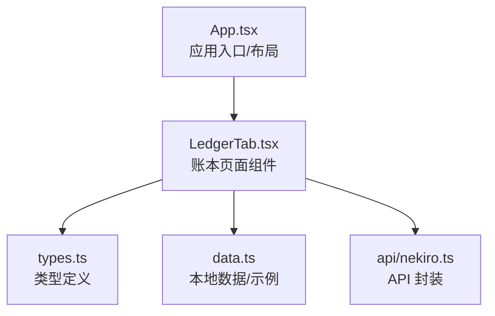
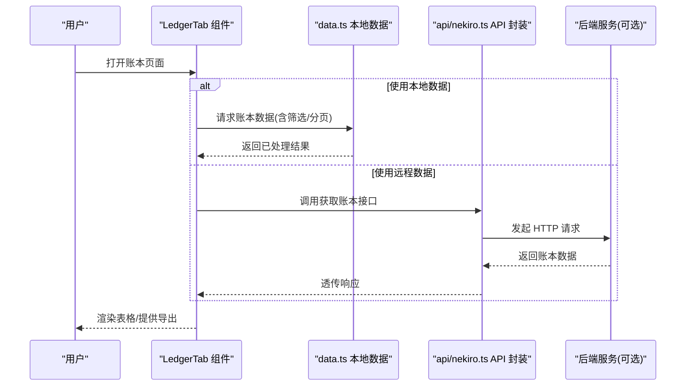
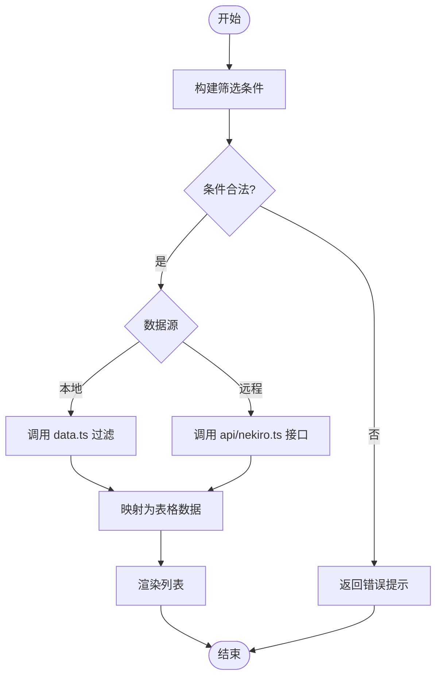
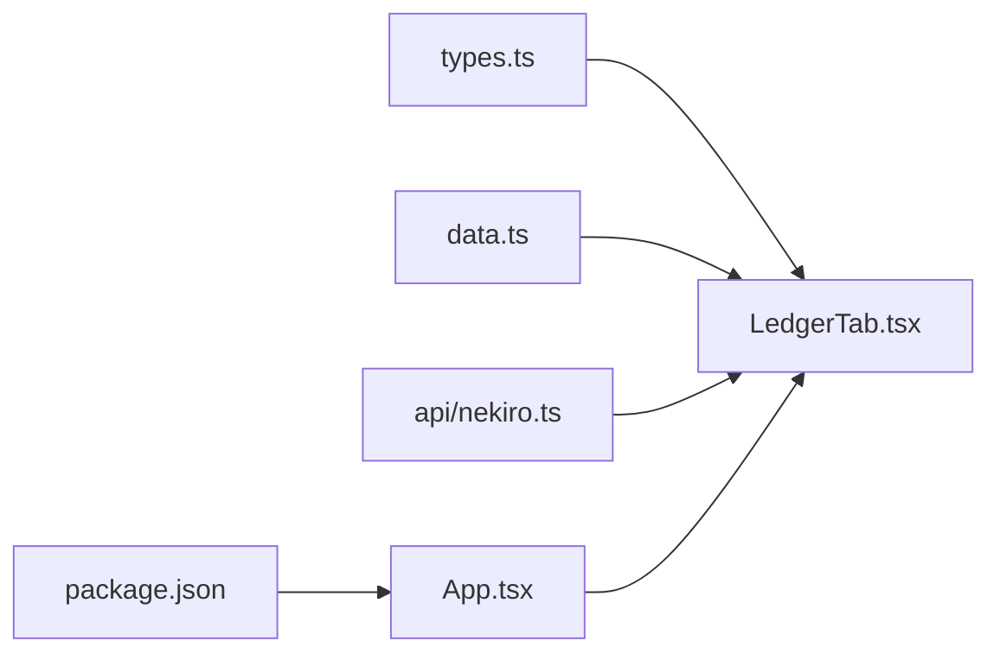

# 数据账本系统

<cite>
**本文引用的文件**   
- [src/components/LedgerTab.tsx](file://src/components/LedgerTab.tsx)
- [src/types.ts](file://src/types.ts)
- [src/data.ts](file://src/data.ts)
- [src/api/nekiro.ts](file://src/api/nekiro.ts)
- [src/App.tsx](file://src/App.tsx)
- [package.json](file://package.json)
</cite>

## 目录
1. [简介](#简介)
2. [项目结构](#项目结构)
3. [核心组件](#核心组件)
4. [架构总览](#架构总览)
5. [详细组件分析](#详细组件分析)
6. [依赖关系分析](#依赖关系分析)
7. [性能考虑](#性能考虑)
8. [故障排查指南](#故障排查指南)
9. [结论](#结论)
10. [附录](#附录)

## 简介
本文件为 NeKiro-console 的数据账本系统提供系统化文档，聚焦以下目标：
- 操作历史记录与审计追踪的实现机制
- 数据一致性保证策略
- 账本条目数据结构、存储格式与查询方式
- 使用场景：操作审计、数据变更追踪、合规性检查
- TypeScript 类型定义在数据验证与完整性中的作用
- 检索、过滤与导出功能的使用方法
- 数据备份恢复策略与长期存储建议
- 性能优化技巧与大数据量下的查询优化方案

本说明兼顾管理员易用性与开发者对数据模型设计的深入理解。

## 项目结构
NeKiro-console 采用前端单页应用结构，账本相关能力集中在 UI 组件、类型定义、本地数据与 API 层中：
- 组件层：LedgerTab 负责账本页面的展示与交互
- 类型层：types.ts 定义账本条目、筛选条件等核心类型
- 数据层：data.ts 提供本地示例数据与基础操作
- API 层：nekiro.ts 封装后端接口调用（如需要）
- 入口与路由：App.tsx 组织页面布局与导航
- 工程配置：package.json 管理依赖与脚本

图表来源
- [src/App.tsx](file://src/App.tsx)
- [src/components/LedgerTab.tsx](file://src/components/LedgerTab.tsx)
- [src/types.ts](file://src/types.ts)
- [src/data.ts](file://src/data.ts)
- [src/api/nekiro.ts](file://src/api/nekiro.ts)

章节来源
- [src/App.tsx](file://src/App.tsx)
- [src/components/LedgerTab.tsx](file://src/components/LedgerTab.tsx)
- [src/types.ts](file://src/types.ts)
- [src/data.ts](file://src/data.ts)
- [src/api/nekiro.ts](file://src/api/nekiro.ts)

## 核心组件
- 账本页面组件（LedgerTab）
  - 职责：渲染账本列表、提供筛选与分页、触发导出、对接数据源
  - 关键流程：加载数据 -> 渲染表格 -> 用户筛选/翻页 -> 导出当前视图
- 类型定义（types.ts）
  - 职责：定义账本条目、筛选条件、排序字段、分页参数等
  - 价值：贯穿 UI 与数据层的强类型约束，保障数据一致性与可维护性
- 本地数据（data.ts）
  - 职责：提供示例账本数据与基础操作函数（如过滤、分页、导出）
  - 适用：离线演示、快速验证、无后端时的开发调试
- API 封装（api/nekiro.ts）
  - 职责：封装与后端的通信（如获取账本、导出），便于替换为真实服务
  - 扩展点：支持切换“本地模式/远程模式”

章节来源
- [src/components/LedgerTab.tsx](file://src/components/LedgerTab.tsx)
- [src/types.ts](file://src/types.ts)
- [src/data.ts](file://src/data.ts)
- [src/api/nekiro.ts](file://src/api/nekiro.ts)

## 架构总览
账本系统采用“UI 组件 + 类型驱动 + 数据/API 抽象”的分层设计：
- 表现层：LedgerTab 负责交互与展示
- 领域层：types.ts 定义领域模型与校验规则
- 数据层：data.ts 提供本地数据与处理逻辑；api/nekiro.ts 提供远程数据访问
- 集成层：App.tsx 组合各模块并挂载到应用

图表来源
- [src/components/LedgerTab.tsx](file://src/components/LedgerTab.tsx)
- [src/data.ts](file://src/data.ts)
- [src/api/nekiro.ts](file://src/api/nekiro.ts)

## 详细组件分析

### 账本条目数据模型
- 字段语义（以类型定义为依据）
  - 唯一标识：用于去重与定位记录
  - 时间戳：记录创建或变更时间
  - 操作类型：如创建、更新、删除、导入、导出等
  - 资源信息：被操作的实体名称/ID
  - 操作者：执行操作的用户或系统身份
  - 变更摘要：简要描述变更内容（如字段级差异）
  - 状态：成功/失败/待确认等
  - 元数据：扩展字段（如来源、批次号、关联任务 ID）
- 复杂度与索引建议
  - 时间范围查询：按时间戳建立倒排或分区
  - 操作者/操作类型：建立复合索引提升过滤效率
  - 资源信息：按资源维度聚合统计

章节来源
- [src/types.ts](file://src/types.ts)

### 筛选与查询
- 支持的筛选维度
  - 时间范围：起止时间
  - 操作类型：多选
  - 操作者：模糊匹配
  - 资源信息：精确/模糊匹配
  - 状态：成功/失败
- 查询流程
  - 构建筛选条件对象（遵循 types.ts 的筛选类型）
  - 调用 data.ts 的过滤函数或 api/nekiro.ts 的远端接口
  - 将结果映射为表格行数据
- 边界情况
  - 空筛选：返回全量（受分页限制）
  - 冲突条件：优先保留更严格条件
  - 非法输入：由类型与校验拦截

图表来源
- [src/components/LedgerTab.tsx](file://src/components/LedgerTab.tsx)
- [src/data.ts](file://src/data.ts)
- [src/api/nekiro.ts](file://src/api/nekiro.ts)

章节来源
- [src/components/LedgerTab.tsx](file://src/components/LedgerTab.tsx)
- [src/data.ts](file://src/data.ts)
- [src/api/nekiro.ts](file://src/api/nekiro.ts)

### 导出功能
- 导出范围
  - 当前筛选结果
  - 当前页
  - 全部数据（需服务端分页或流式导出）
- 导出格式
  - CSV/JSON（根据实现选择）
- 注意事项
  - 大数据量建议服务端导出并下载链接
  - 敏感字段脱敏后再导出

章节来源
- [src/components/LedgerTab.tsx](file://src/components/LedgerTab.tsx)
- [src/data.ts](file://src/data.ts)
- [src/api/nekiro.ts](file://src/api/nekiro.ts)

### 审计与一致性
- 审计要点
  - 不可变性：账本记录一旦写入不应修改或删除
  - 幂等性：重复提交应生成相同或可合并的记录
  - 溯源性：包含操作者、时间、资源、变更摘要
- 一致性策略
  - 事务写入：批量写入时保证原子性
  - 版本控制：对资源变更引入版本号，避免覆盖
  - 校验：基于 types.ts 的强类型与运行时校验双重保障

章节来源
- [src/types.ts](file://src/types.ts)
- [src/data.ts](file://src/data.ts)

### 使用场景
- 操作审计
  - 通过操作者与时间范围快速定位某用户的变更记录
- 数据变更追踪
  - 结合资源信息与变更摘要，还原数据演进路径
- 合规性检查
  - 定期导出指定时间段的账本，进行人工或自动化审查

章节来源
- [src/components/LedgerTab.tsx](file://src/components/LedgerTab.tsx)
- [src/data.ts](file://src/data.ts)

## 依赖关系分析
- 组件依赖
  - LedgerTab 依赖 types.ts 的类型定义与 data.ts 的数据处理
  - 当启用远程模式时，依赖 api/nekiro.ts 的接口封装
- 外部依赖
  - 包管理与脚本由 package.json 管理

图表来源
- [src/components/LedgerTab.tsx](file://src/components/LedgerTab.tsx)
- [src/types.ts](file://src/types.ts)
- [src/data.ts](file://src/data.ts)
- [src/api/nekiro.ts](file://src/api/nekiro.ts)
- [src/App.tsx](file://src/App.tsx)
- [package.json](file://package.json)

章节来源
- [src/components/LedgerTab.tsx](file://src/components/LedgerTab.tsx)
- [src/types.ts](file://src/types.ts)
- [src/data.ts](file://src/data.ts)
- [src/api/nekiro.ts](file://src/api/nekiro.ts)
- [src/App.tsx](file://src/App.tsx)
- [package.json](file://package.json)

## 性能考虑
- 前端优化
  - 虚拟滚动：大数据量列表按需渲染
  - 防抖/节流：搜索与筛选输入减少频繁刷新
  - 分页与懒加载：默认仅加载首屏数据
- 后端优化（如启用远程模式）
  - 服务端分页与过滤：避免一次性拉取全量
  - 索引优化：针对常用筛选字段建立索引
  - 缓存策略：热点筛选结果短期缓存
- 导出优化
  - 大文件分块导出或异步任务+下载链接
  - 压缩传输（GZIP）

[本节为通用指导，不直接分析具体文件]

## 故障排查指南
- 常见问题
  - 筛选无效：检查筛选条件是否符合 types.ts 定义
  - 导出为空：确认当前筛选范围是否有效
  - 网络错误：查看 api/nekiro.ts 的错误分支与重试策略
- 日志与诊断
  - 在关键路径打印结构化日志（时间、操作、资源、状态）
  - 区分本地/远程模式，便于定位问题域

章节来源
- [src/types.ts](file://src/types.ts)
- [src/data.ts](file://src/data.ts)
- [src/api/nekiro.ts](file://src/api/nekiro.ts)

## 结论
本账本系统以类型驱动为核心，结合本地数据与 API 抽象，提供了可扩展的审计与追踪能力。通过合理的筛选、分页与导出机制，可满足日常审计与合规需求。后续可在后端侧增强索引、缓存与异步导出能力，进一步提升大数据量下的体验。

[本节为总结，不直接分析具体文件]

## 附录

### 数据备份与恢复策略
- 备份策略
  - 定期快照：按天/周生成只读副本
  - 增量备份：基于时间戳或版本号增量归档
  - 异地容灾：跨地域或多介质保存
- 恢复流程
  - 校验备份完整性（哈希/签名）
  - 按时间线顺序回放增量
  - 恢复后进行一致性校验与抽样审计
- 长期存储建议
  - 冷存储归档：降低长期成本
  - 保留周期：满足合规要求的最小保留期
  - 访问控制：最小权限与审计日志

[本节为通用指导，不直接分析具体文件]

### 数据类型与验证清单
- 必填字段校验：唯一标识、时间戳、操作类型、资源信息
- 枚举值校验：操作类型、状态等限定取值
- 格式校验：时间戳格式、ID 格式、长度限制
- 业务校验：同一资源的并发变更需引入版本控制

章节来源
- [src/types.ts](file://src/types.ts)