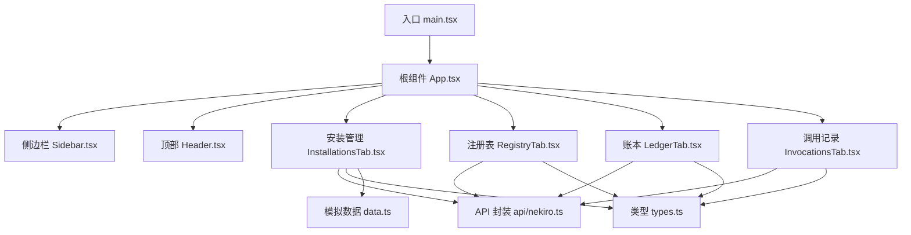
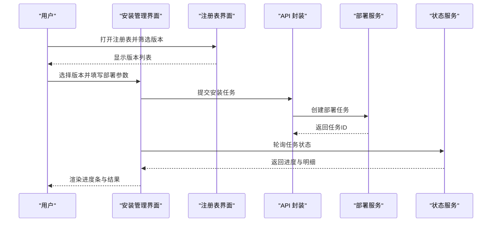
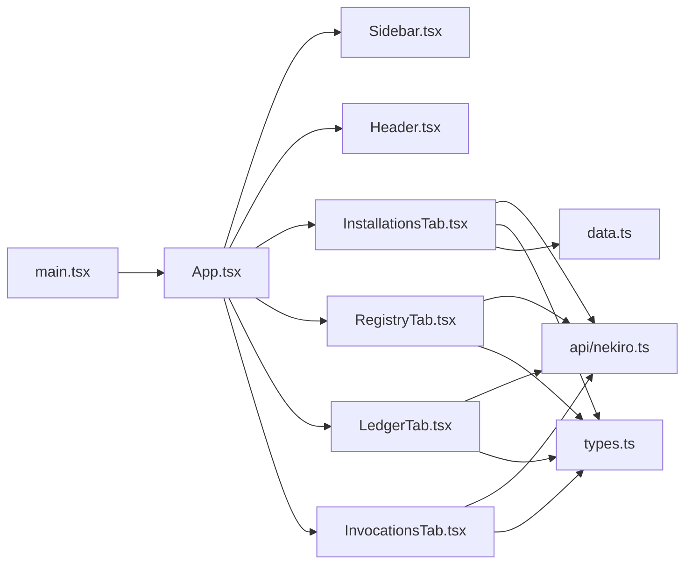

# 服务器安装管理

<cite>
**本文引用的文件**   
- [README.md](file://README.md)
- [package.json](file://package.json)
- [vite.config.ts](file://vite.config.ts)
- [src/main.tsx](file://src/main.tsx)
- [src/App.tsx](file://src/App.tsx)
- [src/types.ts](file://src/types.ts)
- [src/data.ts](file://src/data.ts)
- [src/api/nekiro.ts](file://src/api/nekiro.ts)
- [src/components/Sidebar.tsx](file://src/components/Sidebar.tsx)
- [src/components/InstallationsTab.tsx](file://src/components/InstallationsTab.tsx)
- [src/components/RegistryTab.tsx](file://src/components/RegistryTab.tsx)
- [src/components/LedgerTab.tsx](file://src/components/LedgerTab.tsx)
- [src/components/InvocationsTab.tsx](file://src/components/InvocationsTab.tsx)
- [src/components/Header.tsx](file://src/components/Header.tsx)
</cite>

## 目录
1. [简介](#简介)
2. [项目结构](#项目结构)
3. [核心组件](#核心组件)
4. [架构总览](#架构总览)
5. [详细组件分析](#详细组件分析)
6. [依赖分析](#依赖分析)
7. [性能考虑](#性能考虑)
8. [故障排除指南](#故障排除指南)
9. [结论](#结论)
10. [附录](#附录)

## 简介
本文件面向 NeKiro-console 的“服务器安装管理”能力，聚焦以下目标：
- 版本控制：如何查看与选择服务器版本、在注册表中维护版本元数据。
- 批量部署：如何配置部署参数、发起批量安装任务、并发与限流策略。
- 安装状态监控：如何实时跟踪安装进度、失败重试与结果汇总。
- 界面操作流程：从选择版本到执行安装、再到监控结果的完整步骤。
- 后端 API 交互机制：前端如何调用 API、错误处理与数据同步策略。
- 使用示例：常见部署场景的操作步骤。
- 故障排除：常见问题定位与解决方案。
- 性能优化与最佳实践：提升大规模部署效率与稳定性。

## 项目结构
NeKiro-console 为基于 Vite + React + TypeScript 的前端应用。与“服务器安装管理”相关的核心代码位于 src 目录下，包括类型定义、API 封装、页面组件与路由入口等。



图表来源
- [src/main.tsx:1-200](file://src/main.tsx#L1-L200)
- [src/App.tsx:1-200](file://src/App.tsx#L1-L200)
- [src/components/Sidebar.tsx:1-200](file://src/components/Sidebar.tsx#L1-L200)
- [src/components/Header.tsx:1-200](file://src/components/Header.tsx#L1-L200)
- [src/components/InstallationsTab.tsx:1-200](file://src/components/InstallationsTab.tsx#L1-L200)
- [src/components/RegistryTab.tsx:1-200](file://src/components/RegistryTab.tsx#L1-L200)
- [src/components/LedgerTab.tsx:1-200](file://src/components/LedgerTab.tsx#L1-L200)
- [src/components/InvocationsTab.tsx:1-200](file://src/components/InvocationsTab.tsx#L1-L200)
- [src/api/nekiro.ts:1-200](file://src/api/nekiro.ts#L1-L200)
- [src/types.ts:1-200](file://src/types.ts#L1-L200)
- [src/data.ts:1-200](file://src/data.ts#L1-L200)

章节来源
- [src/main.tsx:1-200](file://src/main.tsx#L1-L200)
- [src/App.tsx:1-200](file://src/App.tsx#L1-L200)
- [src/components/Sidebar.tsx:1-200](file://src/components/Sidebar.tsx#L1-L200)
- [src/components/Header.tsx:1-200](file://src/components/Header.tsx#L1-L200)
- [src/components/InstallationsTab.tsx:1-200](file://src/components/InstallationsTab.tsx#L1-L200)
- [src/components/RegistryTab.tsx:1-200](file://src/components/RegistryTab.tsx#L1-L200)
- [src/components/LedgerTab.tsx:1-200](file://src/components/LedgerTab.tsx#L1-L200)
- [src/components/InvocationsTab.tsx:1-200](file://src/components/InvocationsTab.tsx#L1-L200)
- [src/api/nekiro.ts:1-200](file://src/api/nekiro.ts#L1-L200)
- [src/types.ts:1-200](file://src/types.ts#L1-L200)
- [src/data.ts:1-200](file://src/data.ts#L1-L200)

## 核心组件
- 安装管理（InstallationsTab）：提供版本选择、批量部署参数配置、任务提交与进度监控。
- 注册表（RegistryTab）：展示可用版本清单、版本元数据与筛选。
- 账本（LedgerTab）：记录安装任务的审计日志与变更轨迹。
- 调用记录（InvocationsTab）：展示对后端的调用历史与结果摘要。
- API 封装（api/nekiro.ts）：统一封装后端接口、错误处理与重试策略。
- 类型定义（types.ts）：集中定义数据结构与枚举，保证前后端一致性。
- 模拟数据（data.ts）：用于本地演示与快速验证流程。

章节来源
- [src/components/InstallationsTab.tsx:1-200](file://src/components/InstallationsTab.tsx#L1-L200)
- [src/components/RegistryTab.tsx:1-200](file://src/components/RegistryTab.tsx#L1-L200)
- [src/components/LedgerTab.tsx:1-200](file://src/components/LedgerTab.tsx#L1-L200)
- [src/components/InvocationsTab.tsx:1-200](file://src/components/InvocationsTab.tsx#L1-L200)
- [src/api/nekiro.ts:1-200](file://src/api/nekiro.ts#L1-L200)
- [src/types.ts:1-200](file://src/types.ts#L1-L200)
- [src/data.ts:1-200](file://src/data.ts#L1-L200)

## 架构总览
整体采用“前端单页应用 + 后端 REST API”的架构。安装管理功能通过 API 层与后端交互，完成版本查询、任务下发、状态拉取与结果汇总。

```mermaid
graph TB
subgraph "浏览器"
UI["React 界面<br/>InstallationsTab / RegistryTab"]
Store["本地状态与缓存"]
API["API 封装<br/>nekiro.ts"]
end
subgraph "后端服务"
Catalog["版本目录服务"]
Deploy["部署编排服务"]
Status["状态聚合服务"]
Audit["审计与账本服务"]
end
UI --> API
API --> Catalog
API --> Deploy
API --> Status
API --> Audit
Store < --> UI
```

图表来源
- [src/components/InstallationsTab.tsx:1-200](file://src/components/InstallationsTab.tsx#L1-L200)
- [src/components/RegistryTab.tsx:1-200](file://src/components/RegistryTab.tsx#L1-L200)
- [src/api/nekiro.ts:1-200](file://src/api/nekiro.ts#L1-L200)

## 详细组件分析

### 安装管理（InstallationsTab）
职责
- 展示并筛选可安装版本（来自注册表）。
- 收集批量部署参数（如目标集群、节点范围、并行度、回滚策略等）。
- 提交安装任务，轮询或接收推送以更新进度。
- 汇总成功/失败统计，支持重试与导出报告。

关键流程（序列图）


图表来源
- [src/components/InstallationsTab.tsx:1-200](file://src/components/InstallationsTab.tsx#L1-L200)
- [src/components/RegistryTab.tsx:1-200](file://src/components/RegistryTab.tsx#L1-L200)
- [src/api/nekiro.ts:1-200](file://src/api/nekiro.ts#L1-L200)

界面操作要点
- 版本选择：在注册表中按标签、语义化版本排序与过滤；确认版本元数据后再进入安装。
- 参数配置：设置并行度、超时时间、健康检查策略、灰度比例与回滚条件。
- 任务执行：提交后进入“进行中”状态，界面持续刷新进度。
- 结果查看：按节点维度查看成功/失败详情，支持一键重试失败项。

章节来源
- [src/components/InstallationsTab.tsx:1-200](file://src/components/InstallationsTab.tsx#L1-L200)
- [src/components/RegistryTab.tsx:1-200](file://src/components/RegistryTab.tsx#L1-L200)
- [src/api/nekiro.ts:1-200](file://src/api/nekiro.ts#L1-L200)

### 注册表（RegistryTab）
职责
- 展示服务端发布的版本清单与元数据（版本号、构建信息、兼容性说明等）。
- 支持按标签、日期、作者等维度筛选。
- 提供版本对比与发布说明预览。

典型交互
- 点击某版本查看详情，复制版本标识以便在安装管理中引用。
- 将常用版本加入“推荐版本”集合，便于快速选择。

章节来源
- [src/components/RegistryTab.tsx:1-200](file://src/components/RegistryTab.tsx#L1-L200)
- [src/types.ts:1-200](file://src/types.ts#L1-L200)

### 账本（LedgerTab）
职责
- 记录安装任务的审计日志，包含操作人、时间戳、版本、参数快照与结果。
- 支持按任务 ID、时间范围与状态检索。
- 作为合规与回溯依据。

章节来源
- [src/components/LedgerTab.tsx:1-200](file://src/components/LedgerTab.tsx#L1-L200)
- [src/api/nekiro.ts:1-200](file://src/api/nekiro.ts#L1-L200)

### 调用记录（InvocationsTab）
职责
- 展示对后端的调用历史，便于排查网络与权限问题。
- 显示请求/响应摘要、耗时与错误码。

章节来源
- [src/components/InvocationsTab.tsx:1-200](file://src/components/InvocationsTab.tsx#L1-L200)
- [src/api/nekiro.ts:1-200](file://src/api/nekiro.ts#L1-L200)

### API 封装（api/nekiro.ts）
职责
- 统一封装后端接口，包括版本查询、任务创建、状态查询与审计拉取。
- 实现通用错误处理、重试与超时控制。
- 提供可选的拦截器用于鉴权与日志记录。

设计要点
- 幂等性：任务创建接口需支持幂等键，避免重复提交导致多份任务。
- 分页与增量：列表接口支持分页与游标，减少首屏加载压力。
- 错误分类：区分网络错误、业务错误与系统错误，便于前端差异化提示。

章节来源
- [src/api/nekiro.ts:1-200](file://src/api/nekiro.ts#L1-L200)

### 类型定义（types.ts）
职责
- 统一定义版本、任务、节点状态、审计条目等数据结构。
- 约束字段类型与必填项，降低前后端联调成本。

章节来源
- [src/types.ts:1-200](file://src/types.ts#L1-L200)

### 模拟数据（data.ts）
职责
- 提供本地演示数据，便于在无后端环境下验证流程。
- 可与真实 API 无缝切换，加速开发迭代。

章节来源
- [src/data.ts:1-200](file://src/data.ts#L1-L200)

## 依赖分析
模块间依赖关系如下：



图表来源
- [src/main.tsx:1-200](file://src/main.tsx#L1-L200)
- [src/App.tsx:1-200](file://src/App.tsx#L1-L200)
- [src/components/Sidebar.tsx:1-200](file://src/components/Sidebar.tsx#L1-L200)
- [src/components/Header.tsx:1-200](file://src/components/Header.tsx#L1-L200)
- [src/components/InstallationsTab.tsx:1-200](file://src/components/InstallationsTab.tsx#L1-L200)
- [src/components/RegistryTab.tsx:1-200](file://src/components/RegistryTab.tsx#L1-L200)
- [src/components/LedgerTab.tsx:1-200](file://src/components/LedgerTab.tsx#L1-L200)
- [src/components/InvocationsTab.tsx:1-200](file://src/components/InvocationsTab.tsx#L1-L200)
- [src/api/nekiro.ts:1-200](file://src/api/nekiro.ts#L1-L200)
- [src/types.ts:1-200](file://src/types.ts#L1-L200)
- [src/data.ts:1-200](file://src/data.ts#L1-L200)

章节来源
- [src/main.tsx:1-200](file://src/main.tsx#L1-L200)
- [src/App.tsx:1-200](file://src/App.tsx#L1-L200)
- [src/components/Sidebar.tsx:1-200](file://src/components/Sidebar.tsx#L1-L200)
- [src/components/Header.tsx:1-200](file://src/components/Header.tsx#L1-L200)
- [src/components/InstallationsTab.tsx:1-200](file://src/components/InstallationsTab.tsx#L1-L200)
- [src/components/RegistryTab.tsx:1-200](file://src/components/RegistryTab.tsx#L1-L200)
- [src/components/LedgerTab.tsx:1-200](file://src/components/LedgerTab.tsx#L1-L200)
- [src/components/InvocationsTab.tsx:1-200](file://src/components/InvocationsTab.tsx#L1-L200)
- [src/api/nekiro.ts:1-200](file://src/api/nekiro.ts#L1-L200)
- [src/types.ts:1-200](file://src/types.ts#L1-L200)
- [src/data.ts:1-200](file://src/data.ts#L1-L200)

## 性能考虑
- 列表分页与懒加载：注册表与账本默认分页，按需加载更多，减少首屏体积。
- 并发与限流：批量部署时限制并发数，避免压垮后端与目标节点。
- 增量更新：状态查询使用增量字段或游标，减少无效数据传输。
- 缓存策略：对不频繁变化的版本元数据进行短期缓存，降低重复请求。
- 取消与去抖：搜索与筛选输入防抖，长轮询支持取消，避免资源浪费。
- 渲染优化：大列表虚拟化滚动，仅渲染可视区域。

[本节为通用建议，无需源码引用]

## 故障排除指南
常见问题与解决思路
- 无法获取版本列表
  - 检查网络连通性与鉴权头是否正确。
  - 查看调用记录中的错误码与响应体，定位是网关、鉴权还是目录服务异常。
- 任务创建失败
  - 校验必填参数与格式是否符合类型定义。
  - 确认版本是否存在且兼容当前环境。
  - 若出现重复提交，检查是否使用了幂等键。
- 安装进度不更新
  - 确认轮询间隔与后端推送通道是否正常。
  - 查看状态服务是否返回最新状态，必要时重启轮询。
- 部分节点安装失败
  - 在结果明细中定位失败节点与错误原因。
  - 针对网络抖动、资源不足、依赖缺失分别采取重试、扩容或修复依赖。
- 审计记录缺失
  - 检查审计服务写入是否成功，核对账本接口返回。
  - 确认任务生命周期事件是否完整上报。

章节来源
- [src/components/InvocationsTab.tsx:1-200](file://src/components/InvocationsTab.tsx#L1-L200)
- [src/components/LedgerTab.tsx:1-200](file://src/components/LedgerTab.tsx#L1-L200)
- [src/api/nekiro.ts:1-200](file://src/api/nekiro.ts#L1-L200)
- [src/types.ts:1-200](file://src/types.ts#L1-L200)

## 结论
通过“注册表 + 安装管理 + 账本 + 调用记录”的组合，NeKiro-console 提供了完整的服务器版本管理与批量部署体验。结合合理的并发控制、错误分类与审计追踪，可在保障稳定性的同时提升部署效率。建议在大规模场景中引入灰度发布与自动回滚，进一步提升风险可控性。

[本节为总结性内容，无需源码引用]

## 附录

### 使用示例：常见部署场景

- 场景一：全量升级至指定版本
  - 在注册表中筛选目标版本并确认元数据。
  - 进入安装管理，选择该版本，设置并行度与超时。
  - 提交任务并观察进度，完成后在账本中查看审计记录。

- 场景二：灰度发布
  - 在注册表中选择候选版本。
  - 在安装管理中设置灰度比例与健康检查阈值。
  - 提交任务，监控灰度节点状态，达标后逐步扩大范围。

- 场景三：回滚到上一个稳定版本
  - 在注册表中选择上一稳定版本。
  - 在安装管理中启用回滚策略与快速回滚开关。
  - 提交任务，确认所有节点恢复至预期版本。

[本节为概念性示例，无需源码引用]

### 与后端 API 的交互机制与数据同步策略
- 交互机制
  - 版本查询：GET 版本目录，支持分页与筛选。
  - 任务创建：POST 创建安装任务，返回任务 ID。
  - 状态查询：GET 任务状态，支持增量与游标。
  - 审计拉取：GET 账本条目，支持时间范围与状态过滤。
- 数据同步策略
  - 短轮询 + 取消：对活跃任务进行周期性轮询，离开页面时取消请求。
  - 增量更新：仅拉取变化字段，减少带宽占用。
  - 本地缓存：对静态元数据设置合理过期时间，提高响应速度。
  - 幂等提交：使用幂等键避免重复创建任务。

章节来源
- [src/api/nekiro.ts:1-200](file://src/api/nekiro.ts#L1-L200)
- [src/types.ts:1-200](file://src/types.ts#L1-L200)

### 最佳实践
- 版本治理：严格遵循语义化版本，保留发布说明与兼容性矩阵。
- 参数模板：为不同环境保存参数模板，减少人工配置错误。
- 灰度与回滚：先小范围验证，再逐步放量；失败自动回滚。
- 监控告警：对安装失败率、平均耗时与资源水位设置阈值告警。
- 审计留痕：确保所有操作可追溯，满足合规要求。

[本节为通用建议，无需源码引用]