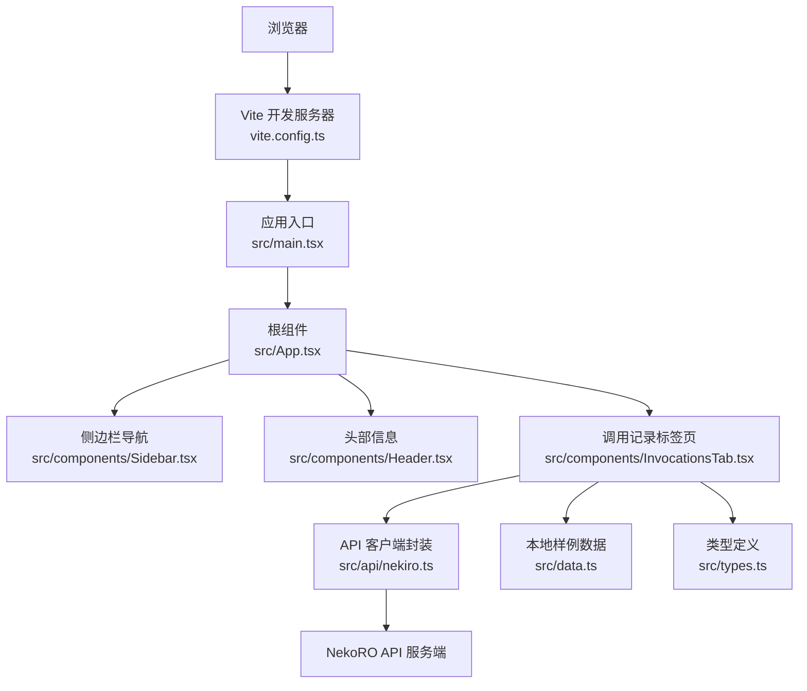
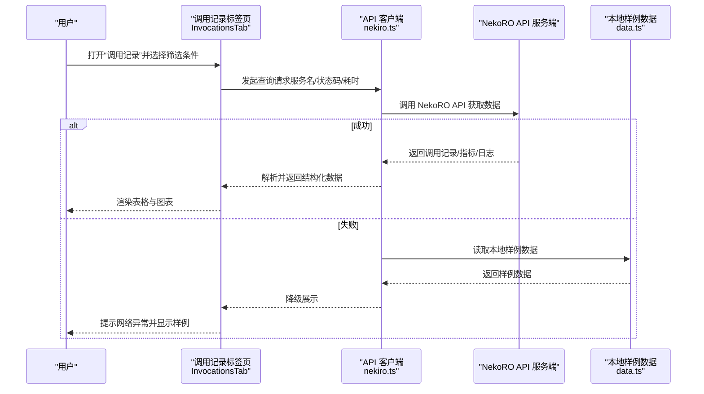
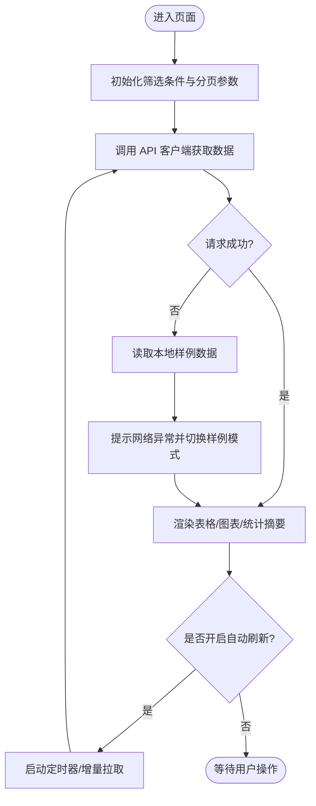
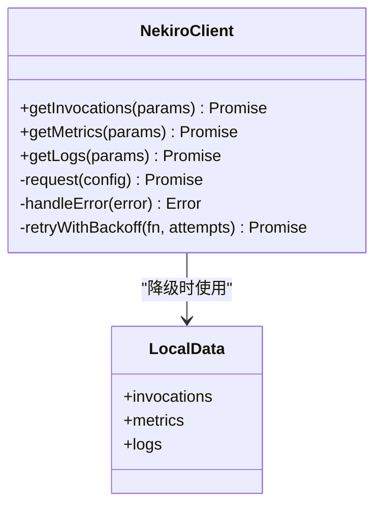
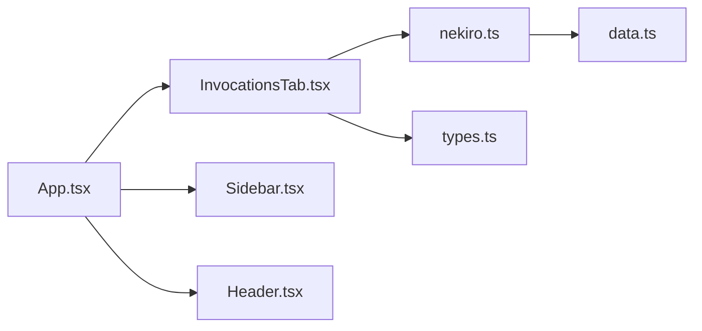

# 服务调用监控

<cite>
**本文引用的文件**   
- [README.md](file://README.md)
- [package.json](file://package.json)
- [vite.config.ts](file://vite.config.ts)
- [src/main.tsx](file://src/main.tsx)
- [src/App.tsx](file://src/App.tsx)
- [src/api/nekiro.ts](file://src/api/nekiro.ts)
- [src/components/InvocationsTab.tsx](file://src/components/InvocationsTab.tsx)
- [src/components/Header.tsx](file://src/components/Header.tsx)
- [src/components/Sidebar.tsx](file://src/components/Sidebar.tsx)
- [src/types.ts](file://src/types.ts)
- [src/data.ts](file://src/data.ts)
</cite>

## 目录
1. [简介](#简介)
2. [项目结构](#项目结构)
3. [核心组件](#核心组件)
4. [架构总览](#架构总览)
5. [详细组件分析](#详细组件分析)
6. [依赖分析](#依赖分析)
7. [性能考虑](#性能考虑)
8. [故障排查指南](#故障排查指南)
9. [结论](#结论)
10. [附录](#附录)

## 简介
本文件面向 NeKiro-console 的“服务调用监控”能力，围绕实时调用跟踪、性能指标收集与错误日志分析展开，提供从运维到开发的全链路文档。内容涵盖：
- 监控规则设置与告警阈值配置方法
- 调用性能数据获取与分析流程
- 典型监控场景示例（高并发调用监控、错误率统计、响应时间分析）
- 与 NekoRO API 客户端的集成方式与数据获取机制
- 监控数据解读方法与性能瓶颈识别技巧
- 常见问题排查与调试工具使用建议

## 项目结构
NeKiro-console 采用前端工程化组织，关键目录与职责如下：
- src/api: 封装与 NekoRO API 的交互逻辑，负责拉取调用记录、指标与日志等数据
- src/components: 页面功能模块，包含“调用记录”、“安装列表”、“注册表”等标签页
- src/types.ts: 全局类型定义，统一前后端数据结构契约
- src/data.ts: 本地样例或缓存数据，便于离线演示与快速验证
- src/main.tsx / src/App.tsx: 应用入口与根路由/布局编排
- vite.config.ts: 构建与代理配置（如需要转发至后端）
- package.json: 依赖与脚本定义
- README.md: 项目说明与使用说明

图表来源
- [vite.config.ts](file://vite.config.ts)
- [src/main.tsx](file://src/main.tsx)
- [src/App.tsx](file://src/App.tsx)
- [src/components/Sidebar.tsx](file://src/components/Sidebar.tsx)
- [src/components/Header.tsx](file://src/components/Header.tsx)
- [src/components/InvocationsTab.tsx](file://src/components/InvocationsTab.tsx)
- [src/api/nekiro.ts](file://src/api/nekiro.ts)
- [src/data.ts](file://src/data.ts)
- [src/types.ts](file://src/types.ts)

章节来源
- [README.md](file://README.md)
- [package.json](file://package.json)
- [vite.config.ts](file://vite.config.ts)
- [src/main.tsx](file://src/main.tsx)
- [src/App.tsx](file://src/App.tsx)
- [src/components/InvocationsTab.tsx](file://src/components/InvocationsTab.tsx)
- [src/components/Header.tsx](file://src/components/Header.tsx)
- [src/components/Sidebar.tsx](file://src/components/Sidebar.tsx)
- [src/api/nekiro.ts](file://src/api/nekiro.ts)
- [src/types.ts](file://src/types.ts)
- [src/data.ts](file://src/data.ts)

## 核心组件
- 调用记录标签页 InvocationsTab
  - 负责展示调用明细、筛选条件、分页与刷新策略
  - 聚合来自 API 客户端的数据，并结合本地样例数据进行对比与演示
  - 支持按服务名、状态码、耗时区间等维度过滤
- API 客户端 nekiro.ts
  - 封装对 NekoRO API 的请求，包括调用记录、指标与日志接口
  - 处理请求重试、超时、鉴权头注入与错误分类
- 类型定义 types.ts
  - 统一定义调用记录、指标、日志等数据结构，确保前后端一致
- 本地样例 data.ts
  - 提供离线可运行的样例数据，用于无后端环境下的功能验证

章节来源
- [src/components/InvocationsTab.tsx](file://src/components/InvocationsTab.tsx)
- [src/api/nekiro.ts](file://src/api/nekiro.ts)
- [src/types.ts](file://src/types.ts)
- [src/data.ts](file://src/data.ts)

## 架构总览
整体数据流遵循“前端 UI -> API 客户端 -> NekoRO API 服务端”，并在必要时回退到本地样例数据。

图表来源
- [src/components/InvocationsTab.tsx](file://src/components/InvocationsTab.tsx)
- [src/api/nekiro.ts](file://src/api/nekiro.ts)
- [src/data.ts](file://src/data.ts)

## 详细组件分析

### 调用记录标签页 InvocationsTab
- 职责
  - 维护筛选状态（服务名、状态码、耗时范围、时间窗口）
  - 管理分页与自动刷新策略
  - 将 API 返回数据映射为 UI 所需结构
  - 在 API 不可用时回退到本地样例数据
- 关键流程
  - 初始化时加载默认筛选条件与第一页数据
  - 用户修改筛选条件后触发重新拉取
  - 定时轮询或增量拉取最新调用记录
  - 错误分支：捕获网络/业务错误，展示友好提示并降级到样例数据

图表来源
- [src/components/InvocationsTab.tsx](file://src/components/InvocationsTab.tsx)
- [src/data.ts](file://src/data.ts)

章节来源
- [src/components/InvocationsTab.tsx](file://src/components/InvocationsTab.tsx)
- [src/data.ts](file://src/data.ts)

### API 客户端 nekiro.ts
- 职责
  - 封装对 NekoRO API 的 HTTP 请求，统一处理鉴权、重试、超时与错误分类
  - 暴露统一的函数以获取调用记录、指标与日志
- 关键设计
  - 请求拦截器：注入必要头（如 Token）、记录请求上下文
  - 响应拦截器：统一解析错误码、转换为前端友好的错误对象
  - 重试策略：针对瞬时错误进行指数退避重试
  - 降级策略：当后端不可用时，返回本地样例数据以保证界面可用

图表来源
- [src/api/nekiro.ts](file://src/api/nekiro.ts)
- [src/data.ts](file://src/data.ts)

章节来源
- [src/api/nekiro.ts](file://src/api/nekiro.ts)
- [src/data.ts](file://src/data.ts)

### 类型定义 types.ts
- 职责
  - 定义调用记录、指标、日志等核心数据结构
  - 约束字段类型与可选性，保证前后端一致性
- 关键点
  - 调用记录包含服务名、状态码、耗时、时间戳、错误信息等
  - 指标包含 QPS、P95/P99 延迟、错误率等
  - 日志包含级别、消息、堆栈、关联 ID 等

章节来源
- [src/types.ts](file://src/types.ts)

### 本地样例 data.ts
- 职责
  - 提供一组稳定的样例数据，用于无后端环境的演示与测试
- 使用场景
  - 网络异常或后端未就绪时作为降级数据源
  - 用于性能与稳定性自测

章节来源
- [src/data.ts](file://src/data.ts)

### 应用入口与布局 main.tsx / App.tsx
- 职责
  - 初始化应用、挂载根组件、配置全局样式与主题
  - 编排侧边栏、头部与主内容区域
- 与监控的关系
  - 提供页面容器与路由，承载“调用记录”等监控相关标签页

章节来源
- [src/main.tsx](file://src/main.tsx)
- [src/App.tsx](file://src/App.tsx)

### 侧边栏 Sidebar.tsx 与头部 Header.tsx
- 职责
  - 侧边栏提供导航入口（如“调用记录”、“安装列表”等）
  - 头部展示系统信息、当前环境与版本
- 与监控的关系
  - 通过导航进入“调用记录”标签页，开始监控数据的查看与分析

章节来源
- [src/components/Sidebar.tsx](file://src/components/Sidebar.tsx)
- [src/components/Header.tsx](file://src/components/Header.tsx)

## 依赖分析
- 运行时依赖
  - 构建工具：Vite（由 vite.config.ts 驱动）
  - 包管理：npm/yarn/pnpm（由 package.json 管理）
- 内部依赖关系
  - InvocationsTab 依赖 nekiro.ts 与 types.ts
  - nekiro.ts 可能依赖 data.ts 作为降级数据源
  - App.tsx 组合多个组件形成完整页面

图表来源
- [src/components/InvocationsTab.tsx](file://src/components/InvocationsTab.tsx)
- [src/api/nekiro.ts](file://src/api/nekiro.ts)
- [src/types.ts](file://src/types.ts)
- [src/data.ts](file://src/data.ts)
- [src/App.tsx](file://src/App.tsx)
- [src/components/Sidebar.tsx](file://src/components/Sidebar.tsx)
- [src/components/Header.tsx](file://src/components/Header.tsx)

章节来源
- [vite.config.ts](file://vite.config.ts)
- [package.json](file://package.json)
- [src/App.tsx](file://src/App.tsx)
- [src/components/InvocationsTab.tsx](file://src/components/InvocationsTab.tsx)
- [src/api/nekiro.ts](file://src/api/nekiro.ts)
- [src/types.ts](file://src/types.ts)
- [src/data.ts](file://src/data.ts)
- [src/components/Sidebar.tsx](file://src/components/Sidebar.tsx)
- [src/components/Header.tsx](file://src/components/Header.tsx)

## 性能考虑
- 请求优化
  - 合理设置分页大小与自动刷新间隔，避免频繁全量拉取
  - 使用增量拉取或基于时间窗口的游标减少重复数据
- 渲染优化
  - 大数据量表格启用虚拟滚动或分页加载
  - 图表按需更新，避免每帧重绘
- 错误与降级
  - 网络异常时快速回退到本地样例数据，保障可用性
  - 对关键接口增加重试与超时控制，提升鲁棒性
- 资源占用
  - 限制并发请求数，避免阻塞主线程
  - 对大体积日志进行分页与懒加载

[本节为通用性能建议，不直接分析具体文件]

## 故障排查指南
- 常见现象
  - 页面无法加载数据或显示空白
  - 自动刷新无效或频繁报错
  - 筛选条件不生效或结果异常
- 排查步骤
  - 检查网络连通性与鉴权头是否正确注入
  - 确认 NekoRO API 服务状态与端口可达
  - 观察控制台错误信息，定位是网络错误还是业务错误
  - 切换到本地样例数据，验证 UI 与筛选逻辑是否正常
- 调试工具
  - 浏览器开发者工具的 Network 面板：查看请求/响应详情
  - Console 面板：查看错误堆栈与自定义日志
  - 断点调试：在 API 客户端与标签页的关键路径打断点，逐步分析数据流转

章节来源
- [src/api/nekiro.ts](file://src/api/nekiro.ts)
- [src/components/InvocationsTab.tsx](file://src/components/InvocationsTab.tsx)
- [src/data.ts](file://src/data.ts)

## 结论
NeKiro-console 的服务调用监控通过清晰的组件分层与稳健的 API 客户端封装，实现了从数据获取、渲染到降级的完整闭环。结合本地样例数据与完善的错误处理，既满足运维人员的日常监控需求，也为开发者提供了可扩展的实现基础。建议在后续迭代中持续完善指标采集粒度、告警规则与可视化图表，以提升问题发现与定位效率。

[本节为总结性内容，不直接分析具体文件]

## 附录
- 监控规则与告警阈值设置建议
  - 错误率阈值：根据业务容忍度设定（如 P99 错误率超过 1% 触发告警）
  - 响应时间阈值：按服务等级目标（SLA）设定（如 P95 延迟超过 500ms 触发告警）
  - 并发阈值：结合容量规划设定（如 QPS 超过预期上限的 80% 触发告警）
- 典型监控场景
  - 高并发调用监控：关注 QPS、CPU/内存占用、队列积压情况
  - 错误率统计：按服务与状态码维度聚合，定位热点错误
  - 响应时间分析：按分位值（P50/P95/P99）评估尾部延迟
- 与 NekoRO API 客户端集成要点
  - 统一鉴权与重试策略
  - 明确错误码与业务语义映射
  - 提供降级数据源，确保弱网与后端异常时的可用性

[本节为概念性指导，不直接分析具体文件]