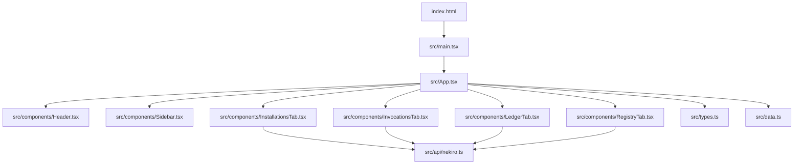
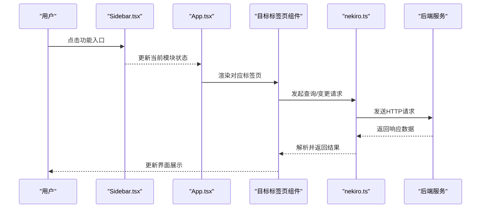
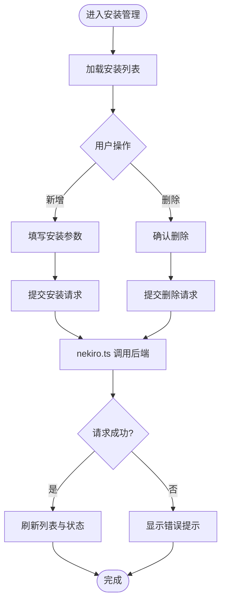
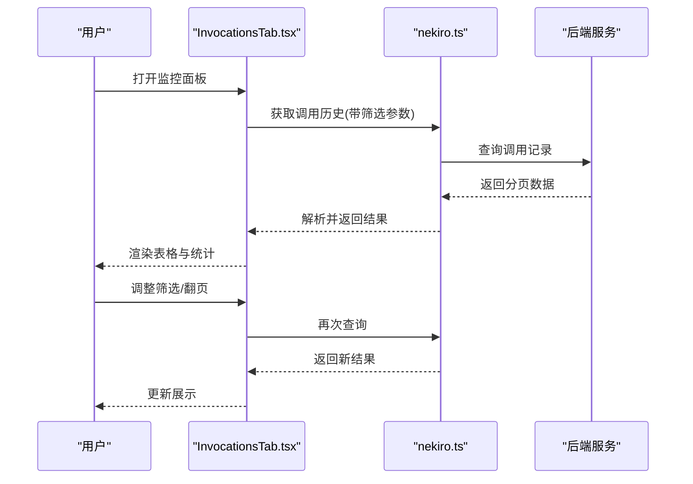
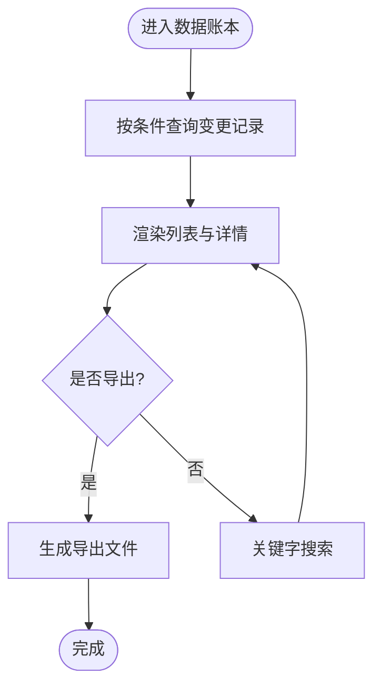
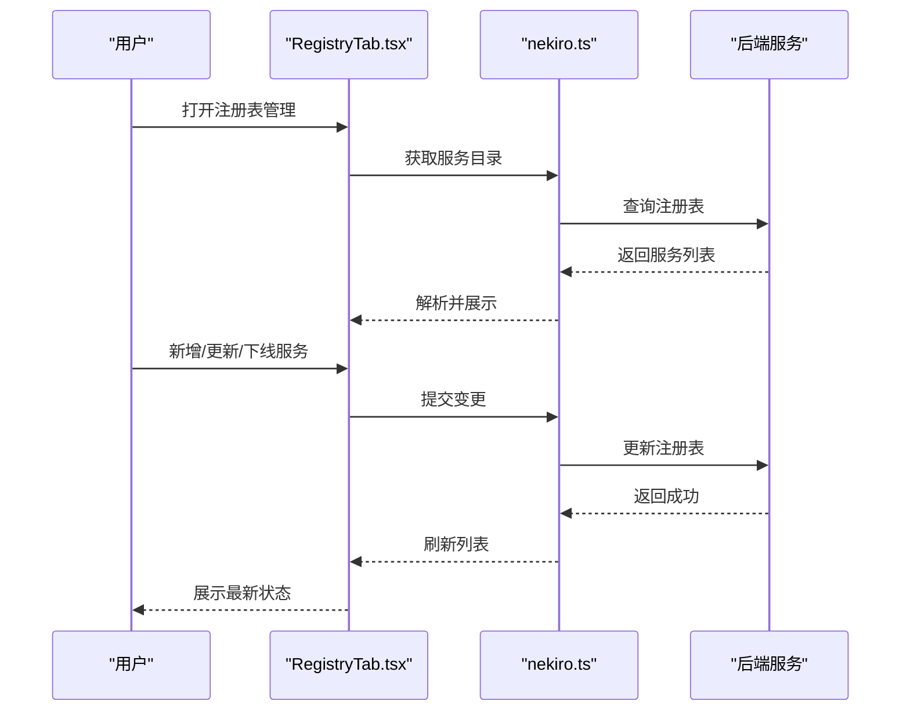
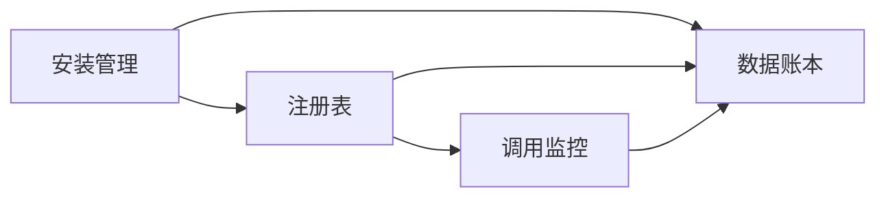
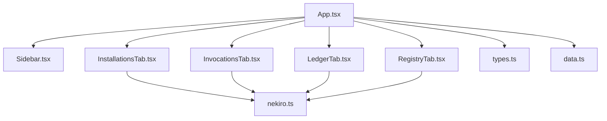

# 核心功能

<cite>
**本文引用的文件**   
- [README.md](file://README.md)
- [package.json](file://package.json)
- [vite.config.ts](file://vite.config.ts)
- [src/main.tsx](file://src/main.tsx)
- [src/App.tsx](file://src/App.tsx)
- [src/components/Sidebar.tsx](file://src/components/Sidebar.tsx)
- [src/components/Header.tsx](file://src/components/Header.tsx)
- [src/components/InstallationsTab.tsx](file://src/components/InstallationsTab.tsx)
- [src/components/InvocationsTab.tsx](file://src/components/InvocationsTab.tsx)
- [src/components/LedgerTab.tsx](file://src/components/LedgerTab.tsx)
- [src/components/RegistryTab.tsx](file://src/components/RegistryTab.tsx)
- [src/api/nekiro.ts](file://src/api/nekiro.ts)
- [src/api/nekiro.test.ts](file://src/api/nekiro.test.ts)
- [src/types.ts](file://src/types.ts)
- [src/data.ts](file://src/data.ts)
- [metadata.json](file://metadata.json)
</cite>

## 目录
1. [简介](#简介)
2. [项目结构](#项目结构)
3. [核心组件](#核心组件)
4. [架构总览](#架构总览)
5. [详细组件分析](#详细组件分析)
6. [依赖关系分析](#依赖关系分析)
7. [性能考虑](#性能考虑)
8. [故障排查指南](#故障排查指南)
9. [结论](#结论)
10. [附录](#附录)

## 简介
NeKiro-console 是一个面向 NeKiro 生态的前端控制台，提供四大核心能力：服务器安装管理、服务调用监控、数据账本系统、注册表管理。控制台通过统一的侧边栏导航与顶部标题栏组织页面，四个功能模块以“标签页”形式呈现，便于在单一应用中快速切换与操作。API 层封装了与后端的交互，类型定义与示例数据支撑前端展示与校验。

## 项目结构
本项目采用基于功能的组件划分方式，核心入口位于 src/main.tsx，应用根组件为 src/App.tsx，UI 布局由 Header 与 Sidebar 组成，四大功能分别对应 InstallationsTab、InvocationsTab、LedgerTab、RegistryTab。API 请求集中在 src/api/nekiro.ts，类型定义集中于 src/types.ts，示例数据位于 src/data.ts。构建工具使用 Vite，配置文件为 vite.config.ts；包管理与脚本定义在 package.json。

图表来源
- [src/main.tsx](file://src/main.tsx)
- [src/App.tsx](file://src/App.tsx)
- [src/components/Header.tsx](file://src/components/Header.tsx)
- [src/components/Sidebar.tsx](file://src/components/Sidebar.tsx)
- [src/components/InstallationsTab.tsx](file://src/components/InstallationsTab.tsx)
- [src/components/InvocationsTab.tsx](file://src/components/InvocationsTab.tsx)
- [src/components/LedgerTab.tsx](file://src/components/LedgerTab.tsx)
- [src/components/RegistryTab.tsx](file://src/components/RegistryTab.tsx)
- [src/api/nekiro.ts](file://src/api/nekiro.ts)
- [src/types.ts](file://src/types.ts)
- [src/data.ts](file://src/data.ts)

章节来源
- [src/main.tsx](file://src/main.tsx)
- [src/App.tsx](file://src/App.tsx)
- [src/components/Sidebar.tsx](file://src/components/Sidebar.tsx)
- [src/components/Header.tsx](file://src/components/Header.tsx)
- [src/components/InstallationsTab.tsx](file://src/components/InstallationsTab.tsx)
- [src/components/InvocationsTab.tsx](file://src/components/InvocationsTab.tsx)
- [src/components/LedgerTab.tsx](file://src/components/LedgerTab.tsx)
- [src/components/RegistryTab.tsx](file://src/components/RegistryTab.tsx)
- [src/api/nekiro.ts](file://src/api/nekiro.ts)
- [src/types.ts](file://src/types.ts)
- [src/data.ts](file://src/data.ts)
- [vite.config.ts](file://vite.config.ts)
- [package.json](file://package.json)

## 核心组件
- 应用容器 App.tsx：负责路由到不同功能标签页，组合 Header 与 Sidebar，并维护当前激活的模块状态。
- 侧边栏 Sidebar.tsx：提供四个功能入口（安装管理、调用监控、数据账本、注册表），点击后切换主内容区。
- 顶部标题 Header.tsx：显示应用名称与全局信息，可承载用户或环境标识。
- 功能标签页组件：
  - InstallationsTab.tsx：服务器安装管理界面，支持查看、新增、删除等操作。
  - InvocationsTab.tsx：服务调用监控面板，展示调用历史、统计指标与筛选过滤。
  - LedgerTab.tsx：数据账本视图，呈现变更记录、审计信息与导出能力。
  - RegistryTab.tsx：注册表管理界面，用于服务发现、版本管理与元数据维护。
- API 层 nekiro.ts：封装 HTTP 请求方法，统一错误处理与重试策略，暴露给各标签页组件使用。
- 类型定义 types.ts：集中声明前后端交互的数据模型与枚举值，保证类型安全。
- 示例数据 data.ts：提供本地演示数据，便于在无后端环境下预览 UI。

章节来源
- [src/App.tsx](file://src/App.tsx)
- [src/components/Sidebar.tsx](file://src/components/Sidebar.tsx)
- [src/components/Header.tsx](file://src/components/Header.tsx)
- [src/components/InstallationsTab.tsx](file://src/components/InstallationsTab.tsx)
- [src/components/InvocationsTab.tsx](file://src/components/InvocationsTab.tsx)
- [src/components/LedgerTab.tsx](file://src/components/LedgerTab.tsx)
- [src/components/RegistryTab.tsx](file://src/components/RegistryTab.tsx)
- [src/api/nekiro.ts](file://src/api/nekiro.ts)
- [src/types.ts](file://src/types.ts)
- [src/data.ts](file://src/data.ts)

## 架构总览
控制台采用“单页应用 + 模块化标签页”的架构。用户通过侧边栏选择功能模块，App 根据当前选中项渲染对应标签页组件。标签页组件通过 API 层与后端通信，读取或提交数据；类型定义确保数据结构一致；示例数据用于离线演示。

图表来源
- [src/components/Sidebar.tsx](file://src/components/Sidebar.tsx)
- [src/App.tsx](file://src/App.tsx)
- [src/components/InstallationsTab.tsx](file://src/components/InstallationsTab.tsx)
- [src/components/InvocationsTab.tsx](file://src/components/InvocationsTab.tsx)
- [src/components/LedgerTab.tsx](file://src/components/LedgerTab.tsx)
- [src/components/RegistryTab.tsx](file://src/components/RegistryTab.tsx)
- [src/api/nekiro.ts](file://src/api/nekiro.ts)

## 详细组件分析

### 服务器安装管理（InstallationsTab）
- 界面操作指南
  - 列表展示：查看已安装的服务器实例、状态与基本信息。
  - 新增安装：填写必要参数并提交，触发安装流程。
  - 删除实例：确认提示后移除指定实例。
  - 刷新与筛选：按状态、名称等条件过滤，手动刷新最新状态。
- 配置选项说明
  - 基础连接信息：后端地址、认证凭据等（由 API 层统一管理）。
  - 安装参数：版本、部署路径、环境变量等（具体字段以类型定义为准）。
- 使用场景示例
  - 批量部署新节点：准备多组安装参数，依次提交安装任务。
  - 下线旧节点：筛选出目标实例，执行删除并验证状态同步。
- 数据流转与交互
  - 标签页组件从 API 层拉取安装列表与详情，提交变更时调用相应接口。
  - 成功后更新本地状态并重绘列表。

图表来源
- [src/components/InstallationsTab.tsx](file://src/components/InstallationsTab.tsx)
- [src/api/nekiro.ts](file://src/api/nekiro.ts)

章节来源
- [src/components/InstallationsTab.tsx](file://src/components/InstallationsTab.tsx)
- [src/api/nekiro.ts](file://src/api/nekiro.ts)

### 服务调用监控（InvocationsTab）
- 界面操作指南
  - 调用历史：分页展示最近调用记录，包含时间戳、服务名、耗时、状态码等。
  - 筛选与排序：按服务、时间范围、状态码筛选，支持按耗时排序。
  - 详情查看：点击某条记录查看请求/响应摘要与链路信息。
- 配置选项说明
  - 刷新频率：控制自动轮询间隔。
  - 保留窗口：仅展示最近 N 条记录，避免大数据量导致卡顿。
- 使用场景示例
  - 定位慢调用：筛选高耗时记录，结合服务维度分析瓶颈。
  - 异常追踪：按错误状态码筛选，快速定位问题服务。
- 数据流转与交互
  - 定时或手动触发查询，API 层聚合返回数据，标签页进行渲染与缓存。

图表来源
- [src/components/InvocationsTab.tsx](file://src/components/InvocationsTab.tsx)
- [src/api/nekiro.ts](file://src/api/nekiro.ts)

章节来源
- [src/components/InvocationsTab.tsx](file://src/components/InvocationsTab.tsx)
- [src/api/nekiro.ts](file://src/api/nekiro.ts)

### 数据账本系统（LedgerTab）
- 界面操作指南
  - 变更记录：按时间顺序展示关键数据的增删改轨迹。
  - 审计信息：记录操作人、来源 IP、关联资源等上下文。
  - 导出与搜索：支持导出 CSV/JSON，按关键字检索条目。
- 配置选项说明
  - 时间窗口：限定展示的时间范围。
  - 敏感字段脱敏：对隐私信息进行遮蔽显示。
- 使用场景示例
  - 合规审计：导出指定时间段内的变更记录供审查。
  - 回滚辅助：根据账本定位变更点，协助恢复。
- 数据流转与交互
  - 标签页向 API 层请求账本数据，后端持久化变更记录，前端分页渲染。

图表来源
- [src/components/LedgerTab.tsx](file://src/components/LedgerTab.tsx)
- [src/api/nekiro.ts](file://src/api/nekiro.ts)

章节来源
- [src/components/LedgerTab.tsx](file://src/components/LedgerTab.tsx)
- [src/api/nekiro.ts](file://src/api/nekiro.ts)

### 注册表管理（RegistryTab）
- 界面操作指南
  - 服务注册：添加新的服务实例，设置版本、权重、健康检查等。
  - 服务发现：查询可用实例列表，查看元数据与健康状态。
  - 版本管理：切换默认版本、灰度发布、回滚操作。
- 配置选项说明
  - 健康检查策略：超时、重试次数、探测间隔。
  - 负载均衡策略：轮询、加权、最少连接等（由后端实现决定）。
- 使用场景示例
  - 灰度发布：将少量流量导向新版本，观察稳定性后再全量切换。
  - 故障隔离：下线不健康实例，保持服务可用性。
- 数据流转与交互
  - 注册表变更通过 API 层提交，后端更新服务目录并通知相关消费者。

图表来源
- [src/components/RegistryTab.tsx](file://src/components/RegistryTab.tsx)
- [src/api/nekiro.ts](file://src/api/nekiro.ts)

章节来源
- [src/components/RegistryTab.tsx](file://src/components/RegistryTab.tsx)
- [src/api/nekiro.ts](file://src/api/nekiro.ts)

### 概念性概览
以下流程图展示了跨模块的数据协作关系：安装管理创建实例后，注册表会感知新服务；调用监控消费注册表的服务目录进行观测；账本记录所有变更事件，形成闭环审计。

[此图为概念性示意，未直接映射到具体源码文件]

## 依赖关系分析
- 组件耦合
  - App.tsx 作为容器，依赖 Sidebar.tsx 与四个标签页组件，低耦合、高内聚。
  - 标签页组件均依赖 API 层 nekiro.ts，避免直接耦合网络细节。
- 外部依赖
  - Vite 构建与开发体验优化。
  - 第三方库（如 React、TypeScript）在 package.json 中声明。
- 潜在循环依赖
  - 当前结构清晰，未见循环导入风险。

图表来源
- [src/App.tsx](file://src/App.tsx)
- [src/components/Sidebar.tsx](file://src/components/Sidebar.tsx)
- [src/components/InstallationsTab.tsx](file://src/components/InstallationsTab.tsx)
- [src/components/InvocationsTab.tsx](file://src/components/InvocationsTab.tsx)
- [src/components/LedgerTab.tsx](file://src/components/LedgerTab.tsx)
- [src/components/RegistryTab.tsx](file://src/components/RegistryTab.tsx)
- [src/api/nekiro.ts](file://src/api/nekiro.ts)
- [src/types.ts](file://src/types.ts)
- [src/data.ts](file://src/data.ts)

章节来源
- [src/App.tsx](file://src/App.tsx)
- [src/components/Sidebar.tsx](file://src/components/Sidebar.tsx)
- [src/components/InstallationsTab.tsx](file://src/components/InstallationsTab.tsx)
- [src/components/InvocationsTab.tsx](file://src/components/InvocationsTab.tsx)
- [src/components/LedgerTab.tsx](file://src/components/LedgerTab.tsx)
- [src/components/RegistryTab.tsx](file://src/components/RegistryTab.tsx)
- [src/api/nekiro.ts](file://src/api/nekiro.ts)
- [src/types.ts](file://src/types.ts)
- [src/data.ts](file://src/data.ts)
- [package.json](file://package.json)

## 性能考虑
- 列表分页与虚拟滚动：对于大量调用记录与账本条目，建议启用分页与按需渲染，减少 DOM 压力。
- 请求去抖与节流：筛选与搜索输入应做防抖，避免频繁触发查询。
- 缓存策略：对静态或低频变化数据（如服务目录）实施短期缓存，降低后端负载。
- 增量更新：调用监控可采用增量拉取或 WebSocket 推送，减少全量刷新开销。
- 图片与资源优化：静态资源压缩与懒加载，提升首屏速度。
- 错误重试与退避：对不稳定网络增加指数退避重试，提高鲁棒性。

[本节为通用指导，无需源码引用]

## 故障排查指南
- 常见问题
  - 无法连接后端：检查 API 地址、代理配置与 CORS 设置。
  - 列表为空：确认后端返回格式是否符合类型定义，必要时使用示例数据验证 UI。
  - 权限不足：核对认证凭据与作用域，确保具备所需操作权限。
  - 性能抖动：检查是否缺少分页或缓存，评估数据量级与渲染成本。
- 调试技巧
  - 使用浏览器开发者工具的网络面板查看请求与响应。
  - 在 API 层添加日志输出，定位失败原因。
  - 利用单元测试覆盖关键路径，确保接口契约稳定。

章节来源
- [src/api/nekiro.ts](file://src/api/nekiro.ts)
- [src/api/nekiro.test.ts](file://src/api/nekiro.test.ts)
- [src/types.ts](file://src/types.ts)

## 结论
NeKiro-console 通过清晰的组件分层与统一的 API 抽象，实现了安装管理、调用监控、数据账本与注册表四大核心能力的集成。建议在后续迭代中完善错误边界、增强可观测性与国际化支持，同时持续优化性能与用户体验。

[本节为总结性内容，无需源码引用]

## 附录
- 安装与运行
  - 安装依赖：参考 package.json 中的脚本命令。
  - 启动开发服务器：使用 Vite 提供的开发模式。
  - 构建生产版本：执行打包命令并部署静态资源。
- 配置与环境
  - 环境变量：在后端地址、认证信息等配置处注入环境变量。
  - 代理设置：在 vite.config.ts 中配置开发代理，解决跨域问题。
- 文档与规范
  - 设计规格与计划：参考 docs/superpowers/specs 与 plans 下的文档。
  - 元数据：metadata.json 包含项目元信息，便于平台集成。

章节来源
- [package.json](file://package.json)
- [vite.config.ts](file://vite.config.ts)
- [metadata.json](file://metadata.json)
- [README.md](file://README.md)