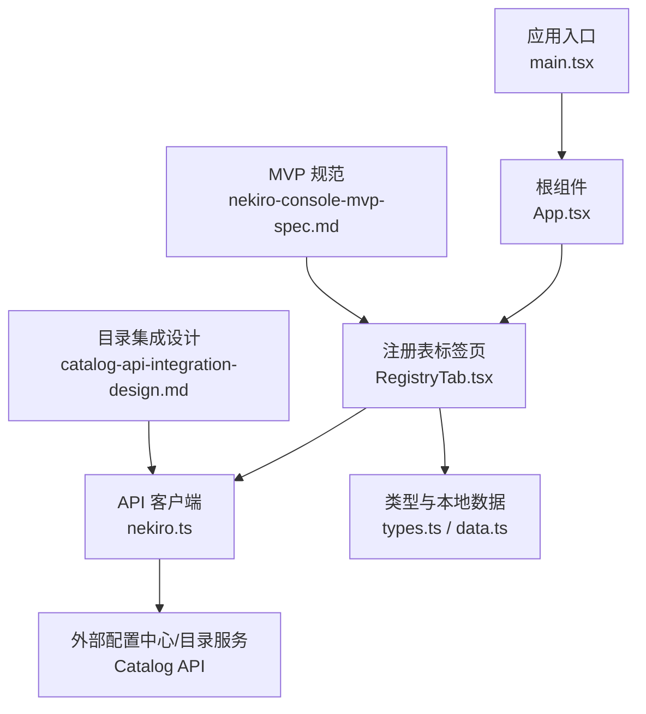
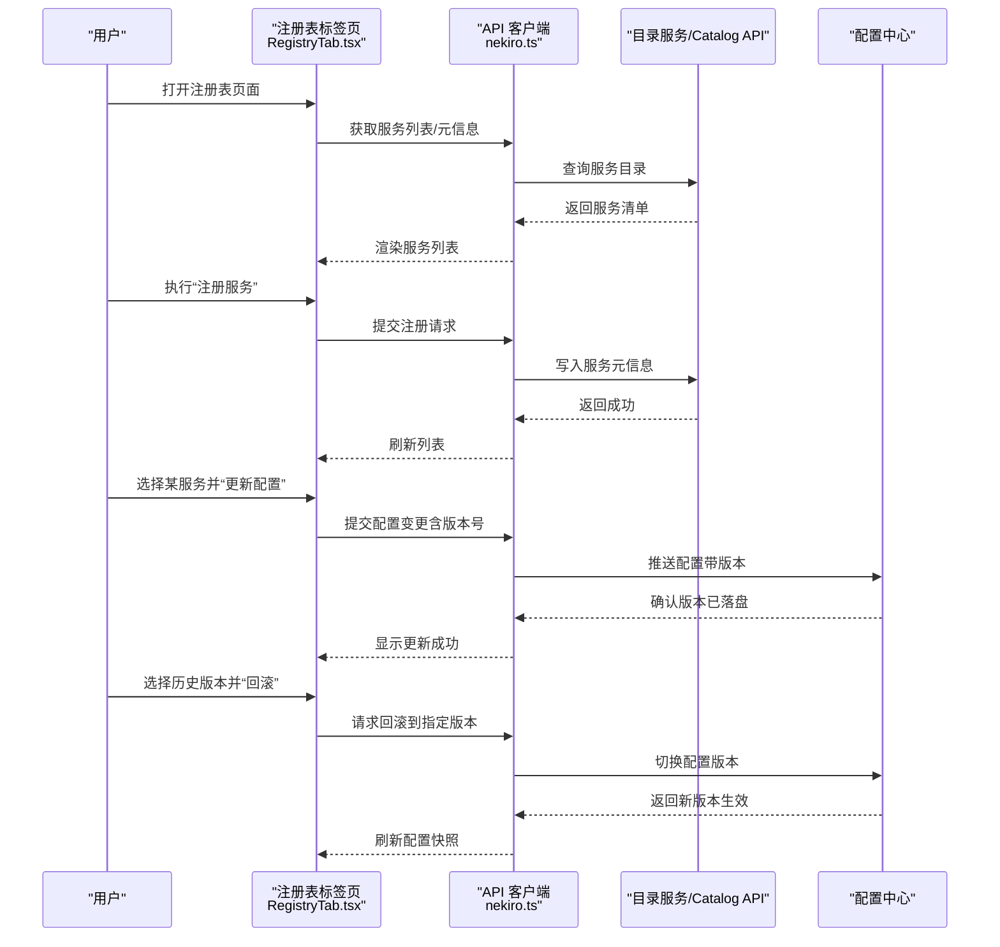
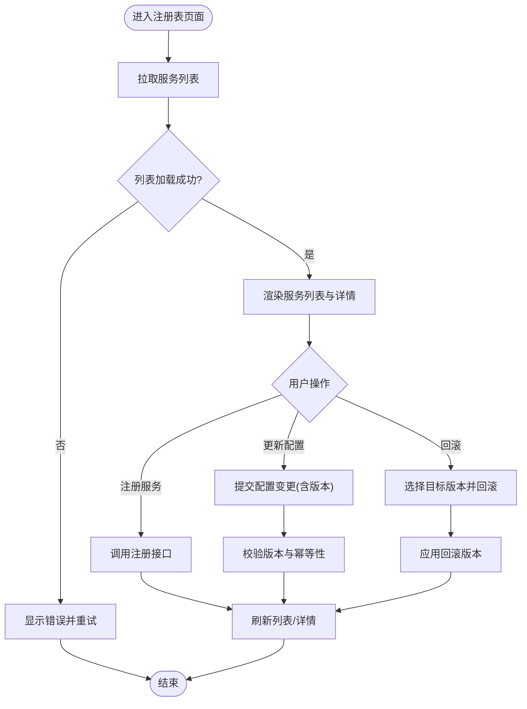
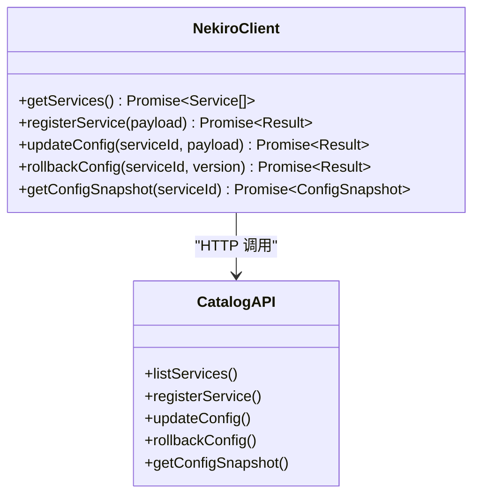
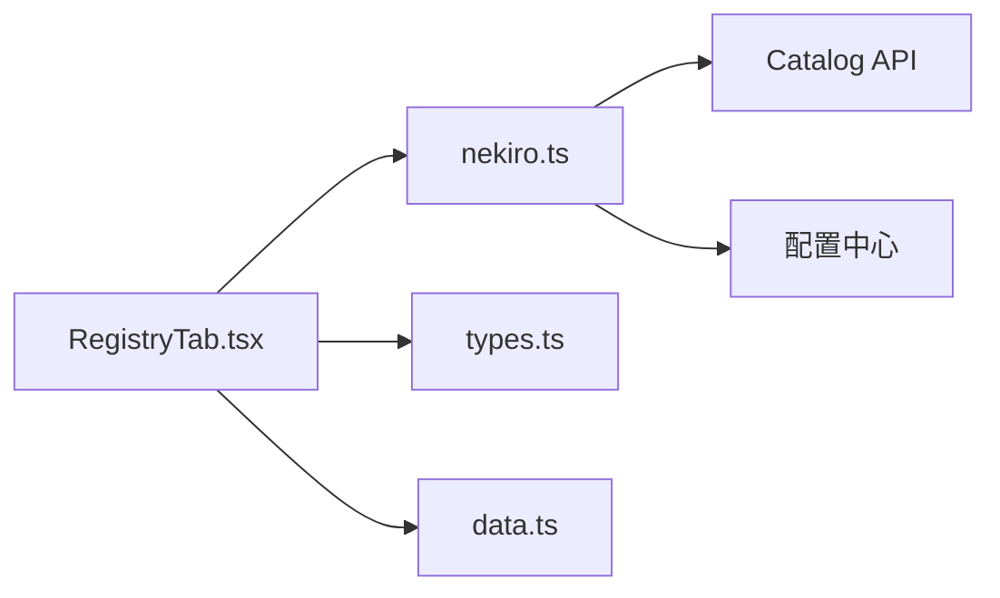

# 注册表管理

<cite>
**本文引用的文件**   
- [README.md](file://README.md)
- [package.json](file://package.json)
- [src/App.tsx](file://src/App.tsx)
- [src/main.tsx](file://src/main.tsx)
- [src/types.ts](file://src/types.ts)
- [src/data.ts](file://src/data.ts)
- [src/components/RegistryTab.tsx](file://src/components/RegistryTab.tsx)
- [src/api/nekiro.ts](file://src/api/nekiro.ts)
- [src/api/nekiro.test.ts](file://src/api/nekiro.test.ts)
- [docs/superpowers/plans/2026-07-14-catalog-api-integration.md](file://docs/superpowers/plans/2026-07-14-catalog-api-integration.md)
- [docs/superpowers/specs/2026-07-14-catalog-api-integration-design.md](file://docs/superpowers/specs/2026-07-14-catalog-api-integration-design.md)
- [docs/superpowers/specs/2026-07-16-nekiro-console-mvp-spec.md](file://docs/superpowers/specs/2026-07-16-nekiro-console-mvp-spec.md)
</cite>

## 目录
1. [简介](#简介)
2. [项目结构](#项目结构)
3. [核心组件](#核心组件)
4. [架构总览](#架构总览)
5. [详细组件分析](#详细组件分析)
6. [依赖关系分析](#依赖关系分析)
7. [性能考虑](#性能考虑)
8. [故障排查指南](#故障排查指南)
9. [结论](#结论)
10. [附录](#附录)

## 简介
本文件面向 NeKiro-console 的“注册表管理”能力，围绕服务发现、动态配置更新与配置中心集成进行系统化说明。文档从系统架构、数据结构、版本控制策略、变更影响评估与冲突解决、备份恢复、权限与安全等维度展开，并提供可操作的场景示例（服务注册、配置热更新、配置回滚）以及最佳实践与常见陷阱提示，帮助系统管理员高效运维，同时为开发者提供清晰的架构设计指导。

## 项目结构
NeKiro-console 采用前端工程化组织方式，注册表相关功能主要位于 UI 组件层与 API 适配层：
- 应用入口与路由挂载：App.tsx、main.tsx
- 类型定义与本地数据模型：types.ts、data.ts
- 注册表界面组件：components/RegistryTab.tsx
- API 客户端与测试：api/nekiro.ts、api/nekiro.test.ts
- 规划与设计文档：docs/superpowers/...

图表来源
- [src/main.tsx:1-50](file://src/main.tsx#L1-L50)
- [src/App.tsx:1-120](file://src/App.tsx#L1-L120)
- [src/components/RegistryTab.tsx:1-200](file://src/components/RegistryTab.tsx#L1-L200)
- [src/api/nekiro.ts:1-200](file://src/api/nekiro.ts#L1-L200)
- [src/types.ts:1-200](file://src/types.ts#L1-L200)
- [src/data.ts:1-200](file://src/data.ts#L1-L200)
- [docs/superpowers/specs/2026-07-16-nekiro-console-mvp-spec.md:1-200](file://docs/superpowers/specs/2026-07-16-nekiro-console-mvp-spec.md#L1-L200)
- [docs/superpowers/specs/2026-07-14-catalog-api-integration-design.md:1-200](file://docs/superpowers/specs/2026-07-14-catalog-api-integration-design.md#L1-L200)

章节来源
- [src/main.tsx:1-50](file://src/main.tsx#L1-L50)
- [src/App.tsx:1-120](file://src/App.tsx#L1-L120)
- [src/components/RegistryTab.tsx:1-200](file://src/components/RegistryTab.tsx#L1-L200)
- [src/api/nekiro.ts:1-200](file://src/api/nekiro.ts#L1-L200)
- [src/types.ts:1-200](file://src/types.ts#L1-L200)
- [src/data.ts:1-200](file://src/data.ts#L1-L200)
- [docs/superpowers/specs/2026-07-16-nekiro-console-mvp-spec.md:1-200](file://docs/superpowers/specs/2026-07-16-nekiro-console-mvp-spec.md#L1-L200)
- [docs/superpowers/specs/2026-07-14-catalog-api-integration-design.md:1-200](file://docs/superpowers/specs/2026-07-14-catalog-api-integration-design.md#L1-L200)

## 核心组件
- 注册表标签页（RegistryTab）
  - 负责展示服务列表、元信息、健康状态与配置快照；提供注册、更新、回滚等操作入口。
  - 通过 API 客户端调用后端或外部配置中心接口，完成数据读写与同步。
- API 客户端（nekiro.ts）
  - 封装对目录服务/Catalog API 的请求，统一错误处理、重试与鉴权头注入。
  - 暴露服务注册、查询、更新、删除、版本拉取等函数。
- 类型与本地数据（types.ts、data.ts）
  - 定义服务实体、配置项、版本对象、操作结果等类型契约。
  - 提供本地样例数据与初始态，便于开发调试与演示。
- 应用入口与路由（main.tsx、App.tsx）
  - 初始化 React 应用并挂载各标签页，包括注册表页面。

章节来源
- [src/components/RegistryTab.tsx:1-200](file://src/components/RegistryTab.tsx#L1-L200)
- [src/api/nekiro.ts:1-200](file://src/api/nekiro.ts#L1-L200)
- [src/types.ts:1-200](file://src/types.ts#L1-L200)
- [src/data.ts:1-200](file://src/data.ts#L1-L200)
- [src/main.tsx:1-50](file://src/main.tsx#L1-L50)
- [src/App.tsx:1-120](file://src/App.tsx#L1-L120)

## 架构总览
注册表管理在 NeKiro-console 中由前端 UI 驱动，通过 API 客户端与外部配置中心（目录服务）交互，实现服务发现与配置管理。整体流程如下：

图表来源
- [src/components/RegistryTab.tsx:1-200](file://src/components/RegistryTab.tsx#L1-L200)
- [src/api/nekiro.ts:1-200](file://src/api/nekiro.ts#L1-L200)
- [docs/superpowers/specs/2026-07-14-catalog-api-integration-design.md:1-200](file://docs/superpowers/specs/2026-07-14-catalog-api-integration-design.md#L1-L200)

## 详细组件分析

### 注册表标签页（RegistryTab）
职责与行为
- 展示服务列表、元信息与健康状态，支持分页与筛选。
- 提供“注册服务”、“更新配置”、“查看历史版本”、“回滚”等操作。
- 维护本地加载态、错误态与操作反馈，确保用户体验一致。

关键交互
- 与服务目录/Catalog API 同步服务清单与元信息。
- 与配置中心协作完成配置的增量更新与版本切换。
- 对异常进行友好提示与重试建议。

图表来源
- [src/components/RegistryTab.tsx:1-200](file://src/components/RegistryTab.tsx#L1-L200)

章节来源
- [src/components/RegistryTab.tsx:1-200](file://src/components/RegistryTab.tsx#L1-L200)

### API 客户端（nekiro.ts）
职责与行为
- 封装对外部目录服务/Catalog API 的 HTTP 调用。
- 统一注入鉴权头、超时与重试策略。
- 将响应转换为业务类型，屏蔽底层差异。

典型方法
- 服务注册、查询、更新、删除
- 配置拉取、推送、版本切换
- 健康检查与心跳上报

图表来源
- [src/api/nekiro.ts:1-200](file://src/api/nekiro.ts#L1-L200)

章节来源
- [src/api/nekiro.ts:1-200](file://src/api/nekiro.ts#L1-L200)

### 类型与本地数据（types.ts、data.ts）
数据类型要点
- 服务实体：包含标识、名称、版本、端点、健康状态、标签等元信息。
- 配置项：键值对集合，支持分组与层级结构。
- 版本对象：版本号、时间戳、变更摘要、创建者等。
- 操作结果：成功/失败、错误码、消息、耗时等。

本地数据
- 提供样例服务与配置，用于快速验证与演示。
- 作为离线模式下的降级数据源。

章节来源
- [src/types.ts:1-200](file://src/types.ts#L1-L200)
- [src/data.ts:1-200](file://src/data.ts#L1-L200)

### 应用入口与路由（main.tsx、App.tsx）
职责
- 初始化应用上下文与全局样式。
- 挂载注册表标签页与其他功能模块。
- 提供基础的路由与布局。

章节来源
- [src/main.tsx:1-50](file://src/main.tsx#L1-L50)
- [src/App.tsx:1-120](file://src/App.tsx#L1-L120)

## 依赖关系分析
- 组件依赖
  - RegistryTab 依赖 API 客户端与类型定义。
  - API 客户端依赖网络栈与鉴权中间件（由上层注入）。
- 外部依赖
  - 目录服务/Catalog API：服务发现与元信息管理。
  - 配置中心：配置存储、版本管理与发布。

图表来源
- [src/components/RegistryTab.tsx:1-200](file://src/components/RegistryTab.tsx#L1-L200)
- [src/api/nekiro.ts:1-200](file://src/api/nekiro.ts#L1-L200)
- [src/types.ts:1-200](file://src/types.ts#L1-L200)
- [src/data.ts:1-200](file://src/data.ts#L1-L200)

章节来源
- [src/components/RegistryTab.tsx:1-200](file://src/components/RegistryTab.tsx#L1-L200)
- [src/api/nekiro.ts:1-200](file://src/api/nekiro.ts#L1-L200)
- [src/types.ts:1-200](file://src/types.ts#L1-L200)
- [src/data.ts:1-200](file://src/data.ts#L1-L200)

## 性能考虑
- 列表加载优化
  - 分页与懒加载：避免一次性拉取大量服务数据。
  - 缓存与去抖：对频繁查询做短期缓存，减少重复请求。
- 配置更新优化
  - 增量更新：仅传输变更字段，降低带宽与解析开销。
  - 幂等与并发控制：使用版本号与乐观锁避免覆盖与竞态。
- 错误与重试
  - 指数退避重试：在网络抖动时提升成功率。
  - 快速失败与降级：不可用服务及时剔除，保障主流程可用。

[本节为通用性能建议，不直接分析具体文件]

## 故障排查指南
常见问题与定位步骤
- 服务列表为空或加载失败
  - 检查目录服务连通性与鉴权头是否正确注入。
  - 查看 API 客户端日志与错误码，确认是否触发重试上限。
- 配置更新失败或版本冲突
  - 核对版本号与期望版本是否一致，确认是否存在并发修改。
  - 查看配置中心的版本历史与变更记录，定位冲突点。
- 回滚后服务异常
  - 对比回滚前后配置差异，确认依赖服务的兼容性。
  - 观察健康检查指标，必要时快速切回上一稳定版本。

章节来源
- [src/api/nekiro.ts:1-200](file://src/api/nekiro.ts#L1-L200)
- [src/components/RegistryTab.tsx:1-200](file://src/components/RegistryTab.tsx#L1-L200)

## 结论
NeKiro-console 的注册表管理以清晰的前端分层与稳定的 API 抽象为核心，结合目录服务与配置中心，实现了服务发现、动态配置更新与版本控制的闭环。通过合理的版本策略、幂等设计与错误处理，可在保证一致性的前提下提供高效的运维体验。建议在生产环境完善权限控制、审计与告警机制，进一步提升安全性与可观测性。

[本节为总结性内容，不直接分析具体文件]

## 附录

### 数据结构与元信息
- 服务实体
  - 标识、名称、版本、端点、健康状态、标签、描述、创建/更新时间等。
- 配置项
  - 键值对集合，支持分组与层级结构，附带版本与变更摘要。
- 版本对象
  - 版本号、时间戳、变更摘要、创建者、关联配置快照 ID。

章节来源
- [src/types.ts:1-200](file://src/types.ts#L1-L200)

### 配置版本控制策略
- 版本号规则
  - 语义化版本或递增整数，确保单调递增与唯一性。
- 变更摘要
  - 每次变更需记录摘要与影响范围，便于审计与回滚决策。
- 幂等与冲突
  - 基于版本号进行乐观锁更新，冲突时提示合并策略。

章节来源
- [src/types.ts:1-200](file://src/types.ts#L1-L200)
- [src/api/nekiro.ts:1-200](file://src/api/nekiro.ts#L1-L200)

### 配置变更影响评估与冲突解决
- 影响评估
  - 根据服务标签与依赖关系，评估变更波及的服务范围。
  - 结合健康指标与错误率阈值，自动预警高风险变更。
- 冲突解决
  - 多源配置合并策略：按命名空间隔离、优先级排序与覆盖规则。
  - 人工审批与灰度发布：对关键变更引入审批流与分批次上线。

章节来源
- [docs/superpowers/specs/2026-07-14-catalog-api-integration-design.md:1-200](file://docs/superpowers/specs/2026-07-14-catalog-api-integration-design.md#L1-L200)

### 与外部配置中心的集成与同步机制
- 集成方式
  - 通过 API 客户端对接目录服务与配置中心，统一鉴权与错误处理。
- 同步机制
  - 事件驱动：配置变更后推送订阅方。
  - 轮询拉取：客户端定时拉取最新配置，结合版本号判断是否需要更新。

章节来源
- [src/api/nekiro.ts:1-200](file://src/api/nekiro.ts#L1-L200)
- [docs/superpowers/specs/2026-07-14-catalog-api-integration-design.md:1-200](file://docs/superpowers/specs/2026-07-14-catalog-api-integration-design.md#L1-L200)

### 配置备份与恢复
- 备份
  - 定期导出配置快照与版本历史，存储于安全介质。
- 恢复
  - 基于版本 ID 或时间戳恢复，确保一致性校验通过后生效。

章节来源
- [src/api/nekiro.ts:1-200](file://src/api/nekiro.ts#L1-L200)

### 权限控制与访问安全
- 鉴权
  - 统一注入令牌与签名，限制敏感操作（注册、更新、回滚）。
- 授权
  - 基于角色与资源的最小权限原则，区分只读与写权限。
- 审计
  - 记录所有配置变更与操作日志，支持追溯与合规审查。

章节来源
- [src/api/nekiro.ts:1-200](file://src/api/nekiro.ts#L1-L200)

### 配置管理场景示例
- 服务注册
  - 填写服务元信息并提交注册，成功后刷新列表并显示健康状态。
- 配置热更新
  - 选择目标服务，编辑配置项并提交，系统推送至配置中心并生效。
- 配置回滚
  - 选择历史版本并执行回滚，系统切换配置并刷新快照。

章节来源
- [src/components/RegistryTab.tsx:1-200](file://src/components/RegistryTab.tsx#L1-L200)
- [src/api/nekiro.ts:1-200](file://src/api/nekiro.ts#L1-L200)

### 最佳实践与常见陷阱
- 最佳实践
  - 使用语义化版本与变更摘要，保持可追溯性。
  - 小步快跑与灰度发布，降低变更风险。
  - 建立自动化测试与回归验证，确保配置正确性。
- 常见陷阱
  - 忽略幂等与并发控制导致覆盖问题。
  - 未设置合理超时与重试策略引发雪崩。
  - 缺少权限与审计导致合规风险。

章节来源
- [src/api/nekiro.ts:1-200](file://src/api/nekiro.ts#L1-L200)
- [src/components/RegistryTab.tsx:1-200](file://src/components/RegistryTab.tsx#L1-L200)

### 参考与规范
- MVP 规范
  - 明确注册表管理的核心能力与验收标准。
- 目录集成设计
  - 定义与 Catalog API 的交互协议与数据格式。

章节来源
- [docs/superpowers/specs/2026-07-16-nekiro-console-mvp-spec.md:1-200](file://docs/superpowers/specs/2026-07-16-nekiro-console-mvp-spec.md#L1-L200)
- [docs/superpowers/specs/2026-07-14-catalog-api-integration-design.md:1-200](file://docs/superpowers/specs/2026-07-14-catalog-api-integration-design.md#L1-L200)
- [docs/superpowers/plans/2026-07-14-catalog-api-integration.md:1-200](file://docs/superpowers/plans/2026-07-14-catalog-api-integration.md#L1-L200)