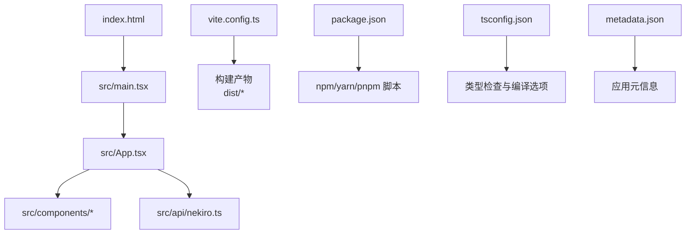
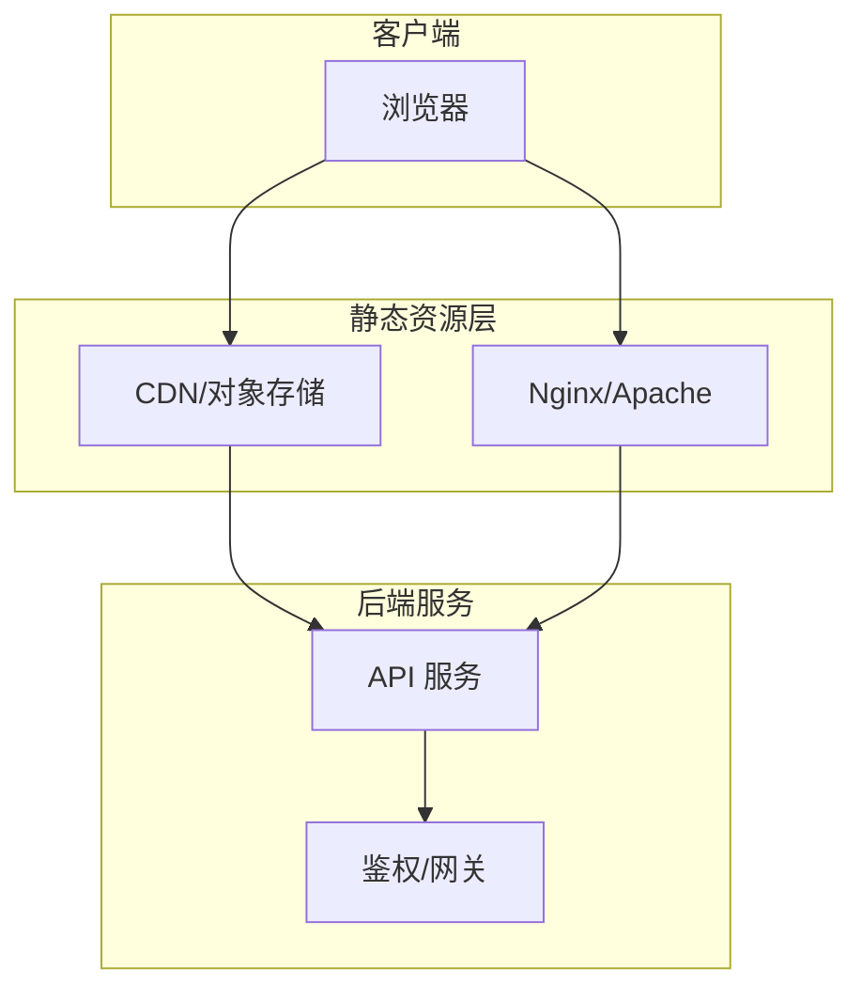
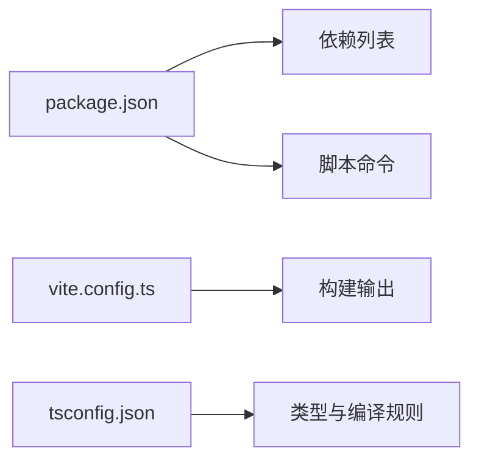

# 部署指南

<cite>
**本文引用的文件**   
- [README.md](file://README.md)
- [package.json](file://package.json)
- [vite.config.ts](file://vite.config.ts)
- [tsconfig.json](file://tsconfig.json)
- [index.html](file://index.html)
- [src/main.tsx](file://src/main.tsx)
- [src/App.tsx](file://src/App.tsx)
- [src/api/nekiro.ts](file://src/api/nekiro.ts)
- [metadata.json](file://metadata.json)
</cite>

## 目录
1. [简介](#简介)
2. [项目结构](#项目结构)
3. [核心组件](#核心组件)
4. [架构总览](#架构总览)
5. [详细组件分析](#详细组件分析)
6. [依赖分析](#依赖分析)
7. [性能考虑](#性能考虑)
8. [故障排查指南](#故障排查指南)
9. [结论](#结论)
10. [附录](#附录)

## 简介
本指南面向运维与平台工程团队，提供 NeKiro-console 在生产环境的构建、部署、安全、监控、日志、性能调优与回滚策略的完整说明。NeKiro-console 是一个基于 Vite + React（TypeScript）的前端控制台应用，通过 API 模块与后端服务交互。生产环境建议采用静态资源托管方案（CDN/对象存储/Nginx），并结合 CI/CD 实现自动化构建与发布。

## 项目结构
仓库为典型的前端单页应用结构：
- 构建与脚本：package.json、vite.config.ts、tsconfig.json
- 入口与页面：index.html、src/main.tsx、src/App.tsx
- 业务模块：src/components/*、src/api/*
- 元数据：metadata.json

图表来源
- [index.html:1-200](file://index.html#L1-L200)
- [src/main.tsx:1-200](file://src/main.tsx#L1-L200)
- [src/App.tsx:1-200](file://src/App.tsx#L1-L200)
- [vite.config.ts:1-200](file://vite.config.ts#L1-L200)
- [package.json:1-200](file://package.json#L1-L200)
- [tsconfig.json:1-200](file://tsconfig.json#L1-L200)
- [metadata.json:1-200](file://metadata.json#L1-L200)

章节来源
- [README.md:1-200](file://README.md#L1-L200)
- [package.json:1-200](file://package.json#L1-L200)
- [vite.config.ts:1-200](file://vite.config.ts#L1-L200)
- [tsconfig.json:1-200](file://tsconfig.json#L1-L200)
- [index.html:1-200](file://index.html#L1-L200)
- [src/main.tsx:1-200](file://src/main.tsx#L1-L200)
- [src/App.tsx:1-200](file://src/App.tsx#L1-L200)
- [src/api/nekiro.ts:1-200](file://src/api/nekiro.ts#L1-L200)
- [metadata.json:1-200](file://metadata.json#L1-L200)

## 核心组件
- 构建系统：Vite（开发服务器、热更新、生产优化）
- 运行时：React + TypeScript
- API 层：src/api/nekiro.ts 封装对后端的请求
- 配置：vite.config.ts 控制构建行为；tsconfig.json 控制类型与编译；package.json 管理脚本与依赖
- 元数据：metadata.json 用于描述应用版本或特性开关等

章节来源
- [vite.config.ts:1-200](file://vite.config.ts#L1-L200)
- [tsconfig.json:1-200](file://tsconfig.json#L1-L200)
- [package.json:1-200](file://package.json#L1-L200)
- [src/api/nekiro.ts:1-200](file://src/api/nekiro.ts#L1-L200)
- [metadata.json:1-200](file://metadata.json#L1-L200)

## 架构总览
NeKiro-console 作为前端 SPA，生产环境由 Web 服务器或 CDN 直接分发静态资源，并通过 API 网关/反向代理访问后端服务。

图表来源
- [vite.config.ts:1-200](file://vite.config.ts#L1-L200)
- [src/api/nekiro.ts:1-200](file://src/api/nekiro.ts#L1-L200)

## 详细组件分析

### 构建与打包（Vite）
- 构建目标：生成优化的静态资源（HTML/CSS/JS），默认输出到 dist 目录
- 关键能力：代码分割、Tree-shaking、资源压缩、缓存指纹
- 环境变量：通过 Vite 的环境变量注入机制在构建期注入常量（如 API 基础路径、功能开关）
- 自定义插件：可在 vite.config.ts 中扩展构建流程（如注入版本号、替换常量）

章节来源
- [vite.config.ts:1-200](file://vite.config.ts#L1-L200)
- [package.json:1-200](file://package.json#L1-L200)

### 应用入口与路由
- index.html 作为 SPA 入口，加载 main.tsx
- src/main.tsx 初始化 React 应用并挂载根节点
- src/App.tsx 组织页面与导航逻辑

章节来源
- [index.html:1-200](file://index.html#L1-L200)
- [src/main.tsx:1-200](file://src/main.tsx#L1-L200)
- [src/App.tsx:1-200](file://src/App.tsx#L1-L200)

### API 集成与安全
- src/api/nekiro.ts 定义与后端交互的请求方法
- 建议将 API 基础地址通过环境变量注入，避免硬编码
- 安全要点：
  - 使用 HTTPS 传输
  - 启用 CORS 白名单
  - 敏感凭据不放入前端，仅传递必要令牌
  - 设置合理的 Cookie 属性（Secure、SameSite）

章节来源
- [src/api/nekiro.ts:1-200](file://src/api/nekiro.ts#L1-L200)

### 类型与编译（TypeScript）
- tsconfig.json 控制严格模式、模块解析、输出目录等
- 建议开启严格类型检查以提升稳定性

章节来源
- [tsconfig.json:1-200](file://tsconfig.json#L1-L200)

### 元数据与版本
- metadata.json 可用于记录应用版本、构建时间、特性开关等
- 建议在构建时注入版本号到 HTML meta 或全局变量，便于问题定位

章节来源
- [metadata.json:1-200](file://metadata.json#L1-L200)

## 依赖分析
- 构建与运行依赖由 package.json 声明
- 建议锁定依赖版本并使用可复现的包管理器（pnpm/yarn）
- 生产构建应使用 --production 或等效参数以跳过开发依赖

图表来源
- [package.json:1-200](file://package.json#L1-L200)
- [vite.config.ts:1-200](file://vite.config.ts#L1-L200)
- [tsconfig.json:1-200](file://tsconfig.json#L1-L200)

章节来源
- [package.json:1-200](file://package.json#L1-L200)

## 性能考虑
- 资源缓存
  - 利用文件名哈希进行长期缓存
  - 对 HTML 设置较短缓存或 no-cache，以便快速拉取新版本
- 代码分割
  - 按路由或大模块拆分，减少首屏体积
- 图片与字体优化
  - 使用现代格式（WebP/AVIF）、按需加载
- 预加载与预连接
  - 对关键资源添加 preload/link rel=preconnect
- 服务端缓存
  - 合理设置 Cache-Control、ETag、Last-Modified
- 网络优化
  - 启用 gzip/brotli 压缩
  - 使用 HTTP/2 或 HTTP/3

[本节为通用指导，无需源码引用]

## 故障排查指南
- 常见问题
  - 404：确认静态资源路径与 base 配置一致
  - CORS 错误：检查后端跨域策略与请求头
  - 5xx：查看后端日志与网关错误页
  - 缓存导致未更新：强制刷新或调整 HTML 缓存策略
- 诊断步骤
  - 打开浏览器开发者工具，检查 Network 与 Console
  - 验证环境变量是否注入成功
  - 核对构建产物中的资源路径
- 回滚策略
  - 保留最近 N 个版本的静态资源
  - 通过蓝绿或金丝雀发布，快速切换流量
  - 若出现问题，立即切回上一稳定版本

[本节为通用指导，无需源码引用]

## 结论
NeKiro-console 采用标准的前端工程化方案，适合通过 CDN/对象存储/Nginx 进行静态资源分发。结合环境变量、CI/CD、监控与日志收集，可实现高可用、可观测的生产部署。遵循本文的安全与性能建议，可获得稳定的用户体验与可维护的运维体系。

[本节为总结性内容，无需源码引用]

## 附录

### 环境变量与配置
- 构建期环境变量
  - 用途：注入 API 基础地址、功能开关、版本信息等
  - 命名规范：统一前缀，区分环境（dev/staging/prod）
  - 安全：避免在前端暴露敏感密钥
- 运行时配置
  - 通过 HTML meta 或全局变量暴露非敏感配置
  - 动态配置可通过后端接口返回

章节来源
- [vite.config.ts:1-200](file://vite.config.ts#L1-L200)
- [index.html:1-200](file://index.html#L1-L200)
- [metadata.json:1-200](file://metadata.json#L1-L200)

### 静态资源部署方案
- CDN/对象存储
  - 上传 dist 目录至对象存储或 CDN
  - 配置域名与缓存策略
  - 使用别名或短链指向最新版本
- Web 服务器（Nginx/Apache）
  - 配置静态站点根目录指向 dist
  - 启用 gzip/brotli、HTTP/2
  - 设置合适的 Cache-Control 与 ETag
- 反向代理
  - 将 /api 转发至后端服务
  - 统一 HTTPS 终止与证书管理

[本节为通用指导，无需源码引用]

### Docker 容器化部署
- 多阶段构建
  - 构建阶段：安装依赖、执行构建
  - 运行阶段：仅包含静态资源与轻量 Web 服务器镜像
- 最佳实践
  - 固定 Node 与包管理器版本
  - 清理构建缓存，减小镜像体积
  - 非 root 用户运行
  - 健康检查与优雅退出
- 示例流程
  - 构建镜像 -> 推送镜像仓库 -> 部署到集群/宿主机

[本节为通用指导，无需源码引用]

### CI/CD 流水线示例
- 触发条件：push 到主分支或创建标签
- 步骤
  - 安装依赖
  - 类型检查与单元测试
  - 构建生产包
  - 生成制品（dist 或镜像）
  - 部署到目标环境（CDN/对象存储/容器平台）
  - 通知与告警
- 回滚
  - 保留历史制品
  - 一键回滚到上一个稳定版本

[本节为通用指导，无需源码引用]

### 监控与日志收集
- 前端监控
  - 错误上报（未捕获异常、Promise 拒绝）
  - 性能指标（FCP/LCP/CLS/TTFB）
  - 用户行为埋点（匿名化）
- 日志收集
  - 集中式日志平台（ELK/Cloud Logging）
  - 结构化日志字段（traceId、userId、env、version）
- 告警
  - 错误率阈值、慢请求、可用性检测

[本节为通用指导，无需源码引用]

### 安全设置清单
- 传输安全：全站 HTTPS，禁用弱加密套件
- 跨域策略：最小权限原则，限定来源与方法
- 凭据管理：不在前端存放密钥，使用短期令牌
- 内容安全策略（CSP）：限制脚本与资源来源
- 依赖安全：定期扫描漏洞，锁定版本

[本节为通用指导，无需源码引用]

### 性能调优与缓存策略
- 构建优化
  - 启用代码分割与 Tree-shaking
  - 资源压缩与懒加载
- 缓存策略
  - 静态资源长期缓存（带指纹）
  - HTML 短缓存或 no-store
  - 服务端启用 ETag/Last-Modified
- 网络优化
  - 启用 Brotli/Gzip
  - 使用 HTTP/2 或 HTTP/3
  - 预加载关键资源

[本节为通用指导，无需源码引用]