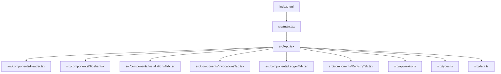
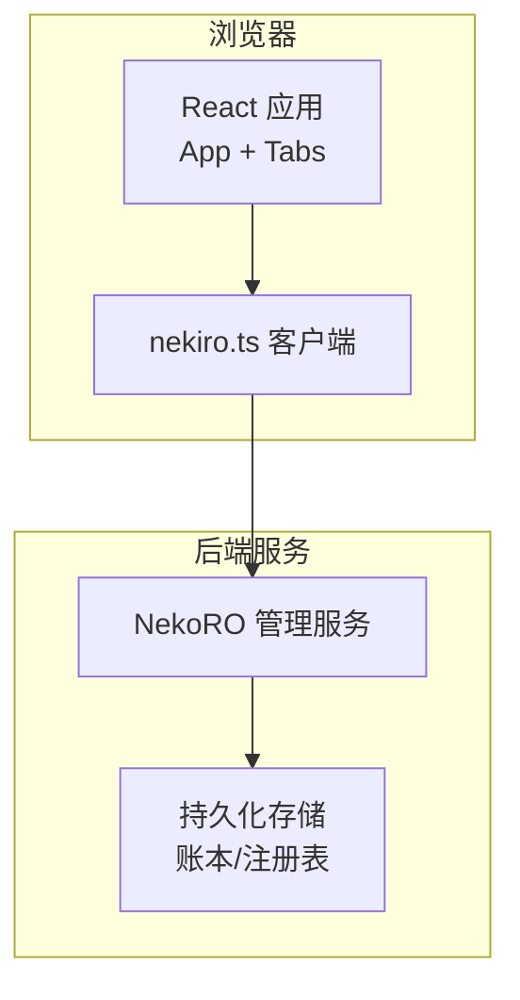
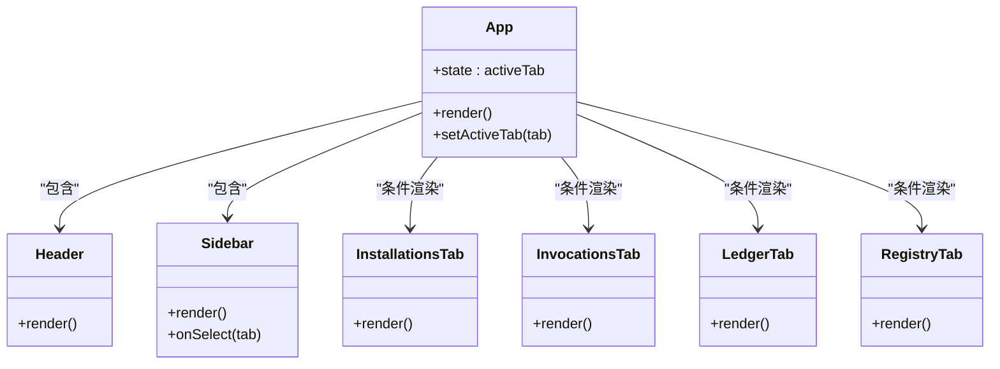
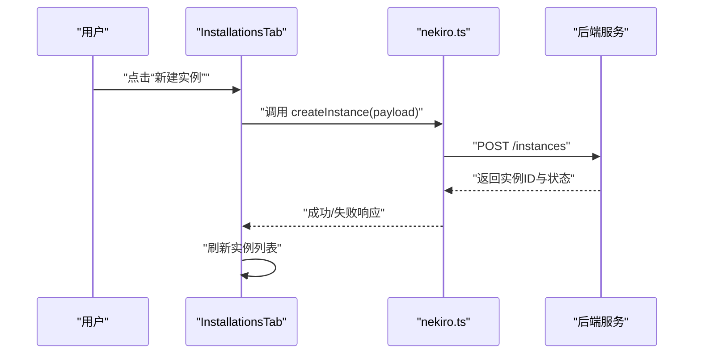
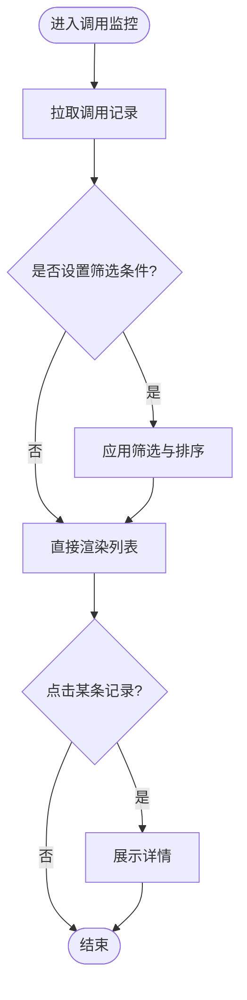
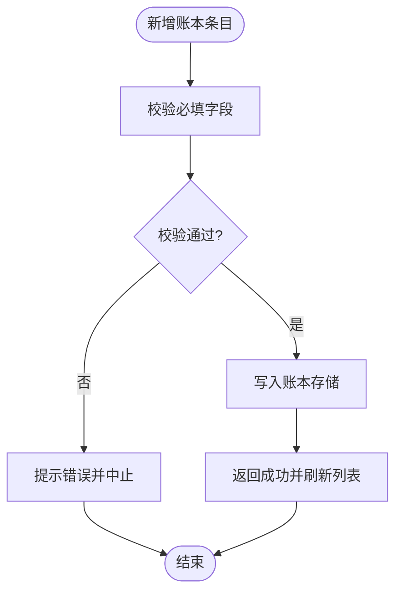
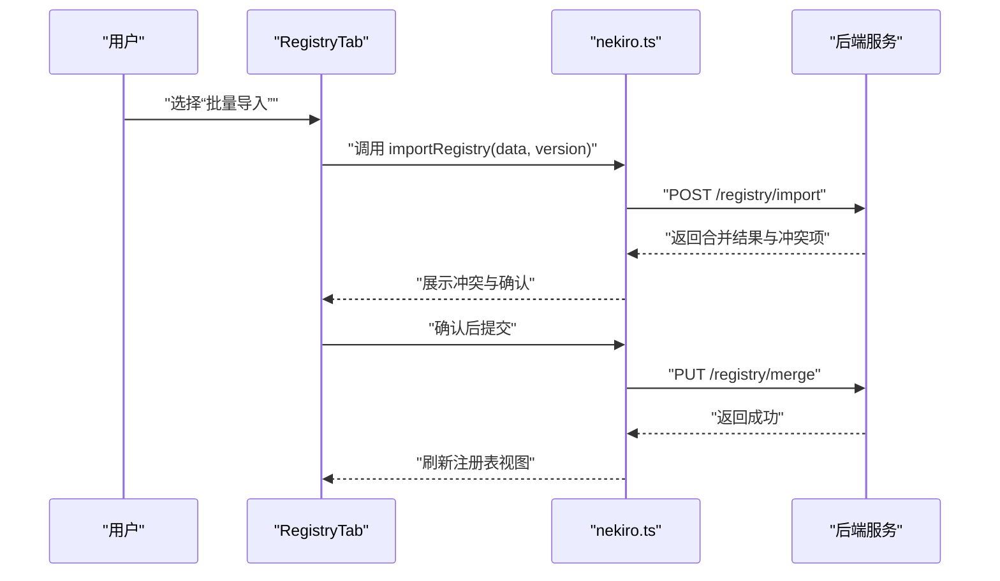
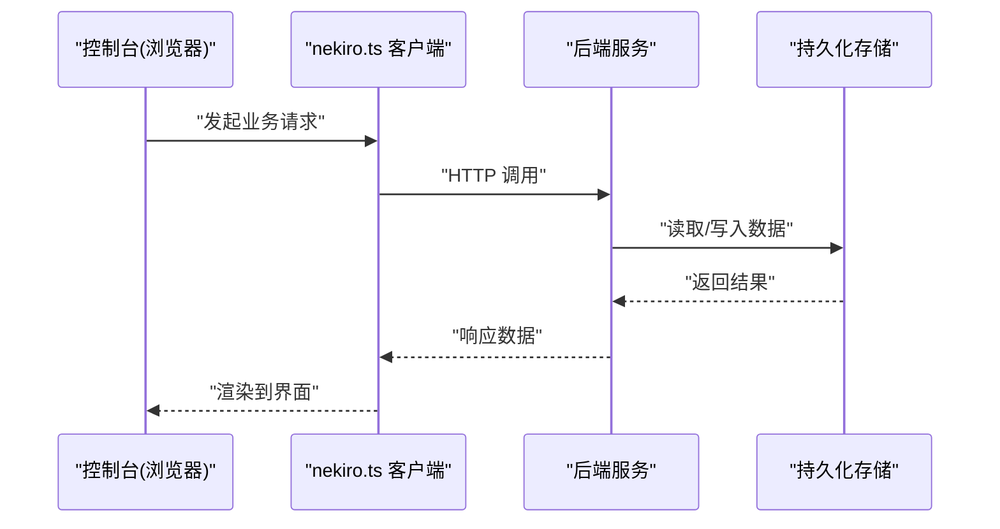
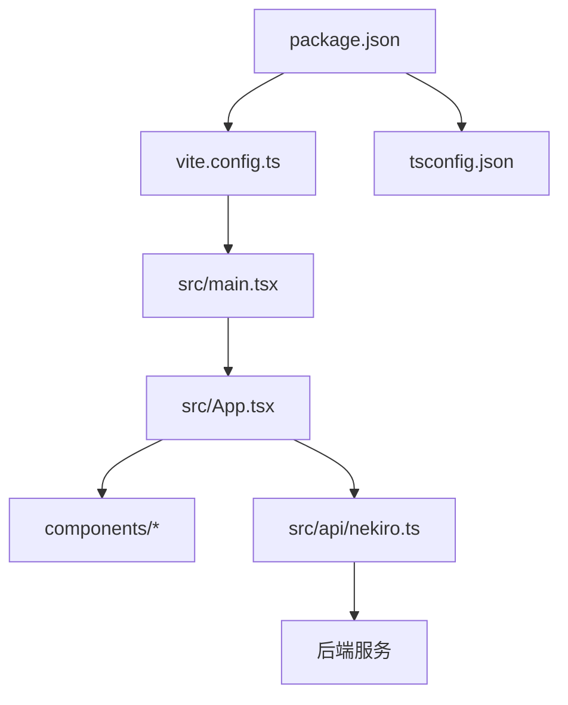

# 项目概述

<cite>
**本文引用的文件**   
- [README.md](file://README.md)
- [package.json](file://package.json)
- [vite.config.ts](file://vite.config.ts)
- [tsconfig.json](file://tsconfig.json)
- [index.html](file://index.html)
- [src/main.tsx](file://src/main.tsx)
- [src/App.tsx](file://src/App.tsx)
- [src/types.ts](file://src/types.ts)
- [src/data.ts](file://src/data.ts)
- [src/api/nekiro.ts](file://src/api/nekiro.ts)
- [src/components/Header.tsx](file://src/components/Header.tsx)
- [src/components/Sidebar.tsx](file://src/components/Sidebar.tsx)
- [src/components/InstallationsTab.tsx](file://src/components/InstallationsTab.tsx)
- [src/components/InvocationsTab.tsx](file://src/components/InvocationsTab.tsx)
- [src/components/LedgerTab.tsx](file://src/components/LedgerTab.tsx)
- [src/components/RegistryTab.tsx](file://src/components/RegistryTab.tsx)
</cite>

## 目录
1. [简介](#简介)
2. [项目结构](#项目结构)
3. [核心组件](#核心组件)
4. [架构总览](#架构总览)
5. [详细组件分析](#详细组件分析)
6. [依赖分析](#依赖分析)
7. [性能考虑](#性能考虑)
8. [故障排查指南](#故障排查指南)
9. [结论](#结论)
10. [附录](#附录)

## 简介
NeKiro-console 是一个基于 React + TypeScript 的前端控制台应用，面向 NekoRO 游戏服务器的运维与管理工作台。其目标是通过统一的 Web 界面，提供以下核心能力：
- 服务器安装管理：集中查看、创建与管理本地或远端的 NekoRO 服务器实例。
- 服务调用监控：记录并展示对后端服务的调用历史、状态与结果，便于问题定位与审计。
- 数据账本系统：以“账本”形式持久化关键操作与变更，支持查询与回溯。
- 注册表管理：维护与服务相关的配置项、元数据与版本信息，确保环境一致性。

技术栈选择说明：
- React：组件化开发、生态成熟、可维护性强，适合构建复杂控制台界面。
- TypeScript：为大型前端工程提供类型安全与更好的开发体验，降低运行时错误。
- Vite：极速的构建与热更新，提升开发与调试效率，同时具备灵活的插件扩展能力。

## 项目结构
仓库采用按功能域组织的前端工程结构，入口位于 src/main.tsx，根组件为 App.tsx，业务模块通过 components 下的 Tab 组件进行划分，API 层集中在 api 目录，类型定义集中于 types.ts，静态资源与页面模板在 index.html 与 public 目录。

图表来源
- [index.html:1-20](file://index.html#L1-L20)
- [src/main.tsx:1-40](file://src/main.tsx#L1-L40)
- [src/App.tsx:1-120](file://src/App.tsx#L1-L120)
- [src/components/Header.tsx:1-60](file://src/components/Header.tsx#L1-L60)
- [src/components/Sidebar.tsx:1-60](file://src/components/Sidebar.tsx#L1-L60)
- [src/components/InstallationsTab.tsx:1-120](file://src/components/InstallationsTab.tsx#L1-L120)
- [src/components/InvocationsTab.tsx:1-120](file://src/components/InvocationsTab.tsx#L1-L120)
- [src/components/LedgerTab.tsx:1-120](file://src/components/LedgerTab.tsx#L1-L120)
- [src/components/RegistryTab.tsx:1-120](file://src/components/RegistryTab.tsx#L1-L120)
- [src/api/nekiro.ts:1-120](file://src/api/nekiro.ts#L1-L120)
- [src/types.ts:1-120](file://src/types.ts#L1-L120)
- [src/data.ts:1-120](file://src/data.ts#L1-L120)

章节来源
- [index.html:1-20](file://index.html#L1-L20)
- [src/main.tsx:1-40](file://src/main.tsx#L1-L40)
- [src/App.tsx:1-120](file://src/App.tsx#L1-L120)
- [src/types.ts:1-120](file://src/types.ts#L1-L120)
- [src/data.ts:1-120](file://src/data.ts#L1-L120)
- [src/api/nekiro.ts:1-120](file://src/api/nekiro.ts#L1-L120)
- [src/components/Header.tsx:1-60](file://src/components/Header.tsx#L1-L60)
- [src/components/Sidebar.tsx:1-60](file://src/components/Sidebar.tsx#L1-L60)
- [src/components/InstallationsTab.tsx:1-120](file://src/components/InstallationsTab.tsx#L1-L120)
- [src/components/InvocationsTab.tsx:1-120](file://src/components/InvocationsTab.tsx#L1-L120)
- [src/components/LedgerTab.tsx:1-120](file://src/components/LedgerTab.tsx#L1-L120)
- [src/components/RegistryTab.tsx:1-120](file://src/components/RegistryTab.tsx#L1-L120)

## 核心组件
- 应用外壳
  - Header：顶部导航与全局信息展示。
  - Sidebar：左侧菜单与路由切换。
  - App：主布局与页面容器，协调各 Tab 组件。
- 功能面板（Tabs）
  - InstallationsTab：服务器安装列表、新增、删除、状态查看等。
  - InvocationsTab：服务调用记录、筛选、详情查看。
  - LedgerTab：数据账本条目、分页、导出与搜索。
  - RegistryTab：注册表键值管理、批量导入/导出、版本对比。
- API 层
  - nekiro.ts：封装对后端的 HTTP 请求，统一错误处理与重试策略。
- 类型与数据
  - types.ts：共享的类型定义，如服务器实例、调用记录、账本条目、注册表项等。
  - data.ts：示例数据或本地缓存数据，用于演示与离线场景。

章节来源
- [src/components/Header.tsx:1-60](file://src/components/Header.tsx#L1-L60)
- [src/components/Sidebar.tsx:1-60](file://src/components/Sidebar.tsx#L1-L60)
- [src/App.tsx:1-120](file://src/App.tsx#L1-L120)
- [src/components/InstallationsTab.tsx:1-120](file://src/components/InstallationsTab.tsx#L1-L120)
- [src/components/InvocationsTab.tsx:1-120](file://src/components/InvocationsTab.tsx#L1-L120)
- [src/components/LedgerTab.tsx:1-120](file://src/components/LedgerTab.tsx#L1-L120)
- [src/components/RegistryTab.tsx:1-120](file://src/components/RegistryTab.tsx#L1-L120)
- [src/api/nekiro.ts:1-120](file://src/api/nekiro.ts#L1-L120)
- [src/types.ts:1-120](file://src/types.ts#L1-L120)
- [src/data.ts:1-120](file://src/data.ts#L1-L120)

## 架构总览
整体采用“前端控制台 + 后端服务”的分离式架构。前端负责 UI 渲染、用户交互与状态管理；后端提供 RESTful API 完成服务器生命周期管理、调用日志采集、账本持久化与注册表读写。

图表来源
- [src/App.tsx:1-120](file://src/App.tsx#L1-L120)
- [src/api/nekiro.ts:1-120](file://src/api/nekiro.ts#L1-L120)

## 详细组件分析

### 应用外壳与路由
- App 作为根容器，组合 Header、Sidebar 与各功能 Tab。
- Sidebar 控制当前激活的 Tab，并在点击时触发视图切换。
- Header 显示应用标题、当前环境与基础统计信息。

图表来源
- [src/App.tsx:1-120](file://src/App.tsx#L1-L120)
- [src/components/Header.tsx:1-60](file://src/components/Header.tsx#L1-L60)
- [src/components/Sidebar.tsx:1-60](file://src/components/Sidebar.tsx#L1-L60)
- [src/components/InstallationsTab.tsx:1-120](file://src/components/InstallationsTab.tsx#L1-L120)
- [src/components/InvocationsTab.tsx:1-120](file://src/components/InvocationsTab.tsx#L1-L120)
- [src/components/LedgerTab.tsx:1-120](file://src/components/LedgerTab.tsx#L1-L120)
- [src/components/RegistryTab.tsx:1-120](file://src/components/RegistryTab.tsx#L1-L120)

章节来源
- [src/App.tsx:1-120](file://src/App.tsx#L1-L120)
- [src/components/Header.tsx:1-60](file://src/components/Header.tsx#L1-L60)
- [src/components/Sidebar.tsx:1-60](file://src/components/Sidebar.tsx#L1-L60)

### 服务器安装管理（InstallationsTab）
- 功能要点：列出已安装的 NekoRO 实例，支持新建、启动/停止、删除与状态刷新。
- 数据流：从 API 获取实例列表，提交表单创建新实例，轮询或事件驱动更新状态。
- 错误处理：网络异常、权限不足、端口冲突等提示与恢复建议。

图表来源
- [src/components/InstallationsTab.tsx:1-120](file://src/components/InstallationsTab.tsx#L1-L120)
- [src/api/nekiro.ts:1-120](file://src/api/nekiro.ts#L1-L120)

章节来源
- [src/components/InstallationsTab.tsx:1-120](file://src/components/InstallationsTab.tsx#L1-L120)
- [src/api/nekiro.ts:1-120](file://src/api/nekiro.ts#L1-L120)

### 服务调用监控（InvocationsTab）
- 功能要点：展示对后端服务的调用历史，包括时间戳、方法、路径、状态码与耗时。
- 过滤与排序：按时间范围、状态码、关键字筛选；支持按耗时降序排列。
- 详情查看：展开单条记录的请求/响应摘要与错误堆栈。

图表来源
- [src/components/InvocationsTab.tsx:1-120](file://src/components/InvocationsTab.tsx#L1-L120)
- [src/api/nekiro.ts:1-120](file://src/api/nekiro.ts#L1-L120)

章节来源
- [src/components/InvocationsTab.tsx:1-120](file://src/components/InvocationsTab.tsx#L1-L120)
- [src/api/nekiro.ts:1-120](file://src/api/nekiro.ts#L1-L120)

### 数据账本系统（LedgerTab）
- 功能要点：以条目为单位记录关键操作与变更，支持分页、搜索与导出。
- 数据结构：条目包含时间、操作类型、对象标识、差异摘要与操作人。
- 审计与回溯：通过唯一 ID 与时间戳保证不可篡改性与可追溯性。

图表来源
- [src/components/LedgerTab.tsx:1-120](file://src/components/LedgerTab.tsx#L1-L120)
- [src/api/nekiro.ts:1-120](file://src/api/nekiro.ts#L1-L120)

章节来源
- [src/components/LedgerTab.tsx:1-120](file://src/components/LedgerTab.tsx#L1-L120)
- [src/api/nekiro.ts:1-120](file://src/api/nekiro.ts#L1-L120)

### 注册表管理（RegistryTab）
- 功能要点：维护键值对形式的配置与元数据，支持批量导入/导出、版本对比与回滚。
- 一致性保障：通过版本号与校验和避免覆盖冲突。
- 使用场景：服务参数、特性开关、环境变量映射等。

图表来源
- [src/components/RegistryTab.tsx:1-120](file://src/components/RegistryTab.tsx#L1-L120)
- [src/api/nekiro.ts:1-120](file://src/api/nekiro.ts#L1-L120)

章节来源
- [src/components/RegistryTab.tsx:1-120](file://src/components/RegistryTab.tsx#L1-L120)
- [src/api/nekiro.ts:1-120](file://src/api/nekiro.ts#L1-L120)

### 概念性概览
下图展示了控制台与后端之间的通用数据流向，适用于所有功能模块。

[此图为概念性流程图，不直接映射具体源码文件]

## 依赖分析
- 构建与运行
  - package.json：声明依赖与脚本命令，包含 React、TypeScript、Vite 等核心包。
  - vite.config.ts：构建配置，如别名、代理、插件扩展等。
  - tsconfig.json：TypeScript 编译选项，严格模式与路径映射。
- 运行时依赖
  - React 与 ReactDOM：UI 框架与渲染器。
  - axios/fetch 封装：由 nekiro.ts 统一处理网络请求。
- 外部集成点
  - 后端服务：RESTful API 接口，涵盖实例管理、调用记录、账本与注册表。
  - 浏览器环境：通过 index.html 注入应用入口。

图表来源
- [package.json:1-60](file://package.json#L1-L60)
- [vite.config.ts:1-60](file://vite.config.ts#L1-L60)
- [tsconfig.json:1-60](file://tsconfig.json#L1-L60)
- [src/main.tsx:1-40](file://src/main.tsx#L1-L40)
- [src/App.tsx:1-120](file://src/App.tsx#L1-L120)
- [src/api/nekiro.ts:1-120](file://src/api/nekiro.ts#L1-L120)

章节来源
- [package.json:1-60](file://package.json#L1-L60)
- [vite.config.ts:1-60](file://vite.config.ts#L1-L60)
- [tsconfig.json:1-60](file://tsconfig.json#L1-L60)
- [src/main.tsx:1-40](file://src/main.tsx#L1-L40)
- [src/App.tsx:1-120](file://src/App.tsx#L1-L120)
- [src/api/nekiro.ts:1-120](file://src/api/nekiro.ts#L1-L120)

## 性能考虑
- 构建优化
  - 使用 Vite 的代码分割与按需加载，减少首屏体积。
  - 合理配置别名与路径映射，提高编译速度。
- 运行时优化
  - 列表分页与虚拟滚动，避免大数据量导致的卡顿。
  - 防抖与节流，减少高频操作触发的重复请求。
  - 错误边界与降级策略，提升用户体验与稳定性。
- 网络优化
  - 请求去重与缓存策略，避免重复拉取相同数据。
  - 超时与重试机制，增强弱网环境下的鲁棒性。

[本节为通用指导，不直接分析具体源码文件]

## 故障排查指南
- 常见问题
  - 无法连接后端：检查代理配置与 CORS 设置，确认后端服务可达。
  - 登录/鉴权失败：核对令牌有效期与作用域，必要时重新获取。
  - 数据不一致：查看账本条目与注册表版本，确认是否存在并发冲突。
- 定位步骤
  - 打开浏览器开发者工具，查看 Network 面板的请求与响应。
  - 在控制台输出中检索错误堆栈与警告信息。
  - 使用 InvocationsTab 的详情视图，比对前后端返回的数据差异。
- 恢复建议
  - 清理本地缓存与临时文件，重启开发服务器。
  - 回滚到上一个稳定版本的注册表与账本快照。
  - 联系后端团队核对接口契约与变更记录。

章节来源
- [src/components/InvocationsTab.tsx:1-120](file://src/components/InvocationsTab.tsx#L1-L120)
- [src/components/LedgerTab.tsx:1-120](file://src/components/LedgerTab.tsx#L1-L120)
- [src/components/RegistryTab.tsx:1-120](file://src/components/RegistryTab.tsx#L1-L120)
- [src/api/nekiro.ts:1-120](file://src/api/nekiro.ts#L1-L120)

## 结论
NeKiro-console 将 NekoRO 服务器的安装、监控、账本与注册表管理整合到一个直观的控制台中，借助 React + TypeScript + Vite 的技术优势，提供了良好的开发体验与可维护性。通过清晰的组件分层与统一的 API 封装，系统具备良好的扩展性与稳定性，适合持续迭代与团队协作。

[本节为总结性内容，不直接分析具体源码文件]

## 附录
- 术语对照
  - 服务器实例：一个独立的 NekoRO 运行环境。
  - 调用记录：对后端接口的访问日志，包含方法与状态。
  - 账本条目：关键操作的不可变记录，用于审计与回溯。
  - 注册表项：键值对形式的配置与元数据集合。
- 参考文档
  - README.md：项目背景与使用说明。
  - docs/superpowers/specs：MVP 规格与设计文档。

章节来源
- [README.md:1-60](file://README.md#L1-L60)
- [docs/superpowers/specs/2026-07-16-nekiro-console-mvp-spec.md:1-120](file://docs/superpowers/specs/2026-07-16-nekiro-console-mvp-spec.md#L1-L120)